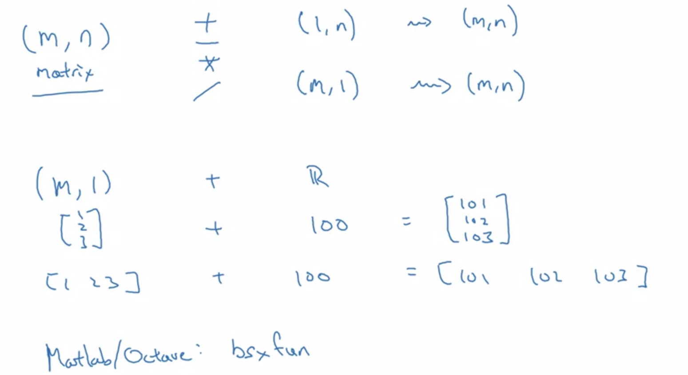
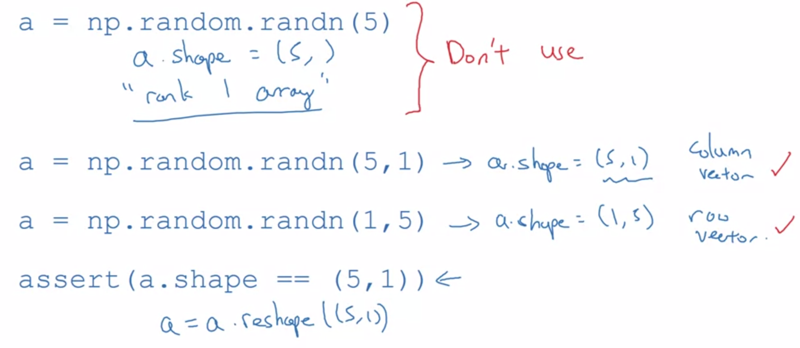

# Numpy

By using built-in numpy functions such as `np.dot` will eliminate the need of a `for loop`. It enables Phyton Pi to take much better advantage of parallelism to do computations on arrays much faster.

## Broadcast
 <br />

## Vectorization
```python
### vectorized dot product of vectors ###
# vector product for single dimension arrays
dot = np.dot(x1,x2)

### vectorized outer product ###
outer = np.outer(x1,x2)

### vectorized elementwise multiplication ###
mul = np.multiply(x1,x2)

### vectorized general dot product ###
# matrix multiplication for multi-dimension arrays
dot = np.dot(W,x1)
```

## Shapes
 <br />

## Numpy Array Operation
```python
### elementwise multiplication ###
np_arr1 * np_arr2
```