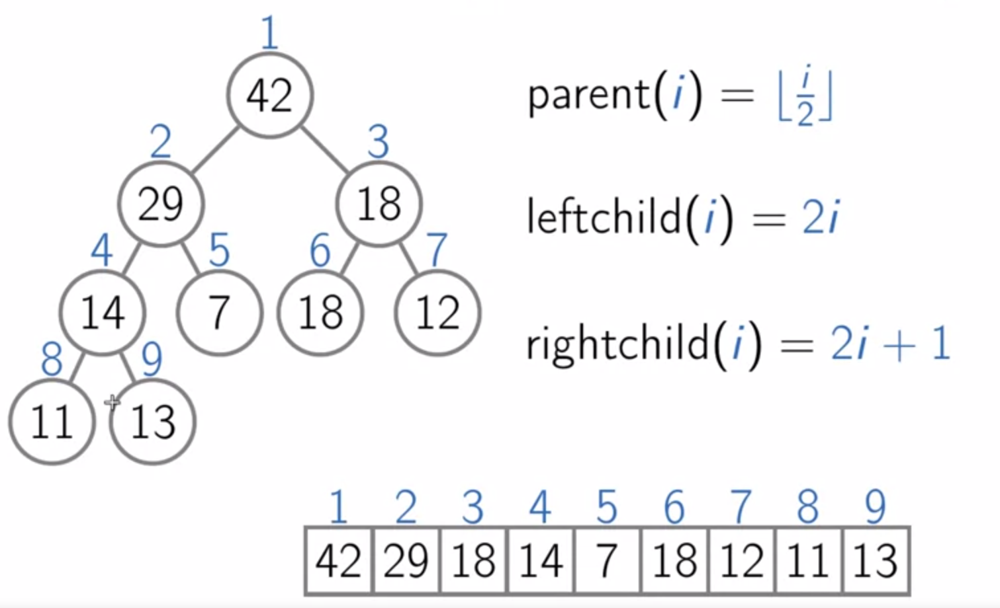
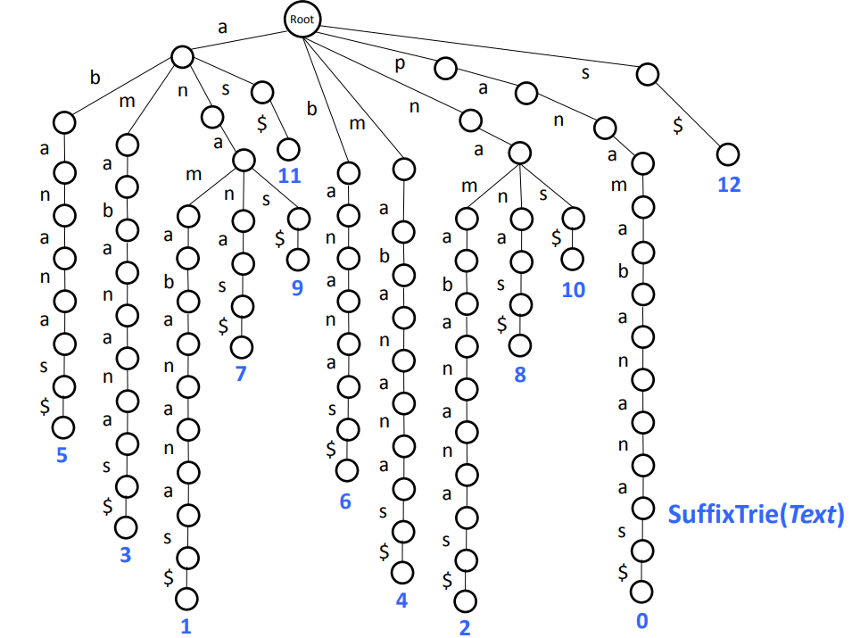
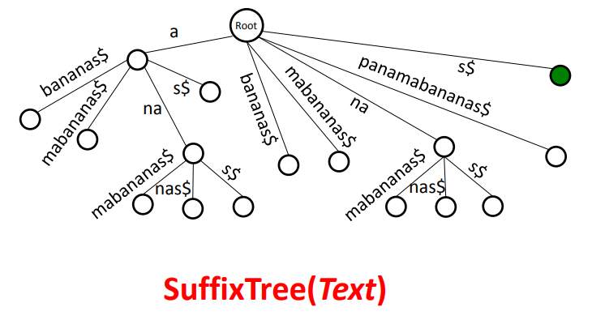
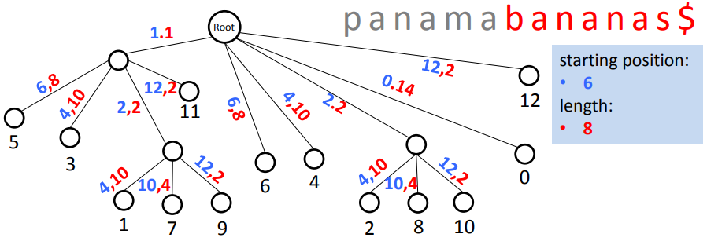
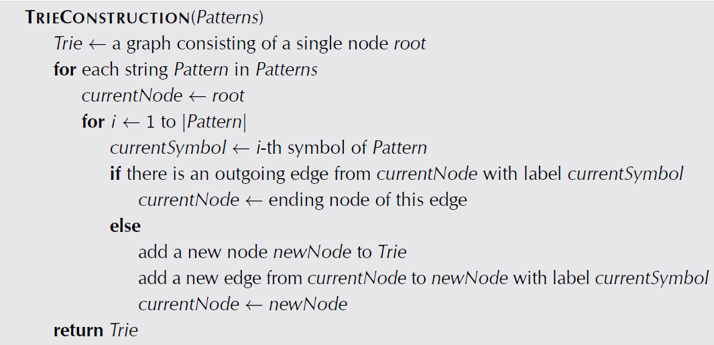
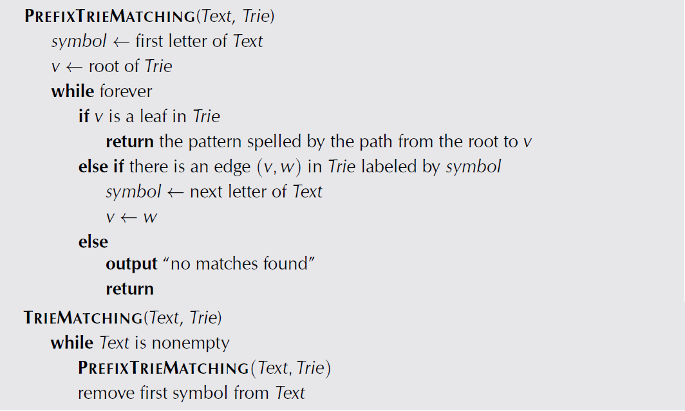
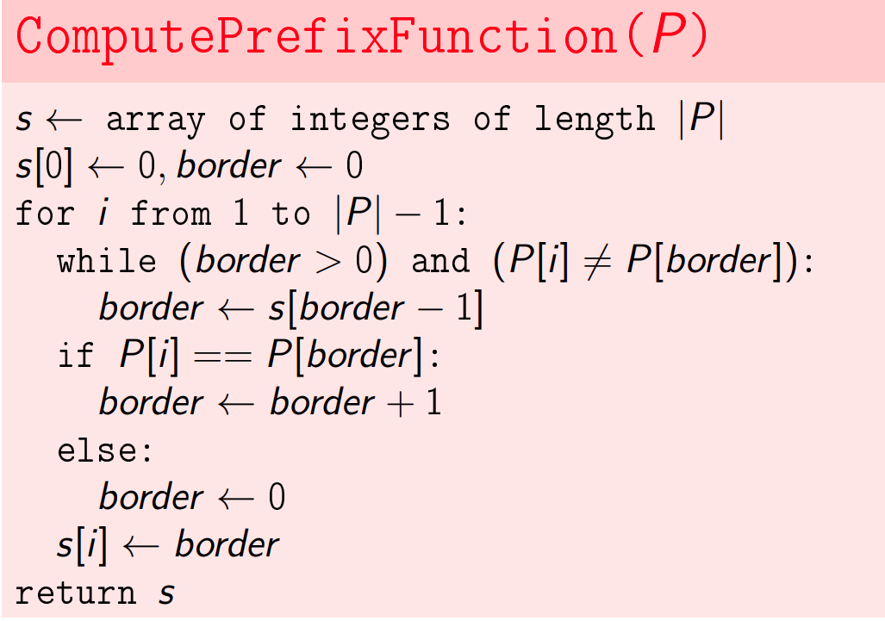
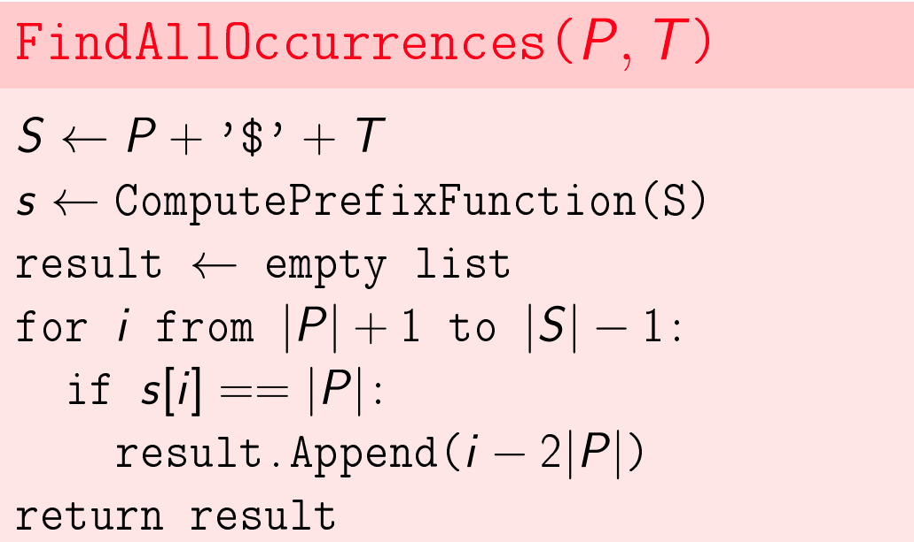

## Array
* A contiguous area of memory of equal-size elements
* Read, Update, Insert / Remove at end - `O(1)`
* Insert / Remove elsewhere - `O(n)`

### Dynamic Array
Arrays which lengths are not fixed.
* size() - Number of itmes in the array
* capacity() - Number of items it can hold
* resize(new_capacity) - Private function
    - when you reach capacity, resize to double the size, and copy all the elements to the new array and free up the old array.
    - when popping an item, if size is 1/4 of capacity, resize to half

## Linked List
### Singly-Linked List
* empty() - Check the list is empty or not
    - `O(1)`
* value_at(index) - Returns the value of the nth item
    - `O(n)`
* front() - Get value of front item
    - `O(1)`
* push_front(value) - Adds an item to the front of the list
    - `O(1)`
* pop_front() - Remove front item and return its value
    - `O(1)`
* back() - Get value of end item
    - `O(1)` with tail pointer
    - `O(n)` wo tail pointer
* push_back(value) - Adds an item at the end
    - `O(1)` with tail pointer
    - `O(n)` wo tail pointer
* pop_back() - Removes end item and returns its value
    - `O(n)` w/wo tail
* erase(index) - Removes node at given index
    - `O(n)`

### Doubly-Linked Lists
* pop_back() - Removes end item and returns its value
    - `O(1)` with tail
    - `O(n)` wo tail

## Stack
### Last in, first out
* push(value) - Adds an item to the top of the stack
    - `O(1)`
* top(value) - Returns the value of the top item of the stack
    - `O(1)`
* pop(value) - Removes the top item of the stack and returns its value
    - `O(1)`
* empty() - Check the stack is empty or not
    - `O(1)`

### Implementations
1. Similar to the implementation of dynamic array
2. Use linked list
    - push to the front, pop to take the head
    - `head == null` then it is empty

## Queue
### First in, first out
* push(value) - Adds an item to the end of the queue
    - `O(1)`
* pop(value) - Removes the top item of the queue and returns its value
    - `O(1)`
* empty() - Check the queue is empty or not
    - `O(1)`

### Implementations
1. Use array
    - Use two indices to track the push indice and pop indice
    - Start with `push indice ==  pop indice` to indicate queue is emtpy
    - Array is fixed length, so the queue can be full
        - Need a buffer of 1 to not allow write
        - Otherwise when `push indice ==  pop indice`, we are not clear if the queue is empty or full
2. Use linked list with tail
    - push to the tail, pop to take the head
    - `head == null` then it is empty

## Hash Table
### Design
1. Use an array of linked lists
2. Use the hash function to convert keys into integers, and link the object to the chain of linked lists in the array
    - chained linked lists can handle collisions
    - expected length of chain: n/m (n elements, m for length of array)
3. Add, Remove, Get: `O(1+n/m)`
4. Memory usage: `O(n+m)`
5. Grow table
    - grow the table then the hash is around 70% (or any other value) full
    - make a new table with size of 2m
    - build a new hash function
    - rehash all the keys into the new table
    - in this way `n/m` is less than 1

### Implementation
* Check key exists in hash or not
    ```python
    def has_key(o)
        list = A[h(o)]
        for obj, val in list:
            if obj == o:
                return True
        return False
    ```
* Get value for key
    ```python
    def get(o)
        list = A[h(o)]
        for obj, val in list:
            if obj == o:
                return val
        return None
    ```
* Set value for key
    ```python
    def set(o, v)
        list = A[h(o)]
        for p in list:
            if p.obj == o:
                p.val = v
                return
        L.append(o, v)
    ```

### Cloud Storage with Hash
1. Compute a set of hashes for the file locally
    - It is very rare for two different files have the same has values for 3 or 5 hash functions
2. Upload the hashes to determine if the file already exists or not
3. Store file addresses and hashes in a hash table
4. Use distributed hash table
    - Use multiple servers and each server owns one hash table
    - Use another hash function to determine which server owns the file

## Heap - Priority Queues
 <br />

### Key Points
1. It is a complete binary tree
    - binary: has maximum two children
    - complete: all the levels are filled except the last one which starts from left to right.
    - height: `O(logn)`
2. The value of the parent must be larger than or equal to the value of the children.

### Basic Operations
* All operations are in place, so it is memory efficient.
* getMax() - Returns the max value (the root)
    - `O(1)`
* Insert(value)
    - Insert the element to the left most position on the last level
    - Swap the elment with its parent until the parent is no smaller than the element
    - `O(logn)`
* extractMax() - Removes the max element
    - Swap the root with the last leaf, then remove it
    - Swap the root with its larger child until it is no smaller than its children
    - `O(logn)`
* update(value) - Changes the priority of the element
    - Swap the element up/down depends on whether we increase/decrease the priority
    - `O(logn)`
* removes(value)
    - Update the priority to "inf"
    - Swap the element up until it reaches root
    - Call extractMax()
    - `O(logn)`

### Heap Sort
1. Turn the array into heap: `O(n)`
    ```python
    for i in range((n-1)//2, -1, -1):
        shit_down(i)
    ```
2. Sort the heap into sorted array: `O(nlogn)`
    ```python
    for i in range(n):
        swap H[0] and H[size]
        size = size - 1
        shit_down(0)
    ```
3. Running time: `O(nlogn)`, in-place operation
4. Efficient to find the K largest elements in the array: `O(n)`

## Disjoint Sets
Creating sets of data points, with each set as a tree, and the set ID to be the root of the tree.

### Basic Operations
* Create A Set
    ```python
    def make_set(i)
        parent[i] = i
        rank[i] = 0
    ```
* Get Parent of a Node: `O(logn)`
    ```python
    def find(i)
        while i != parent[i]:
            i = parent[i]
        return i
    ```
* Merge Two Sets: `O(logn)`
    ```python
    def union(i, j)
        i_id = find(i)
        j_id = find(j)
        if i_id == j_id:
            return
        if rank[i_id] > rank[j_id]:
            parent[j_id] = i_id
        elif rank[i_id] < rank[j_id]:
            parent[i_id] = j_id
        else:
            parent[i_id] = j_id
            rank[j_id] += 1
    ```

### Path Compression
* Get Parent of a Node: `O(logn)`
    ```python
    def find(i)
        if i != parent[i]:
            parent[i] = find(parent[i])
        return parent[i]
    ```

## Sort
### Merge Sort
```python
values = []
def sort(numbers):
    merge_sort(0, len(numbers) - 1)
    return values
def merge_sort(low, high):
    if low < high:
        mid = (low + high) // 2
        merge_sort(low, mid)
        merge_sort(mid + 1, high)
        merge(low, mid, high)
def merge(low, mid, high):
    b = []
    i = low
    j = mid + 1
    while i <= mid and j <= high:
        if values[i] <= values[j]:
            b.append(values[i])
            i += 1
        else:
            b.append(values[j])
            j += 1
    while i <= mid:
        b.append(values[i])
        i += 1
    while j <= high:
        b.append(values[j])
        j += 1
    for index, val in enumerate(b):
        values[low + index] = val
```

### Quick Sort
```python
import random
class QuickSort(object):
    def __init__(self, numbers):
        self.values = numbers
    def sort(self):
        self.quick_sort(0, len(self.values) - 1)
        return self.values
    def quick_sort(self, left, right):
        if left == right:
            return
        i = left
        j = right
        v = random.randint(left, right)
        pivot = self.values[v]
        while i < j:
            while self.values[i] < pivot:
                i += 1
            while self.values[j] > pivot:
                j -= 1
            if i <= j:
                temp = self.values[i]
                self.values[i] = self.values[j]
                self.values[j] = temp
                i += 1
                j -= 1
        if left < j:
            self.quick_sort(left, j)
        if right > i:
            self.quick_sort(i, right)
```

### Counting Sort - for range of data (1 to k) not very big, O(n + k)
```python
L = [[]] * len(k)
output=[]
for i in range(n):
    L[key(A[i])].append(A[i])
for i in range(k):
    output.append(L[i])
return output
```

## Tree
A node with a value and a list of child trees. Usually use recursive algorithms when dealing with trees.
* height(tree) - Returns the height / depth of the tree <br/>
    ```python
    def height(tree)
        if tree == None:
            return 0
        return 1 + max(height(tree.left), height(tree.right))
    ```
* size(tree) - Returns the number of nodes in the tree <br/>
    ```python
    def size(tree)
        if tree == None:
            return 0
        return 1 + size(tree.left) + size(tree.right)
    ```

### Tree Traversal
1. Depth-First: Traverse one sub-tree before a sibling sub-tree
    - In-Order: Left => Root => Right <br/>
        ```python
        def in_order_dfs(tree)
            if tree == None:
                return
            in_order_dfs(tree.left)
            print(tree.value)
            in_order_dfs(tree.right)
        ```
    - Pre-Order: Root => Left => Right
         ```python
        def pre_order_dfs(tree)
            if tree == None:
                return
            print(tree.value)
            pre_order_dfs(tree.left)
            pre_order_dfs(tree.right)
        ```
    - Post-Order: Left => Right => Root
        - For example, for tree of an math euqation with parents as the operator, we can use post-order (calculate left first, then right, then on the operator)


2. Breadth-First: Traverse all nodes on one level before progressing to the next level
    ```python
    def bfs(tree)
        if tree == None:
            return
        queue = []
        queue.enqueue(tree)
        while not q.empty():
            node = queue.dequeue()
            print(node.value)
            if node.left != None:
                queue.enqueue(node.left)
            if node.right != None:
                queue.enqueue(node.right)
    ```

## Binary Search Tree
A binary tree that all nodes in the left sub tree of a parent node is no larger and the parent (for the same value, goes to left), and all nodes in the right sub tree is larger than the parent.

### Implementation
* Check key exists in hash or not
    ```python
    def find(k, R)
        if R.value == k:
            return R
        elif R.value > k and R.left:
            return find(k, R.left)
        elif R.value < k and R.right:
            return find(k, R.right)
        else:
            return R
    ```
* Add a new node
    ```python
    def insert(k, R)
        p = find(k, R)
        p.left = k
    ```
* Delete a new node
    ```python
    def delete(k, R)
        if R is None:
            return;
        if k > R.value:
            return delete(k, R.right)
        elif k < R.value:
            return delete(k, R.left)
        else:
            if R.left is None and R.right is None:
                R = None
                return
            elif R.left is None:
                R = R.right
                return
            elif R.right is None:
                R = R.left
            else:
                R.value = findMin(R.right)
                return delete(R.value, R.right)
    ```

### AVL Tree
AVL tree is a tree that the height difference between left sub tree and right sub tree is less than or equal to 1. So that we can minize the height to reduce the running time to `O(logn)`.
1. https://www.geeksforgeeks.org/avl-tree-set-1-insertion/
2. https://www.geeksforgeeks.org/avl-tree-set-2-deletion/

* Rebalance the tree
    ```python
    def rebalance(N)
        P = N.parent
        if N.left.height > N.right.height + 1:
            rebalanceRight(N)
        if N.right.height > N.left.height + 1:
            rebalanceLeft(N)
        adjustHeight(N)
        if P != None:
            rebalance(P)
    
    def adjustHeight(N):
        N.height = 1 + max(N.left.height, N.right.height)
    
    def rebalanceRight(N):
        M = N.left
        if M.right.height > M.left.height:
            rotateLeft(M)
        RotateRight(N)
        adjustHeight on all affected nodes
    ```

### Splay Tree
Keep the most frequent accessed nodes at the top of the tree. E.g. for every find operation, we splay the tree to move the found node to the top of th tree.
1. https://www.geeksforgeeks.org/splay-tree-set-1-insert/
2. https://www.geeksforgeeks.org/splay-tree-set-2-insert-delete/
3. https://www.geeksforgeeks.org/splay-tree-set-3-delete/

## Graph
Graph `G = (V, E)` consistents of n vertices V and m edges E
1. Adjacency Matrix representation:
    - `M(i, j)` is 1 if `(i, j)` is an edge of `G`
    - Can use half of the matrix if the graph is undirected
    - memory usage: `O(n^2)`
    - insert/delete edge: `O(1)`
2. Adjacency List representation:
    - N elements, and each element points to a linked list of adjacencies of i
    - length of the list is the degree
    - memory usage: `O(n+m)`
    - for each vertex, visit each edge of it: `O(n+m)`

### DFS
Runtime: `O(n+m)`
```python
visited = {}
count = 0
clock = 0
def DFS(G):
    for v in V:
        if v not in visited:
            count = count + 1
            explore(v)

def explore(v):
    visited[v] = True
    previsit(v)
    for w in adj[v]:
        if w not in visited:
            explore(w)
    postvisit(v)

# we can use previsit and postvisit to handle some 
# simple extra logics while visiting the nodes
# below is just an examplle
def previsit(v):
    prev[v] = clock
    clock = clock + 1

def postvisit(v):
    post[v] = clock
    clock = clock + 1
```

### BFS
Runtime: `O(n+m)`
```python
def BFS(s, adj):
    frontier = [s]
    for i in range(len(adj)):
        levels[i] = float("inf")
    levels[s] = 0
    parent = {}
    while len(frontier) > 0:
        next = []
        for v in frontier:
            for w in adv[v]:
                if levels[w] == float("inf"):
                    next.append(w)
                    levels[w] = levels[v] + 1
                    parent[w] = v
        frontier = next
```

### Cycle Detection
1. Undirected Graph: 
    - Use DFS
    - If x has an adjacency node y, which is already found and it is not parent of x, then it is a cycle
2. Directed Graph: 
    - Use DFS
    - If x has an adjacency node y, which is already found and not completed, then it is a cycle

### Directed Graph
* Directed Acyclic Graph (Topological Sort - Task Scheduling)
```python
def TopologicalSort(G):
    result = DFS(G, order='postOrder')
    result.reverse()
```

* Find Strongly Connected Components
```python
def scc(G):
    visited = {}
    result = DFS(G_reverse, order='postOrder')
    for v in result.reverse():
        if v not in visited:
            explore(v)
            makred explored vertices in the new scc
```

### Shortest Path
1. Use BFS to find the shortest path / level to the node.

    ```python
    def shortest_path(parent, u, s):
        result = []
        while u != s:
            result.append(u)
            u = parent[u]
        result = result.reverse()
        return result
    ```

2. Dijkstra - positive weights only
    - Running Time:
`T(make heap) + |V|*T(extract min) + |E|*T(change priority)`
    - `O(V^2)` using array;  `O((V+E)logV)` using heap.

    ```python
    parent = {}
    d = {}

    def Dijkstra(adj, W, s):
        for v in range(len(adj)):
            d[v] = float("inf")
        d[s] = 0
        Q = heap(d)
        while len(Q) != 0:
            u = Q.extract_min()
            for v in adj[u]:
                if d[v] > d[u] + W(u, v)
                    d[v] = d[u] + W(u, v)
                    parent[v] = u
                    Q.change_priority(v, d[v])
    ```

3. Bi_directional Dijkstra
    - Given source `s` and destination `t`
    - Do Dijkstra with `s` on Graph and with `t` on Reversed Graph simultaneously until they reach the first common point `v`
    - Then find the shortest path by looping through all the visited points:

    ```python
    def shortest_path(prec, prec_r, dist, dist_r):
        distance = float("inf")
        u_best = None
        for u in prec + prec_r:
            if dist[u] + dist_r[u] < distance:
                u_best = u
                distance = dist[u] + dist_r[u]
        return u_best, distance
    ```

4. Bellman-Ford - both positive / negative weights
    - Running Time: `O(VE)`

    ```python
    parent = {}
    d = {}

    def BellmanFord(adj, W, s):
        for v in range(len(adj)):
            d[v] = float("inf")
        d[s] = 0
        # repeat V-1 times
        for i in range(len(adj)-1):
            # for each edge
            for v in range(len(adj)):
                for u in adj[v]:
                    if d[u] > d[v] + W(u, v)
                        d[u] = d[v] + W(u, v)
                        parent[u] = v
        
        negative_nodes = []
        results = [] # nodes can have infinite values
        # for each edge
        for v in range(len(adj)):
            for u in adj[v]:
                if d[u] > d[v] + W(u, v)
                    # negative cycle exists
                    negative_nodes.append(u)
        for element in negative_nodes:
            results.append(BFS(adj, element))
    ```

### Minimum Spanning Tree
1. Kruskal's Algorithm
    - Repeatedly add the next lightest edge if this does not produce a cycle
    - Running Time: `T(sort edges) + T(process edges) = 
O(ElogE) + O(E*T(find) + V*T(union)) = O(ElogV^2) + O(ElogV + VlogV) = O(2ElogV) + O(ElogV + (E+1)logv) = O(ElogV)`

    ```
    def kruskal(adj, W):
        for v in V:
            make_set(v)
        x = set()
        sort edges E by weight
        for {u, v} in E:
            if find(u) != find(v):
                x.add({u, v})
                union(u, v)
        return x
    ```

2. Prim's Algorithm
    - Select a source node, then repeatedly attach a new vertex to the current tree by selecting a lightest edge

    ```python
    parent = {}
    d = {}

    def Dijkstra(adj, W, s):
        for v in range(len(adj)):
            d[v] = float("inf")
        d[s] = 0
        Q = heap(d)
        while len(Q) != 0:
            u = Q.extract_min()
            for v in adj[u]:
                if v in Q and d[v] > W(u, v)
                    d[v] = W(u, v)
                    parent[v] = u
                    Q.change_priority(v, d[v])
    ```

## Trie
A trie is a tree-like data structure whose nodes store the letters of an alphabet. 

1. Build Trie on patterns and loop through the text to find pattern matches
    - Running time: `O(|text| * |longest_pattern|)`

2. Build trie on text and loop through patterns to find matches
    - Runtime: `Generate_Suffic_Tree + Pattern_Matching = O(|Text| + |Patterns|)`

Below is an example of trie that represents a string which is used for pattern matching. Memory Usage: `O(n * (n-1)) = O(n^2)`

 <br />
<small>string: panamabananas$, with `$` as ending sign</small>

We can update the suffix trie to suffix tree, so that the number of edges will be much less.

Memory Usage: `O(n)`

 <br />

 <br />

### Implementation
 <br />

 <br />

## Knuth-Morris-Pratt Algorithm (Pattern Matching)
1. Compute Prefix
    - running time: `O(n)` <br />
    - border is increased by 1 at maximum each step, and max border is `n`; border is decreased by 1 each step in the while loop, the maximum operation on the while loops is `n`. That is why the combination of while loop and outer loop is `O(n)`.
     <br />

2. Find All Occurrences
    - runnint time: `O(t+p)` <br />
     <br />