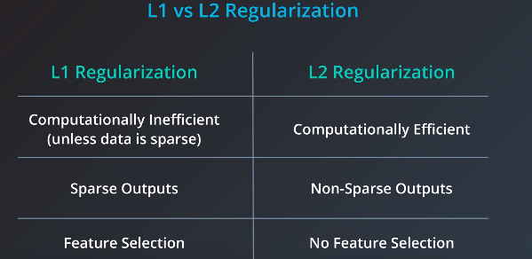

# Algorithm Comparison and Selection

<a href="https://download.microsoft.com/download/A/6/1/A613E11E-8F9C-424A-B99D-65344785C288/microsoft-machine-learning-algorithm-cheat-sheet-v7.pdf" download>Microsoft Machine Learning Algorithm Cheat Sheet</a>

## Supervised / Unsupervised Learning and Reinforcement Learning

### Supervised learning
> train on labelled data.

1. **Classification**  
For predicting a category. When there are only two labels, this is called binomial classification. When there are more than two categories, the problems are called multi-class classification. 

2. **Regression**  
For predicting values.

3. **Forecasting**  
For making predictions about the future based on the past and present data. It is most commonly used to analyse trends.

4. **Anomaly detection**  
To identify data points that are unusual. For example, in credit card fraud detection, the possible variations are so numerous and the training examples so few, that it’s not feasible to learn what fraudulent activity looks like. The approach that anomaly detection takes is to learn what normal activity looks like (using a history of non-fraudulent transactions) and identify anything that is significantly different.

### Unsupervised learning
> train on unlabelled data

1. **Clustering:**  
Grouping a set of data examples so that examples in one group (or one cluster) are more similar (according to some criteria) than those in other groups. This is often used to segment the whole dataset into several groups. Analysis can be performed in each group to help users to find intrinsic patterns.

2. **Dimension reduction:**  
Reducing the number of variables under consideration. In many applications, the raw data have very high dimensional features and some features are redundant or irrelevant to the task. Reducing the dimensionality helps to find the true, latent relationship. 

### Reinforcement learning
> Reinforcement learning analyses and optimises the behaviour of an agent based on the feedback from the environment. Machines try different scenarios to discover which actions yield the greatest reward, rather than being told which actions to take. Trial-and-error and delayed reward distinguishes reinforcement learning from other techniques

## Regularization
>Take the coefficients into part of the error, as large coefficients may result in over fitting.

**L1 Regularization** — Add the absolute of the coefficients into the error.  
**L2 Regularization** — Add the squares of the coefficients into the error.

  

***Computation Efficiency**: Absolute values are difficult to calculate the derivation.  *

***Sparse Outputs**: Lots of features, but only a few is relevant to the results.  *

***Feature Selection**: L1 Regularization can find the features that are important and relevant. For example, for weights `(1, 0)` and `(0.5, 0.5)`, they are the same amount of errors in in L1, but in L2, `(0.5, 0.5)` is favored.  *

## Algorithm Selection
>When choosing an algorithm, we can start with algorithms that are easy to implement and can obtain results quickly. After we obtain some results and become familiar with the data, we may spend more time using more sophisticated algorithms to strengthen the results. We need to take following aspects into account:

* Accuracy and Training Time  
They are closely tied to each other. Sometimes we do not need to get the most accurate result, an approximation is adequate. If that’s the case, we can cut the training time dramatically by sticking with more approximate methods. Another advantage of more approximate methods is that they naturally tend to avoid overfitting.

* Data Linearity  

* Number of Parameters  
Algorithms with large numbers of parameters require the most trial and error to find a good combination. The upside is that having many parameters typically indicates that an algorithm has greater flexibility. It can often achieve very good accuracy, after finding the right combination of parameter settings.

* Number of features  
For certain types of data, the number of features can be very large compared to the number of data points (for example, textual data).The large number of features will result in long training time. Support Vector Machines are particularly well suited to this case.

## Linear Regression and Logistic Regression
* Linear regression models the relationship between a continuous dependent variable y and one or more predictors X, by `y=WX+b`.

* Logistic regression is a classification algorithm. It is used to predict the probability that a given example belongs to the “1” class versus the probability that it belongs to the “-1” class. Usually represented by a sigmoid function.

## SVMs
SVM finds the classifier represented by the normal vector W and bias b of the hyperplane that separates different classes as wide as possible. Which means we need to minimize W, where `|WX+b|>1`.

When the classes are not linearly separable, a kernel trick can be used to map a non-linearly separable space into a higher dimension linearly separable space.

## Trees and Ensemble Trees
Decision trees are easy to understand and implement. However, they tend to over fit data when we exhaust the branches and go very deep with the trees.

Random Forrest and gradient boosting are two popular ways to use tree algorithms to achieve good accuracy as well as overcoming the over-fitting problem.

## K-Means Vs GMM
- K-Means advantages:

    - It is easy to implement.
    - With large number of variables, it is computationally faster.
    - Consistent and scale-invariant.
    - It is guaranteed to converge.

- GMM advantages:

    - It is much more flexible in terms of cluster covariance, which means that each cluster can have unconstrained covariance structure.
    - Soft assignment — points can belong to different clusters, with different level of membership. This level of membership is the probability of each point to belong to each cluster.