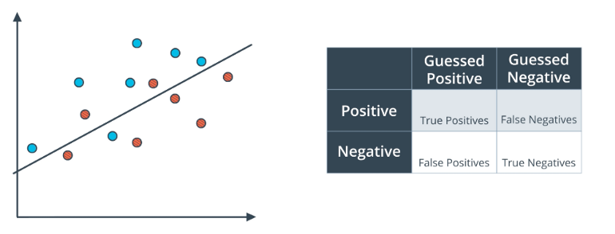
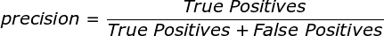
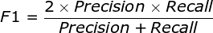
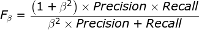
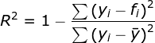
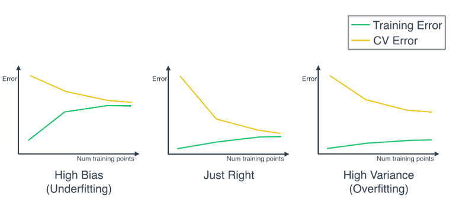

# Machine Learning Cheat Sheet — Model Evaluation and Validation

## Model Evaluation
### Confusion Matrix Summary
  
<small>*Blue Points — labelled positive; Red Points — labelled negative*</small>

True Positive: 6 blue points  
True Negative: 5 red points  
False Positive (Type 1 Error): 2 red points  
False Negative (Type 2 Error): 1 blue point  

### Accuracy

Accuracy is not always perfect for model evaluation, especially for **imbalanced data sets**.

For example, if we have a data set, where 99% of the data is positive, 1% of the data is negative. We can simply have a model which always predict positive, then the model accuracy is 99%, while we are not catching any of the negative data.

### Precision
> _Precision focuses on **False Positive** errors._

### Recall
> _Recall focuses on **False Negative** errors._

### F1 Score
> _F1 Score is a harmonic mean between Precision and Recall._

### F beta Score

If &#946; is close to 0, then F beta is close to precision, the result is more sensitive to **False Positive** errors;  
If &#946; is large, then F beta is close to recall, the result is more sensitive to **False Negative** errors;

_**Examples:**_  
&#946; should be large if the model is to detect the malfunctioning parts in cars;  
&#946; should be small if the model is to detect the potential clients to send promotion materials.  

### ROC Curve

To find ROC Curve:
1. True Positive Rate = True Positives / All Positives  
2. False Positive Rate = False Positives / All Negatives  
3. Find all the (_True Positive Rate_, _False Positive Rate_), and plot them on a plane to get a curve  
4. Calculate the area under the curve  
5. If area is close to 1, then we can get a good split from the data   set;  
   If area is close to 0.5, then the data set is random, we cannot get a good split;  
   If area is close to 0, we can flip the data and get a good split.  

### R2 Score
> _Percentage of data variation not described by the model_

R2 score close to 0, then it is a bad model;  
R2 score close to 1, then it is a good model.  

## Model Validation
**Under Fitting:** Model is too simple; high training error.  
**Over Fitting:** Model is too complicated, and memorise the training data; high test error.

**Training Set:** Used to train the model.  
**Validation Set:** Used to estimate the model, and tune the model hyper-parameters.  
**Test Set:** Used for final testing.  
> If we do not have validation set, and simply use the test results to decide on the parameters of the model, then after many iterations of this procedure, we are overfitting to the test set of data.

### K-Fold Cross Validation
1. Split the data into training set and test test
2. Split the training set into K subsets
3. Use K-1 subsets to train the model, and the 1 set to validate the model
4. Rotate step 3 K times so that each subset is used as validation set for one time
5. All of the validation error rates are averaged together.

**Pros:**  
* Allows us not to set aside a validation data set, which is beneficial when we have a small data set.  
* Prevents over fitting from over-tuning the model during grid search. If we use single validation set then there is the risk that we just select the best parameters for that specific validation set. But using k-fold we perform grid search on various validation sets so we select best hyper-parameter for generalisation.

### Learning Curve
  
<small>*For a good model, the validation error and training error converges with larger data set, and error is low.*</small>

* The training error and validation error tends to converge with more data; but more data is not always helpful if both errors are already converged to the optimal scores.  
* From learning curve, if the model is under fitting, then we can try increase the model complexity by adding more features, or decrease the regularisation parameter.  
* If the model is over fitting, we can try simplify the model by setting a smaller set of features, or increase the regularisation parameter.

### Grid Search
Training the model on different combinations of hyper-parameters, and select the combination with highest score on the validation set.