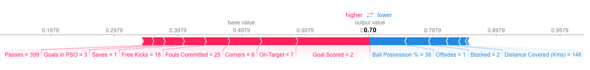

# Model Insights

## Permuation Importance
Permuation importance is an approach to measure feature importnace. The process is as follows:
1. Get a trained model.

2. Shuffle the values in a single column, make predictions using the resulting dataset. Use these predictions and the true target values to calculate how much the loss function suffered from shuffling. That performance deterioration measures the importance of the variable you just shuffled.

3. Return the data to the original order (undoing the shuffle from step 2). Now repeat step 2 with the next column in the dataset, until you have calculated the importance of each column.

If a feature has medium permutation importance, that could mean it has:
* a large effect for a few predictions, but no effect in general, or

* a medium effect for all predictions.

## Partial Dependence Plots
Partial dependence plots show how a feature affects predictions. The process is as follows:

1. We will use the fitted model to predict our outcome on a single row of data.

2. Then we repeatedly alter the value for one variable to make a series of predictions.

3. We trace out predicted outcomes (on the vertical axis) as we move from small values to large values (on the horizontal axis).

4. Repeat that mental experiment with multiple rows from the original dataset, and we plot the average predicted outcome on the vertical axis.

## SHAP Values
SHAP Values break down a prediction to show the impact of each feature. It interprets the impact of having a certain value for a given feature in comparison to the prediction we'd make if that feature took some baseline value.

Below is the SHAP equation:
```
sum(SHAP values for all features) = pred_for_team - pred_for_baseline_values
```
That is, the SHAP values of all features sum up to explain why my prediction was different from the baseline. This allows us to decompose a prediction in a graph like this:

 <br />
