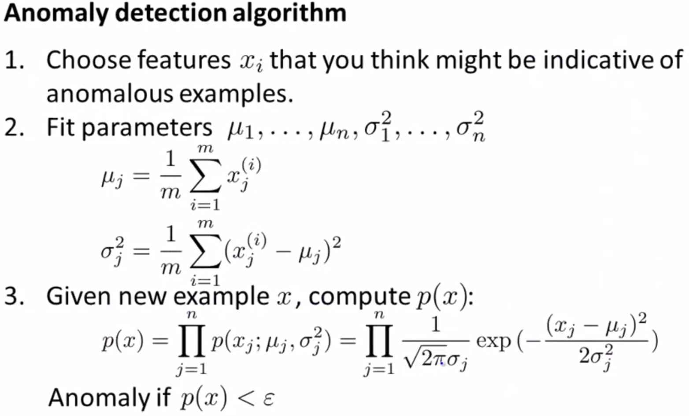
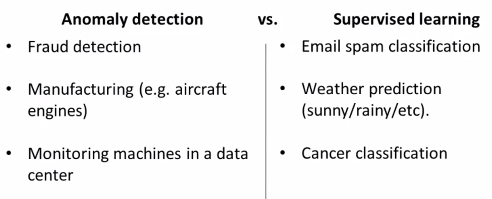
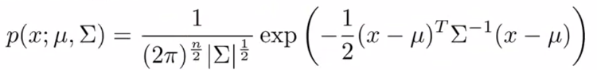

# Supervised Learning

## Regression vs. Classification
* A **regression** model predicts continuous values. For example, regression models make predictions for the value of a house in California.

* A **classification** model predicts discrete values. For example, classification models make predictions whether an email message is spam or not spam.

## Key Assumptions
The following three basic assumptions guide generalization:

* We draw examples independently and identically (i.i.d) at random from the distribution. In other words, examples don't influence each other. (An alternate explanation: i.i.d. is a way of referring to the randomness of variables.)
* The distribution is stationary; that is the distribution doesn't change within the data set.
* We draw examples from partitions from the same distribution.

If the key assumptions of supervised ML are not met, then we **lose important theoretical guarantees** on our ability to predict on new data. For example:

1. Consider a model that chooses ads to display. The i.i.d. assumption would be violated if the model bases its choice of ads, in part, on what ads the user has previously seen.
2. Consider a data set that contains retail sales information for a year. User's purchases change seasonally, which would violate stationarity.

## Linear Regression
  
<small>*W: weights; X: features*</small>

* Works best when the data is linear. If the data is not linear, then we may need to transform the data, add features, or use another model.

* Sensitive to outliers. Outliers contribute too much to the errors, so will impact the model. We may need to determine the outliers and remove them if necessary.

### Error functions:
  
<small>*Mean Absolute Error*</small>

  
<small>*Mean Squared Error*</small>

### Gradient Descent:

Gradient Descent changes the weights to move in the direction that descent the error the most.

In linear regression, split the data into many small batches. Each batch, with roughly the same number of points. Then, use each batch to update your weights. This is still called mini-batch gradient descent.

### Gradient Descent Vs Closed Form Solution:
We can solve W (weights) by setting derivatives of the Error to weights to 0. Then it is just a solving of n*n matrix (n is the number of features). But when n is too large, this requires a lot of computing power. So gradient descent will be a better solution to find the results which is close enough, but requires less computing power.

### Polynomial Regression:
Fit the data to a higher degree polynomials.

### Linear Regression and Logistic Regression
* Linear regression models the relationship between a continuous dependent variable y and one or more predictors X, by `y=WX+b`.

* Logistic regression is a classification algorithm. It is used to predict the probability that a given example belongs to the “1” class versus the probability that it belongs to the “-1” class. Usually represented by a sigmoid function.

## Naive Bayes
  
<small>*Bayes Theorem*</small>

Naive Bayes is to use the Bayes Theorem, make some assumptions (e.g. assume the features are independent, `P(A,B) = P(A)*P(B)` ), and calculate the proportions of the probability to simplify the calculation. For example: `P(A|B) ~ P(B|A)P(A)`

## Support Vector Machines
  
<small>*Margin Error (Same as L2 Regularization)*</small>

`Error = Error(Classification) + Error(Margin)`

SVM finds the classifier represented by the normal vector W and bias b of the hyperplane that separates different classes as wide as possible. Which means we need to minimize W, where `|WX+b|>1`.

When the classes are not linearly separable, a kernel trick can be used to map a non-linearly separable space into a higher dimension linearly separable space.

### C Parameter
`Error =C * Error(Classification) + Error(Margin)`

  
<small>*Impact of C*</small>

### Polynomial Kernel
Set a polynomial degree to separate the data.

### RBF Kernel
Project the points to a higher dimension with Gaussian distribution, and cut the mountains by a plane; the circles of the cuts are the boundaries.

  
<small>*Larger gamma, Narrower the Gaussian*</small>

## Decision Trees
  
<small>*Decision Tree Example*</small>

Decision trees are easy to understand and implement. However, they tend to over fit data when we exhaust the branches and go very deep with the trees.

### Entropy
  
<small>*Entropy Equation*</small>

  
<small>*Information Gain*</small>

Lower entropy means the state is more stable; higher entropy means the state has more randomness in it.

Decision Tree is to split the data into groups so that the information gain is maximized. However it is very easy to lead into **over fitting**.

### Random Forest to Avoid Over Fitting
1. Split features into groups
2. Each group forms a decision tree
3. Let the results from each decision tree to vote

### Decision Tree Hyper-parameters to Avoid Over Fitting
1. Maximum Depth — The largest possible length between the root to a leaf
2. Minimum number of samples to split
3. Minimum number of samples per leaf

## Ensemble Methods
Combine multiple models into a better model. Compared with desicion trees, random forrest and gradient boosting are two popular ways to use tree algorithms to achieve good accuracy as well as overcoming the over-fitting problem.

### Bagging
Split data into smaller subsets, and get the models for each subset; then to get the predictions, run under all the models and vote for the final prediction.

### Boosting
1. Get a simple model on the data
2. Punish the classified data more and re-run to get a new model
3. Repeat step 2 for n times
4. Combine all the n models together by model weights

### Model Weights
  

## Anomaly Detection
  

Usually there is not much anomaly data, we can split the data as in the following example:

1. Data Set
    - 10000 normal data
    - 20 anomaly data

2. Training Set - 6000 normal data (training for mean and std)

3. CV Set - 2000 normal data; 10 anomaly data (pick the proper epsilon)

4. Test Set - 2000 normal data; 10 anomaly data

  

We apply anomaly detection under the following situations:
1. When the dataset is imbalanced.

2. Many different types of anomalies. Hard for the algorithm to learn from anomalies to know what they look like.

3. Future anomalies may look nothing like any of the anomalies we have seen so far.

### Multivariate Gaussian Distribution
  

Compared with original anomaly detection model, MGD can:
1. Automatically captures correlations between features;
2. Computationally more expensive;
3. The covariance matrix will not be invertible if there are reduntant features (features have linear relations with each other) or number of examples is smaller than number of features.
