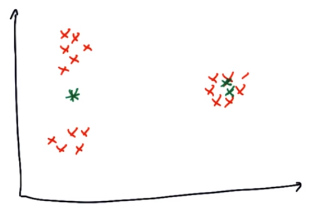
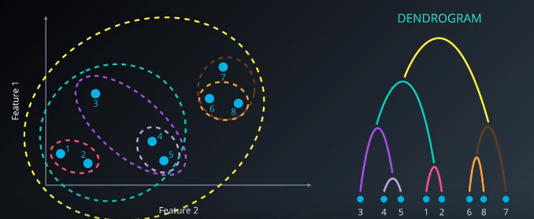

# Unsupervised Learning

## Benefits of Clustering
1. Generalization  
When some examples in a cluster have missing feature data, you can infer the missing data from other examples in the cluster.

2. Data Compression  
Feature data for all examples in a cluster can be replaced by the relevant cluster ID. This replacement simplifies the feature data and saves storage.

3. Privacy Preservation  
You can preserve privacy by clustering users, and associating user data with cluster IDs instead of specific users.

## Clustering Algorithms

### K-Means Clustering
1. Assign: set K centroids randomly, assign each point to a centroid which is closest to the point  
2. Optimize: moving the centroids to optimize the distances that are assigned to them  
3. Repeat step 1 and 2: reassign the points to the centroids, and re-optimize  

#### Disadvantages:
  
<small>*Getting 3 Clusters But in Local Minimum*</small>

1. Local Minimum — We can run the K-Means clustering multiple times with different initial conditions to find the best output.  
2. Sensitive to noise and outliers  

#### Advantage:
1. Computation efficient: `O(nk)`

#### Choosing K
1. _Elbow Method_: Plot the ascending values of k versus the total error calculated using that k, to find the minimum total error.  
2. _Average Silhouette Method_: Plot the ascending values of k versus the average silhouette (average distance between points in the same cluster) using that k, to find the maximum average silhouette.  

### Hierarchical Clustering
  
<small>*Single-Link Clustering*</small>

1. _Single-Link_: Distance between two clusters are determined by the **closest points** between two clusters. Then merge the two closest clusters into one cluster.

2. _Complete-Link_: Distance between two clusters are determined by the **farthest points** between two clusters. Then merge the two closest clusters into one cluster.

3. _Average-Link_: Distance between two clusters are determined by the **average of all points** between two clusters. Then merge the two closest clusters into one cluster.

4. _Ward_: Get 3 central points, central point A for cluster A, central point B for cluster B and central point X for all points in both clusters. Distance between two clusters are determined by summing the distance for all points to point X, subtract by distances of all points in cluster A to point A, and distances of all points in cluster B to point B. Then merge the two closest clusters into one cluster. **Least increase in variance in the cluster after merging**.

#### Advantages:
* Resulting hierarchical representation can be very informative  
* Provides an additional ability to visualise (dendrogram)  
* Especially potent when data set contains real hierarchical relationship

#### Disadvantages:
* Sensitive to noise and outliers  
* Computationally intensive `O(N²)`  

### DBSCAN

`Inputs:`  
`Epsilon - the search distance around point`  
`MinPoints - Minimum number of points required to form a cluster`  

Scan through all the points, and determine each point whether it is a noise point, core point or border point.

#### Advantages:
* No need to specify the number of clusters  
* Flexibility in the shapes and sizes of clusters  
* Able to deal with noise and outliers  

#### Disadvantages:
* Boarder points reachable from two clusters are assigned to the cluster find them first, so DBSCAN cannot guarantee the same clustering every time it runs.  
* Faces difficulty finding clusters of varying densities. (HDBSCAN can fix this issue)  

### GMM
1. Initialize K Gaussian Distributions  
Can use K-Means to find the initialization points, to set mean, variance and co-variance

2. Soft Clustering  
Find the probability for each point that which cluster it belongs to

3. Re-Estimate the Gaussians  
Use the output from step 2, find new mean and new variance for the new Gaussians by using weighted average for the points in the cluster

4. Evaluate the log-likelihood for the Gaussians

5. Repeat Step 2 - Step 4 until the log-likelihood converges 

#### Advantages:
* Soft-clustering  
For a data point, can find its membership / possibility to multiple clusters

* Cluster shape flexibility  
A cluster can contain another cluster in it  

#### Disadvantages:
* Sensitive to initialization values  
* Possible to converge to a local optimum  
* Slow convergence rate  

### K-Means Vs GMM
- K-Means advantages:

    - It is easy to implement.
    - With large number of variables, it is computationally faster.
    - Consistent and scale-invariant.
    - It is guaranteed to converge.

- GMM advantages:

    - It is much more flexible in terms of cluster covariance, which means that each cluster can have unconstrained covariance structure.
    - Soft assignment — points can belong to different clusters, with different level of membership. This level of membership is the probability of each point to belong to each cluster.

## Cluster Validation
1. External indices: Scoring methods for labelled data  
_Adjusted Rand Index_

2. Internal indices: Scoring methods for unlabelled data  
_Silhouette Coefficient_

## PCA
1. Transform input features into principal components, and use PCs as new features

2. PCs are directions in data that maximize the variance, or minimize information loss

3. PCs are independent features with each other

4. The maximum number of PCs is the number of input features 

5. Dimension Reduction, reduce noise

6. Use PCA to find the latent features driving the patterns in data

7. Make other algorithms work better because of less inputs 

## Random Projection
When PCA is too slow, we can use random projection to reduce dimensions. From D dimension to K dimension by multiplying a random matrix, and also preserve the distance between the points to a large degree.

## ICA
1. Assumes the components are statistically independent  
2. Components are non-Caussian  
3. Needs as many observations as the original sources to separate  