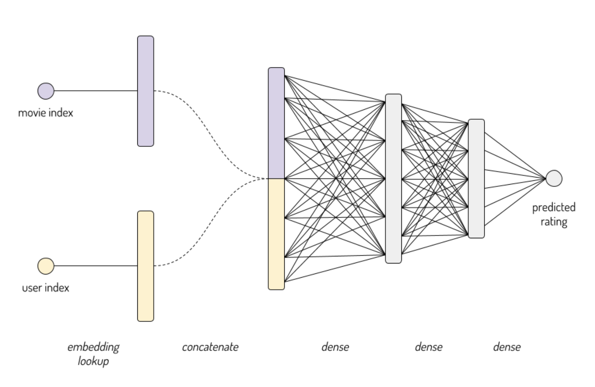
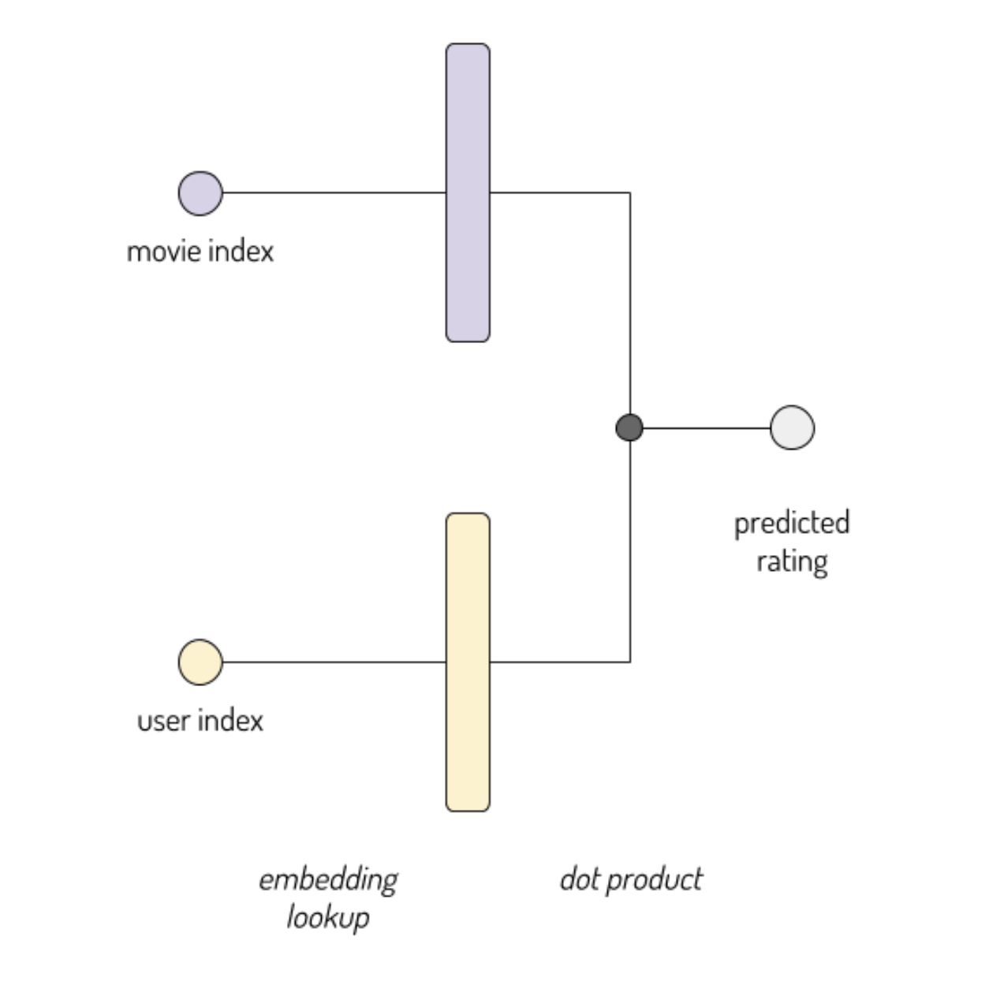

# Embedding Layers
An embedding is a mapping of discrete categorical variables to a vector of continuous numbers. In the context of neural networks, embeddings are low-dimensional, learned continuous vector representations of discrete variables. Neural network embeddings are useful because they can reduce the dimensionality of categorical variables and meaningfully represent categories in the transformed space.

Neural network embeddings have 3 primary purposes:

1. Finding nearest neighbors in the embedding space. These can be used to make recommendations based on user interests or cluster categories.

2. As input to a machine learning model for a supervised task.

3. For visualization of concepts and relations between categories.

Neural network embeddings overcome the two limitations of one-hot encoding:

1. For high-cardinality variables — those with many unique categories — the dimensionality of the transformed vector becomes unmanageable.

2. The mapping is completely uninformed: “similar” categories are not placed closer to each other in embedding space.


## Sample Code
 <br />

```python
hidden_units = (32,4)
movie_embedding_size = 8
user_embedding_size = 8

# Each instance will consist of two inputs: a single user id, and a single movie id
user_id_input = keras.Input(shape=(1,), name='user_id')
movie_id_input = keras.Input(shape=(1,), name='movie_id')

user_embedded = keras.layers.Embedding(
    df.userId.max()+1,
    user_embedding_size,
    input_length=1,
    name='user_embedding'
)(user_id_input)

movie_embedded = keras.layers.Embedding(
    df.movieId.max()+1,
    movie_embedding_size,
    input_length=1,
    name='movie_embedding'
)(movie_id_input)

# Concatenate the embeddings (and remove the useless extra dimension)
concatenated = keras.layers.Concatenate()([user_embedded, movie_embedded])
out = keras.layers.Flatten()(concatenated)

# Add one or more hidden layers
for n_hidden in hidden_units:
    out = keras.layers.Dense(n_hidden, activation='relu')(out)

# A single output: our predicted rating
out = keras.layers.Dense(1, activation='linear', name='prediction')(out)

# Add biases
bias_embedded = keras.layers.Embedding(
    df.movieId.max()+1,
    1,
    input_length=1,
    name='bias',
)(movie_id_input)
movie_bias = keras.layers.Flatten()(bias_embedded)
out = keras.layers.Add()([out, movie_bias])

model = keras.Model(
    inputs = [user_id_input, movie_id_input],
    outputs = out,
)

model.compile(
    # Technical note: when using embedding layers, I highly recommend using one of the optimizers
    # found  in tf.train: https://www.tensorflow.org/api_guides/python/train#Optimizers
    # Passing in a string like 'adam' or 'SGD' will load one of keras's optimizers (found under 
    # tf.keras.optimizers). They seem to be much slower on problems like this, because they
    # don't efficiently handle sparse gradient updates.
    tf.train.AdamOptimizer(0.005),
    loss='MSE',
    metrics=['MAE'],
)

history = model.fit(
    [df.userId, df.movieId],
    df.y,
    batch_size=5000,
    epochs=20,
    verbose=0,
    validation_split=.05,
)
```

## Matrix Factorization
 <br />

```python
movie_embedding_size = user_embedding_size = 8

# Each instance consists of two inputs: a single user id, and a single movie id
user_id_input = keras.Input(shape=(1,), name='user_id')
movie_id_input = keras.Input(shape=(1,), name='movie_id')

user_embedded = keras.layers.Embedding(
    df.userId.max()+1,
    user_embedding_size,
    input_length=1,
    name='user_embedding'
)(user_id_input)
movie_embedded = keras.layers.Embedding(
    df.movieId.max()+1,
    movie_embedding_size,
    input_length=1,
    name='movie_embedding'
)(movie_id_input)

dotted = keras.layers.Dot(2)([user_embedded, movie_embedded])
out = keras.layers.Flatten()(dotted)

model = keras.Model(
    inputs = [user_id_input, movie_id_input],
    outputs = out,
)
model.compile(
    tf.train.AdamOptimizer(0.001),
    loss='MSE',
    metrics=['MAE'],
)
model.summary(line_length=88)
```
## Cosine Distance
The embedding layers will give us vector reporesentations of spatial data. We use the **cosine distance** to judge the similarities of two vectors. We can use **Gensim** to explore the embeddings.

## Tips
### Embedding Size
Increasing the size of our embeddings will:
* Increases model's capacity, and the model will be able to recognize more complex patterns, increasing our accuracy.

* The downside is that the model might be overfitting.

### Adding Biases
* Adding biases gives our model more numbers to tune, and in this sense it's strictly increasing its "capacity".

* Because our biases get added at the very end, our model has a lot less flexibility in how to use them. And this can be a good thing. At a high level, we're imposing a prior belief - that some movies are intrinsically better or worse than others. This is a form of regularization!

### Regularization
By adding L2 regularization, we can fix the obscure recommendation problem.

In the absence of regularization, even if a movie has only a single rating, the model will try to move its embedding around to match that one rating. However, if the model has a budget for movie weights, it's not very efficient to spend it on improving the accuracy of one rating out of 20,000,000. Popular movies will be worth assigning large weights. Obscure movies should have weights close to 0.

If a movie's embedding vector is all zeros, our model's output will always be zero after dot product. For output value of 0, it corresponds to a predicted rating equal to the overall average in the training set. This seems like a reasonable behaviour to tend toward for movies we have little information about.

```python
movie_embedding_size = user_embedding_size = 8
user_id_input = keras.Input(shape=(1,), name='user_id')
movie_id_input = keras.Input(shape=(1,), name='movie_id')

movie_r12n = keras.regularizers.l2(1e-6)
user_r12n = keras.regularizers.l2(1e-7)
user_embedded = keras.layers.Embedding(
    df.userId.max()+1,
    user_embedding_size,
    embeddings_initializer='glorot_uniform',
    embeddings_regularizer=user_r12n,
    input_length=1,
    name='user_embedding'
)(user_id_input)
movie_embedded = keras.layers.Embedding(
    df.movieId.max()+1,
    movie_embedding_size,
    embeddings_initializer='glorot_uniform',
    embeddings_regularizer=movie_r12n,
    input_length=1,
    name='movie_embedding'
)(movie_id_input)

dotted = keras.layers.Dot(2)([user_embedded, movie_embedded])
out = keras.layers.Flatten()(dotted)

l2_model = keras.Model(
    inputs = [user_id_input, movie_id_input],
    outputs = out,
)
```