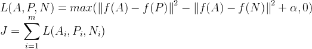

# Face Recognition

## Verification vs Recognition
Verification:
* Input image, name/ID
* Output whether the input image is that of the claimed person

Recognition:
* Has a DB of K persons
* Get an input image
* Output ID if the image is any of the K persons or not recognized.

## One-shot Learning Problem
Be able to recognize a person given just one single image, or given just one example of that person's face. Instead of using trainditional way to train the neural network, we train the neural network to learn a similarity function, which computes the difference of two input images.

### Siamese Network
1. After convolutional layers and fully connected layers, instead of feeding the output to softmax layer for classification, we take the output as an encoding of the input image `f(x)`.

2. Train the neural network parameters so that if `X1` and `X2` are the same person, then `||f(x1)-f(x2)||^2` is small; and large if they are different person.

### Triplet Loss Function
Each training/triplet set has 3 images A (anchor image or base image), P (positive image - image for the same person as A), and N (negative image - image for the different person as A). The loss function is defined as below:

 <br />

#### Triplet Selection
To ensure fast convergence for the model, it is important to select triplets that are `argmax||f(A)-f(P)||^2` (hard positive) and `argmin||f(A)-f(N)||^2` (hard negative). How we do that is:

1. Select around 40 faces per identity per mini-batch, and randomly select negative faces for the identity.

2. Use all anchor-positive pairs, and select hard negatives for training for the mini-batch.

3. Do not search hard negatives globally for training, this will result in local minima easily.

### Binary Classification
Besides Triplet Loss Function, we can also simply use binary classification as well.

After Siamese Network and getting the encoding/embeddings of the input image, we can simply feed them into a logistic regression unit to then just make a prediction. Output `1` if they are the same persons, and `0` if they are different persons.

 <br />

### Presave Embedding Results
In practical implementation, we can also pre-save the encodings/embeddings of the person faces in DB to save computation time.

## Python Implementation
```python
def triplet_loss(y_true, y_pred, alpha = 0.2):
    """    
    Arguments:
    y_true -- true labels, required when you define a loss in Keras, you don't need it in this function.
    y_pred -- python list containing three objects:
            anchor -- the encodings for the anchor images, of shape (None, 128)
            positive -- the encodings for the positive images, of shape (None, 128)
            negative -- the encodings for the negative images, of shape (None, 128)
    
    Returns:
    loss -- real number, value of the loss
    """
    
    anchor, positive, negative = y_pred[0], y_pred[1], y_pred[2]
    
    # Step 1: Compute the (encoding) distance between the anchor and the positive, you will need to sum over axis=-1
    pos_dist = tf.reduce_sum(tf.square(anchor - positive), axis = -1)
    # Step 2: Compute the (encoding) distance between the anchor and the negative, you will need to sum over axis=-1
    neg_dist = tf.reduce_sum(tf.square(anchor - negative), axis = -1)
    # Step 3: subtract the two previous distances and add alpha.
    basic_loss = pos_dist- neg_dist + alpha
    # Step 4: Take the maximum of basic_loss and 0.0. Sum over the training examples.
    loss = tf.reduce_sum(tf.maximum(basic_loss, 0.0))
    
    return loss

FRmodel = faceRecoModel(input_shape=(3, 96, 96))
FRmodel.compile(optimizer = 'adam', loss = triplet_loss, metrics = ['accuracy'])
load_weights_from_FaceNet(FRmodel)

# build the DB
database = {}
database["danielle"] = img_to_encoding("images/danielle.png", FRmodel)
database["younes"] = img_to_encoding("images/younes.jpg", FRmodel)
database["tian"] = img_to_encoding("images/tian.jpg", FRmodel)
database["andrew"] = img_to_encoding("images/andrew.jpg", FRmodel)
database["kian"] = img_to_encoding("images/kian.jpg", FRmodel)
database["dan"] = img_to_encoding("images/dan.jpg", FRmodel)
database["sebastiano"] = img_to_encoding("images/sebastiano.jpg", FRmodel)
database["bertrand"] = img_to_encoding("images/bertrand.jpg", FRmodel)
database["kevin"] = img_to_encoding("images/kevin.jpg", FRmodel)
database["felix"] = img_to_encoding("images/felix.jpg", FRmodel)
database["benoit"] = img_to_encoding("images/benoit.jpg", FRmodel)
database["arnaud"] = img_to_encoding("images/arnaud.jpg", FRmodel)

def verify(image_path, identity, database, model):
    """
    Arguments:
    image_path -- path to an image
    identity -- string, name of the person you'd like to verify the identity. Has to be a resident of the Happy house.
    database -- python dictionary mapping names of allowed people's names (strings) to their encodings (vectors).
    model -- your Inception model instance in Keras
    
    Returns:
    dist -- distance between the image_path and the image of "identity" in the database.
    door_open -- True, if the door should open. False otherwise.
    """
    encoding = img_to_encoding(image_path, model)
    dist = np.linalg.norm(encoding - database[identity])
    
    if dist < 0.7:
        print("It's " + str(identity) + ", welcome home!")
        door_open = None
    else:
        print("It's not " + str(identity) + ", please go away")
        door_open = None
        
    return dist, door_open

def who_is_it(image_path, database, model):
    """
    Arguments:
    image_path -- path to an image
    database -- database containing image encodings along with the name of the person on the image
    model -- your Inception model instance in Keras
    
    Returns:
    min_dist -- the minimum distance between image_path encoding and the encodings from the database
    identity -- string, the name prediction for the person on image_path
    """
    encoding = img_to_encoding(image_path, model)
    min_dist = 100

    for (name, db_enc) in database.items():
        dist = np.linalg.norm(encoding-db_enc)
        if dist < min_dist:
            min_dist = dist
            identity = name
    
    if min_dist > 0.7:
        print("Not in the database.")
    else:
        print ("it's " + str(identity) + ", the distance is " + str(min_dist))
        
    return min_dist, identity


```