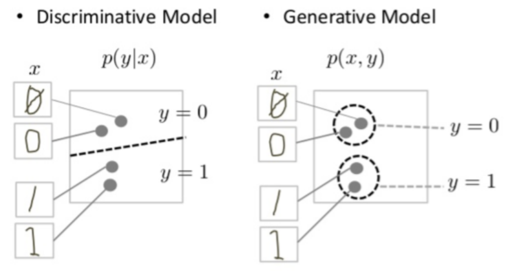

# Generative Adversarial Networks

## GANs vs Discriminative Models
* **Generative** models can generate new data instances.

* **Generative** models capture the joint probability `p(X,Y)`, or just `p(X)` if there are no labels.

* **Discriminative** models discriminate between different kinds of data instances.

* **Discriminative** models capture the conditional probability `p(Y|X)`.

  

## GAN Structure
1. The **generator** learns to generate plausible data. The generated instances become negative training examples for the discriminator.

2. The **discriminator** learns to distinguish the generator's fake data from real data. The discriminator penalizes the generator for producing implausible results.

3. When training begins, the generator produces obviously fake data, and the discriminator quickly learns to tell that it's fake.

4. As training progresses, the generator gets closer to producing output that can fool the discriminator.

5. Finally, if generator training goes well, the discriminator gets worse at telling the difference between real and fake. It starts to classify fake data as real, and its accuracy decreases.