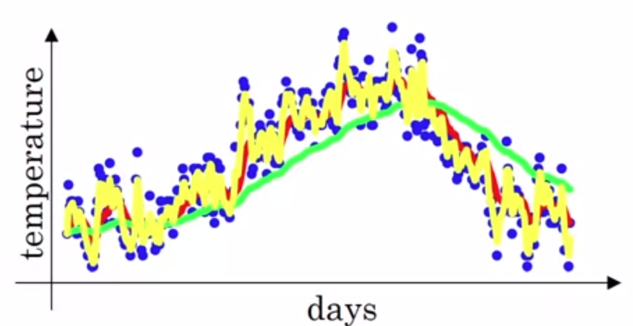
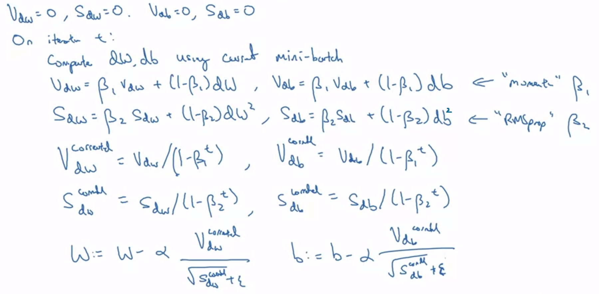

# Neural Network Basics

## Perceptron
 <br />
<small>*Perceptron is a single layer of neural network.*</small>

### Logistic Regression
Instead of predicting exactly 0 or 1, **logistic regression** generates a probability—a value between 0 and 1, exclusive. For example, consider a logistic regression model for spam detection. If the model infers a value of 0.932 on a particular email message, it implies a 93.2% probability that the email message is spam.

We need to define a classification threshold to map a logistic regression value to a binary category. 

### Prediction Bias


Logistic regression predictions should be unbiased. A significant nonzero prediction bias tells you there is a bug somewhere in your model, as it indicates that the model is wrong about how frequently positive labels occur.

Possible root causes of prediction bias are:
1. Incomplete feature set
2. Noisy data set
3. Buggy pipeline
4. Biased training sample
5. Overly strong regularization

### Calibration Plot
 <br />

Calculate the prediction bias by buckets of the data, we can form buckets in the following ways:
* Linearly breaking up the target predictions.
* Forming quantiles.

In above example plot, the predictions are poor for only part of the model. Here are a few possibilities:
1. The training set doesn't adequately represent certain subsets of the data space.
2. Some subsets of the data set are noisier than others.
3. The model is overly regularized. (Consider reducing the value of lambda.)

## Neural Networks
A neural network consists multiple layers of perceptron. It has three parts: input layer, hidden layers and output layer. The training samples define the input and output layers.

When the output layer is a categorical variable, then the neural network is a way to address classification problems. When the output layer is a continuous variable, then the network can be used to do regression. When the output layer is the same as the input layer, the network can be used to extract intrinsic features. The number of hidden layers defines the model complexity and modeling capacity.

There are functions you can compute with a small deep neural network hat shallower networks require exponentially more hidden units to compute.

### Activation Functions
Activation functions are used to add non-linearity into the model. Otherwise, no matter how many layers of neurons you add, the output is always linear to the inputs.

1. **Sigmoid Function:** <br />
 <br />
 <br />

2. **Softmax Function:** <br />
 <br />
    - **Full Softmax** is the Softmax that calculates a probability for every possible class.
    - **Candidate sampling** means that Softmax calculates a probability for all the positive labels but only for a random sample of negative labels. For example, if we are interested in determining whether an input image is a beagle or a bloodhound, we don't have to provide probabilities for every non-doggy example.
    - Candidate sampling can improve efficiency in problems having a large number of classes.
    - Softmax assumes that each example is a member of exactly one class. For many-label problem, we should use **multiple logistic regressions**.

3. **hyperbolic tangent function:** <br />
 <br />
    - Zero centered, result in faster convergence than sigmoid.
    - Usually use tanh instead of sigmoid unluess at the output layer for classification

4. **ReLU:** <br />
 <br />
    - Since the tanh and sigmoid function has very low derivatives when value is large (result in small steps and learning is very slow), we use ReLU to overcome this.

### Gradient Descent The Math
Assume the following scenario, we need to classify `m` points into 2 groups, each point has `p` features, which is represented by <code>(X<sub>1</sub>,X<sub>2</sub>,...,X<sub>p</sub>)</code>. Say we are using one layer neural networks to do that.

We feed in point `P1`, after the neuron we get <code>WX+b</code>; We apply activation function on <code>WX+b</code> (let us assume we use sigmoid function), and we can get the probability for P1 in class 1 is <code>y&#770;<sub>11</sub>=S(WX+b)</code>, and probability for P1 in class 2 is <code>y&#770;<sub>12</sub>=1-S(WX+b)</code>.

So to summerize:<br/>
<code>If y=1: p(y|x) = y&#770;</code><br/>
<code>If y=0: p(y|x) = 1-y&#770;</code><br/>
We can get:<br/>
<code>p(y|x) = y&#770;<sup>y</sup>(1-y&#770;)<sup>1-y</sup></code>

Equivalently, all we need to do now is to maximize <code>G<sub>1</sub>=y<sub>11</sub>y&#770;<sub>11</sub>+(1-y<sub>11</sub>)(1-y&#770;<sub>11</sub>)</code>; <code>Y<sub>11</sub></code> is 1 for P1 belongs to class 1, and 0 for P1 belongs to class 2. So for all these m points, we need to maximize <code>G<sub>1</sub>\*G<sub>2</sub>\*...\*G<sub>m</sub></code>. We can design the Cross-Entropy as below for `m` points and `n` classes:

 <br />
<small>*The lower the CE, the higher the probability*</small>

Then our error function can be (_we are not using MSE for the error function because MSE is non-convex and difficult for Gradient Descent_):  <br />
 <br />

Now `Gradient Descent` is applied to find the derivatives of the Error over the weights. To simplify the calculations, we only consider the error that one point produces: <code>E=-yln(y&#770;)-(1-y)ln(1-y&#770;)</code>.

We can get the derivative of the error `E` at a point `x`, with respect to the weight <code>w<sub>j</sub></code>: <br />
 <br />
and similarly: <br />
 <br />

So we can get the gradient of `E`: <br />
 <br />

Then we can set a **learning rate alpha**, and update weights and bias. <br />
_Note: `Gradient Descent` may lead to local minimum._

### Back Propagation
1. Doing a feedforward operation.

2. Comparing the output of the model with the desired output.

3. Calculating the error.

4. Running the feedforward operation backwards (backpropagation) to spread the error to each of the weights.

5. Use this to update the weights, and get a better model.

6. Continue this until we have a model that is good.

### Back Propagation The Math
 <br />
Let us assume we are doing backpropagation on the above neural network, and we still use `corss-entropy` as the error function, and our error is: <code>E=-yln(y&#770;)-(1-y)ln(1-y&#770;)</code>.

Let us first calculate the gradient descent step for <code>W<sub>21</sub></code>: <br />
 <br />
<small>*The same algorithm can be applied to <code>W<sub>21</sub>, W<sub>22</sub>, W<sub>23</sub>, W<sub>24</sub></code>.*</small>

Now Let us calculate the gradient descent step for weights between input layer and hiddent layer <code>W<sub>11</sub></code>: <br />
 <br />

Sample code is shown below:
```python
class NeuralNetwork:
    def __init__(self, x, y):
        self.input      = x
        self.weights1   = np.random.rand(self.input.shape[1],4)
        self.b1         = np.zeros((1, 4))
        self.weights2   = np.random.rand(4,1)      
        self.b2         = 0           
        self.y          = y
        self.output     = np.zeros(self.y.shape)

    def feedforward(self):
        self.layer1 = sigmoid(np.dot(self.input, self.weights1) + self.b1)
        self.output = sigmoid(np.dot(self.layer1, self.weights2) + self.b2)

    def backprop(self):
        # application of the chain rule to find derivative of the loss function with respect to weights2 and weights1
        d_weights2 = np.dot(self.layer1.T, (self.output - self.y))/self.input.shape[0]
        d_b2 = np.sum(self.output - self.y, axis=1, keepdims=True)/self.input.shape[0]
        d_weights1 = np.dot(self.input.T,  np.dot((self.output - self.y), self.weights2.T) * sigmoid_derivative(self.layer1))/self.input.shape[0]
        d_b1 = np.sum(np.dot((self.output - self.y), self.weights2.T) * sigmoid_derivative(self.layer1), axis=1, keepdims=True)/self.input.shape[0]

        # update the weights with the derivative (slope) of the loss function
        self.weights1 -= d_weights1
        self.weights2 -= d_weights2
        self.b1 -= d_b1
        self.b2 -= d_b2   
```

### Weight Initialization
In logistic regression, it was okay to initialize the weights to zero.

But for a neural network, if we initialize the weights to all 0s and then apply gradient descent, it won't work. By initializing the weights to 0s, the hidden units will start off by computing exactly the same function. And then, when you compute backpropagation, it turns out that all the updates will be symmetric. So no matter how long you train your neural network, the hidden units are still computing exactly the same function. And so in this case, there's really no point to having more than one hidden unit. Because they are all computing the same thing.

So we usually initialize with small random values around gaussian distribution to avoid vanishing/exploding gradients:
* For tanh activation functions: <code>w<sup>l</sup> = np.random.randn((a,b)) * 1/√n<sup>l-1</sup></code>
* For relu activation functions <code>w<sup>l</sup> = np.random.randn((a,b)) * 2/√n<sup>l-1</sup></code>

### Neural Network Techniques
 <br />
<small>*Binary Classification NN (or to do Regression by Removing Activation Function on Last Layer)*</small>

 <br />
<small>*Multi-Class Classification (Softmax in the output layer)*</small>

#### Early Stopping
To determine the number of training epochs. If we use too few epochs, we might underfit (`w` starts small when we initialize); if we use too many epochs, we might overfit (`w` becomes larger and larger after training when it is trying to minimize the error). <br />

 <br />
<small>*Stop Training when Testing Error starts increasing*</small>

#### Learning Rate Decay/ Schedules
1. If error derivative is steep, taking long steps; <br />
If error derivative is plain, taking small steps.

2. <code>α = α<sub>0</sub> / (1 + decay_rate*num_epoch)</code> <br />
<code>α = α<sub>0</sub> * decay_rate^num_epoch</code> <br />
<code>α = α<sub>0</sub> * k / √num_epoch</code> <br />
use a discrete staircase <br />

#### Neural Network Training Challenges
* Learning Rate <br />
It is difficult to get a proper learning rate. A small learning rate leads to slow convergence, while a large learning rate can hinder convergence and cause the loss function to fluctuate around the minimum or even to diverge. <br />

* Learning Rate Schedules <br />
Learning rate schedules try to adjust the learning rate during training, i.e. reducing the learning rate according to a pre-defined schedule or when the change in objective between epochs falls below a threshold. These schedules and thresholds, however, have to be defined in advance and are thus unable to adapt to a dataset’s characteristics. <br />

* Learning Rate on Different Features <br />
The same learning rate applies to all parameter updates. If our data is sparse and our features have very different frequencies, we need to perform a larger update for rarely occurring features. <br />

* Local Minimum <br />
We need to avoid getting trapped in local minima for non-convex error functions. In Neural Network, since there are usually high dimensional features, it is more likely to get into saddle points, rather than tranditional bowl like local minima, i.e. points where one dimension slopes up and another slopes down. These saddle points are usually surrounded by plateaus (regions where derivatives are close to 0), which makes the learning very slow and hard to escape the plateaus. <br />

#### Optimizers
* SGD Stochastic Gradient Descent (or mini-batch)<br />
    - Instead of run all the data forward and backward, and update the weights, SGD randomly shuffle the data and divides the training data into small batches, then update the weights on the gradients for each batch.
    - Models trained with smaller batches can generalize better.
    - This also runs faster, saves a lot of computation resource, and scales well with both data and model size.
    - Usually the size of batches is `64, 128, ..., 512` (make sure it can fit in GPU/CPU memory for each batch)<br />
    - 1 epoch equals to running through the entire data set for one time.

* Exponentially Weighted Averages<br />
<code>V<sub>t</sub> = β*V<sub>t-1</sub> + (1-β)*θ<sub>t</sub></code><br />
<code>V<sub>t</sub> = V<sub>t</sub>/(1-β<sup>t</sup>)</code>: for bias correction as <code>V<sub>0</sub>=0</code>
    - Yellow line: `β = 0.5`, averaging over 2 days
    - Red line: `β = 0.9`, averaging over 10 days
    - Green line: `β = 0.98`, averaging over 50 days<br />
 <br />

* Momentum <br />
Instead of define the step as the gradient descent of the current point (at local minimum, the step is 0), define the step as a sum of the previous steps `(β*step(n)+(1-β)*step(n-1))`, then times that with the learning rate; this gives us a good chance to go over the hump on local minimum. Also it smoothes out the fluctuations in the gradients (as shown above in weighted averages) and have the gradients move towards the correct direction more quickly.<br />

* Adagrad <br />
An optimizer with parameter-specific learning rates, which are adapted relative to how frequently a parameter gets updated during training. The more updates a parameter receives, the smaller the learning rate. For this reason, it is well-suited for dealing with sparse data. The weakness is that the learning rate will shrink to very small during training. <br />

* Adadelta <br />
It is an extension of Adagrad that adapts learning rates based on a moving window of gradient updates, instead of accumulating all past gradients. This way, Adadelta continues learning even when many updates have been done. <br />

* RMSProp (RMS stands for Root Mean Squared Error) <br />
<code>S<sub>dw</sub> = β<sub>2</sub>*S<sub>dw</sub> + (1-β<sub>2</sub>)*dw<sup>2</sup></code><br />
<code>S<sub>db</sub> = β<sub>2</sub>*S<sub>db</sub> + (1-β<sub>2</sub>)*db<sup>2</sup></code><br />
<code>W = W - α\*dw/√(S<sub>dw</sub>+ε)</code><br />
<code>b = b - α\*db/√(S<sub>db</sub>+ε)</code><br />
Decreases the learning rate by dividing it by an exponentially weighted average of squared gradients, so that we can smooth the fluctuations on the path to the global minimum.<br />

* Adam (Adaptive Moment Estimation) <br />
Uses a more complicated exponential decay that consists of not just considering the average (first moment), but also the variance (second moment) of the previous steps. It can be viewed as a combination of RMSprop and momentum. Usually we just tune on learning rate `α`, and use the default values for <code>β<sub>1</sub>=0.9, β<sub>2</sub>=0.999, and ε=10<sup>-8</sup></code>.<br />
 <br />

* Nadam <br />
Similar to Adam, it can be viewed as a combination of RMSprop and NAG <br />

#### Callbacks
* EarlyStopping — Stop training when a monitored quantity has stopped improving <br />
* ModelCheckpoint — Save the model after every epoch

### Network Layers
* First hidden layer specifies the input shape, then each layer takes the outputs from the previous layer as inputs and pipes through to the next layer. <br />

* Activation layers <br />
specifies activation function for the Dense layers (e.g., `model.add(Dense(128)); model.add(Activation('softmax'))` is equivalent to `model.add(Dense(128, activation="softmax"))`). By separating the activation layers allows direct access to the outputs of each layer before the activation is applied. <br />

* Output Layer <br />

 <br />

### Vanishing Gradient Problem
The gradient tends to get smaller as we move backward through the hidden layers. So in deep neural network, the gradients of the loss function in lower layers approaches zero, making the network hard to train. The random initialization means the first layer throws away most information about the input image. Even if top layers have been extensively trained, they will still find it extremely difficult to identify the input image, simply because they don’t have enough information. Below are a few techniques to avoid vanishing gradient problem.

* RELU <br />
ReLU has a derivative of 1, while sigmoid function has a derivative of 0.25 maximum.

* ResNet <br />
Residual networks provide residual connections straight to earlier layers. The residual connection directly adds the value at the beginning of the block to the end of the block `(F(x)+x)`. This residual connection doesn’t go through activation functions that “squashes” the derivatives, resulting in a higher overall derivative of the block.

* Batch Normalization <br />
The vanishing gradient problem arises when a large input space is mapped to a small one, causing the derivatives to disappear. Batch normalization reduces this problem by simply normalizing the input so `|x|` doesn’t reach the outer edges of the sigmoid function.

Similar is the case with exploding gradient, If we initialize our weight matrices with very large values, then the gradients for the lower layers involve products of many large terms. In this case you can have exploding gradients: gradients that get too large to converge. Batch normalization  and lower learning rate can help prevent exploding gradients.

### Dead Filters
ReLU units can be fragile during training and can “die”. For example, a large gradient(usually caused by aggressive learning rates) flowing through a ReLU neuron could cause the weights to update in such a way that the neuron will never activate on any datapoint again. If this happens, then the gradient flowing through the unit will forever be zero from that point on. That is, the ReLU units can irreversibly die during training since they can get knocked off the data manifold. For example, you may find that as much as 40% of your network can be “dead” (i.e. neurons that never activate across the entire training dataset) if the learning rate is set too high. With a lower learning rate this is less frequently an issue.

**Leaky ReLUs** with a small positive gradient for negative inputs (e.g. `y= max{0.01x, x}`) are one attempt to address this issue and give a chance to recover.

For sigmoid units, if weights are very large numbers, then the sigmoid will saturate(tail regions), resulting into dead as well. Therefore, we usually initialize the weights for `n` inputs with below techniques:
* uniform distribution with weights equal to `1/n`.
* normal distribution with scale `1/√n`.