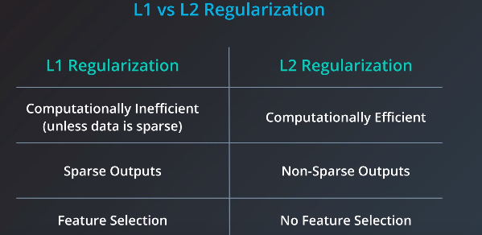
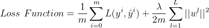
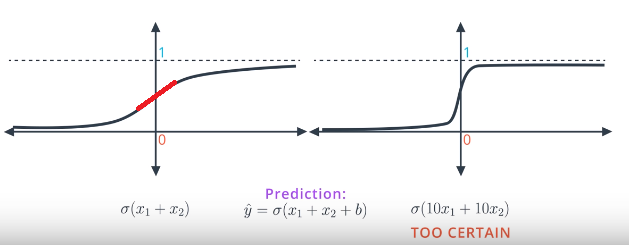
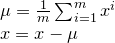
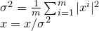
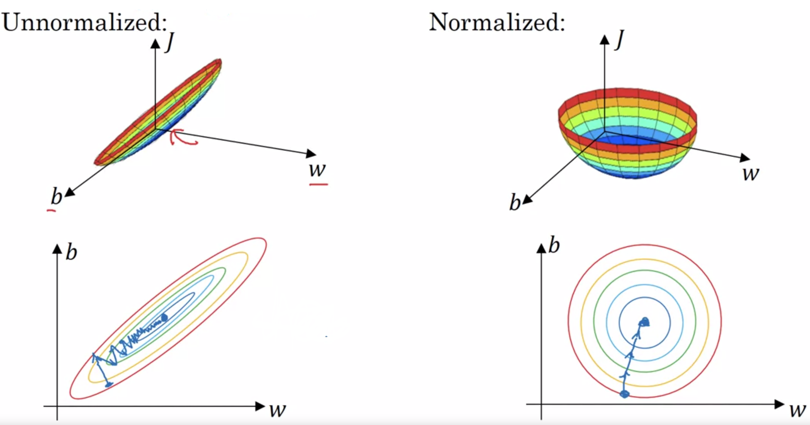

# Neural Network Optimization Techniques

## Regularization
Regularization takes the coefficients into part of the error, as large coefficients may result in over fitting.

* **L1 Regularization** — Add the absolute of the coefficients into the error.

* **L2 Regularization** — Add the squares of the coefficients into the error.

 <br />
<small>***Computation Efficiency**: Absolute values are difficult to calculate the derivation. <br />*
***Sparse Outputs**: Lots of features, but only a few is relevant to the results. <br />*
***Feature Selection**: L1 Regularization can find the features that are important and relevant. For example, for weights `(1, 0)` and `(0.5, 0.5)`, they are the same amount of errors in in L1, but in L2, `(0.5, 0.5)` is favored. <br />*</small>

### Neural Network Regularization
 <br />
<small>*We usually only do regularization on weights (`w`), and ommit `b`, as there are way more `w` parameters so that we can simply ignore `b` parameters. <br />
We usually use L2 regularizations; as L1 regularization will make the w parameters very sparse, which has no benefit for neural network.*</small>

Why we need regularization in Neural Networks:

1. Without regularization, the asymptotic nature of logistic regression would keep driving loss towards 0 in high dimensions, result in over fitting. <br />

    * Model on the left (small coefficients)has larger errors, model on the right (large coefficients) has smaller errors.

    * Model on the right is better than the model on the right; Model on the right is too certain, and has little room to apply gradient descent; easily results in over fitting.

    * Bad models are usually too certain of themselves; good models are full of doubts.

    * So we add regularization to punish on the large coefficients.

2. By penalizing on the weight parameters, we can have smaller `w` values, results in lighter neurons, and simplify the network to avoid overfitting.

3. With regularization, we will have small values for weights, which will results in smaller input data into the activation functions. By having small values (which are close to 0) into the sigmoid/tanh function, it is close to linear (as per the red line in the image above). So it will result in simpler network.

## Dropout Regularization
```python
keep_prob = 0.8

dl = np.random.rand(al.shape[0], al.shape[1]) < keep_prob
al = np.multiply(al, dl)

# Inverted dropout - make sure the expected output from layer remains the same, which makes test easier as there is no scaling problem
al /= keep_prob
```
1. This is the probability that each node gets dropped at each epoch during training. In a fully connected layer, neurons develop co-dependency with each other during training, and will result in overfitting. Dropout can prevent over fitting.

2. Dropout also forces the model to learn a redundant representation for everything to make sure that at least some of the information remains. By learning redundantly, it also means the neuron in the later layer cannot trust the neurons int the previous layer (as it can get dropped), so it will spread the weights across the neurons instead of have a large weight on one neuron. This effect is also similar to L2 regularization.

4. During testing, set dropout probability to 0 to keep all units and maximize the power of the model. Also we do not want our output to be random.

5. We can have different dropout probability on different layers, depends on the number of neurons on the layer.

6. Usually do not use dropout unless the algorithm is overfitting. It is mainly used in Computer Vision as you usually just don't have enough data (for all these pixels with all the possible values), so you're almost always overfitting.

7. Disadvantage of dropout is that the cost function will not be well defined.

## Normalizing Inputs
Steps to normalize the input data:

1. Zero out the mean <br />


2. Normalize the variances <br />


3. Use the same `μ` and `σ` to normalize the test set



The reason to normalize the input data is that:
1. If the features are on very different scales, and we do not normalized input features, then the range of values for the parameters w1 and w2 will end up taking on very different values. And the cost function will look like a very squished out bowl. The gradient descent will have to use a very small learning rate and need a lot of steps to find the minimum.

2. If you normalize the features, then your cost function will on average look more symmetric, and looks like spherical contours. The gradient descent can take much larger steps to get to the minimum.

## Batch Normalization
### Training
1. We normalize the data before activation function in each neuron **for each mini-batch**.

2. Normalize the values `z` to `z_norm` for the mini-batch, and then update it to `γ * z_norm + β`
    - To set the mean and variance of z to whatever we want.
    - `γ` and `β` (shapes are the same as `z`) are learnt during the training.
    - We add `γ` and `β` because if `z` is 0-mean and standard deviation, then all the values will fall around 0; after sigmoid function, this will act like linear function.
    - We do not need to train `b` (set them to 0) as we normalize them anyway.

### Testing
During training, the `μ` and `σ` for normalization is computed on each mini-batch, so during training, we use exponationally weighted average across mini-batches to compute the `μ` and `σ` that is used for testing.

### Why Batch Normalization
1. To make weights in later layers more robust to changes in weights in earlier layers (covariant shit), as the inputs to later layers will have stable mean and variance.

2. Since the mean/ variance are computed on each mini-batch during training, this introduces some noises and will have some regularization effect.

## Hyperparameters Tuning
1. Instead of using grid search, we can try sample the hyperparameters randomly.

2. Instead of sampling uniformly random, it makes more sense to sample on a log scale:
    - for sampling on `0.0001` to `0.1`
        - `r = np.random.rand() * b + a` range in `(a, a+b)`.
        - then take the value of `10^r` to get log scale samples.
    - for sampling on `0.9` to `0.9999`
        - sample on `0.0001` to `0.1` first
        - then `1 - sampel_value`

3. While training models in practice, you can either babysitting one model (tune the parameters while the model is running) if computation resources are limited and model is large; or traing models in parallel.

### Bias Variance Analysis
When training error is far away from bayes error (high bias):
1. Try bigger model
2. Try better optimization algorithms (Adam)
3. Try different NN architecture/ hyperparameter search

When validation error is far away from training error (high variance):
1. Try more data
2. Try regularization
3. Try different NN architecture/ hyperparameter search

### Error Analysis
Check whrere are the errors are from and decide which to improve.

For training data with label errors, usually it is okay to ignore them if the training data is large enough and the errors are random; However if the errors are systematic (i.e. consistantly label white dogs as cats), then we need to fix these errors.

### Data Mismatch
When we do not have enough data for train, validation and test from the same data srouce, and we have a lot of similar data from a different source, what we can do is:
1. Take all the data from different source, and a small portion from the target source to form the training set; and further split it into **training set** and **training-validation set**.

2. Take the rest of data from the target source to split into **validation set** and **test set**.

3. Now we have 4 sets of data and 5 sets of errors: bayes error, train error, train-validation error, validation error and test error; Base on this, we can clearly define bias, variance, or error is from data mismatch.

4. If there is data mismatch error, we can analysis the difference of the data source, and maybe simulate/manually manipulate/collect the data source to make it similar to the target data source.