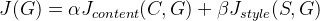
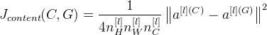
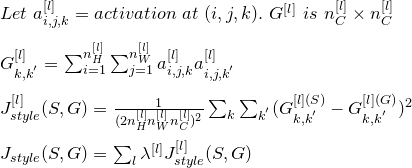

# Neural Style Transfer
From a content image (C) and a style image (S), generate a new image (G) with the same style.

1. Initialize G randomly.

2. Use gradient descent to minimize cost function J(G).

3. Then we can get the output G.

## Cost Function
 <br />

### Content Cost Function
1. Use a pre-trained ConvNet, pick a hidden layer `l` to compute content cost (usually we choose a middle layer).

2. Let <code>a<sup>\[l](C)</sup></code> and <code>a<sup>\[l](G)</sup></code> be the activation of layer `l` on the images; if they are similary, then both images have similar content.

     <br />

### Style Cost Function
Style is the correlation between activations across channels in the layer. Below is formula for style matrix:

 <br />

## Python Implementation
```python
def compute_content_cost(a_C, a_G):
    """    
    Arguments:
    a_C -- tensor of dimension (1, n_H, n_W, n_C), hidden layer activations representing content of the image C 
    a_G -- tensor of dimension (1, n_H, n_W, n_C), hidden layer activations representing content of the image G
    
    Returns: 
    J_content -- scalar that you compute using equation 1 above.
    """

    m, n_H, n_W, n_C = a_G.get_shape().as_list()

    a_C_unrolled = tf.reshape(a_C,shape=[m, n_H*n_W, n_C])
    a_G_unrolled = tf.reshape(a_G,shape=[m, n_H*n_W, n_C])

    J_content = tf.reduce_sum(tf.square(a_C_unrolled - a_G_unrolled))/(4 * n_H * n_W * n_C)
    
    return J_content

def gram_matrix(A):
    """
    Argument:
    A -- matrix of shape (n_C, n_H*n_W)
    
    Returns:
    GA -- Gram matrix of A, of shape (n_C, n_C)
    """
    GA = tf.matmul(A, tf.transpose(A))    
    return GA

def compute_layer_style_cost(a_S, a_G):
    """
    Arguments:
    a_S -- tensor of dimension (1, n_H, n_W, n_C), hidden layer activations representing style of the image S 
    a_G -- tensor of dimension (1, n_H, n_W, n_C), hidden layer activations representing style of the image G
    
    Returns: 
    J_style_layer -- tensor representing a scalar value, style cost defined above by equation (2)
    """
    m, n_H, n_W, n_C = a_G.get_shape().as_list()
    
    a_S = tf.reshape(a_S, [n_H*n_W, n_C])
    a_G = tf.reshape(a_G, [n_H*n_W, n_C])

    GS = gram_matrix(tf.transpose(a_S))
    GG = gram_matrix(tf.transpose(a_G))

    J_style_layer = tf.reduce_sum(tf.square(GS - GG))/(4 * n_H**2 * n_W**2 * n_C**2)
    
    return J_style_layer

STYLE_LAYERS = [
    ('conv1_1', 0.2),
    ('conv2_1', 0.2),
    ('conv3_1', 0.2),
    ('conv4_1', 0.2),
    ('conv5_1', 0.2)]

def compute_style_cost(model, STYLE_LAYERS):
    """    
    Arguments:
    model -- our tensorflow model
    STYLE_LAYERS -- A python list containing:
                        - the names of the layers we would like to extract style from
                        - a coefficient for each of them
    
    Returns: 
    J_style -- tensor representing a scalar value, style cost defined above by equation (2)
    """
    J_style = 0

    for layer_name, coeff in STYLE_LAYERS:
        out = model[layer_name]
        a_S = sess.run(out)
        a_G = out
        
        J_style_layer = compute_layer_style_cost(a_S, a_G)
        J_style += coeff * J_style_layer

    return J_style

def total_cost(J_content, J_style, alpha = 10, beta = 40):
    """    
    Arguments:
    J_content -- content cost coded above
    J_style -- style cost coded above
    alpha -- hyperparameter weighting the importance of the content cost
    beta -- hyperparameter weighting the importance of the style cost
    
    Returns:
    J -- total cost as defined by the formula above.
    """
    J = alpha * J_content + beta * J_style    
    return J

# Reset the graph
tf.reset_default_graph()

# Start interactive session
sess = tf.InteractiveSession()

content_image = scipy.misc.imread("images/louvre_small.jpg")
content_image = reshape_and_normalize_image(content_image)

style_image = scipy.misc.imread("images/monet.jpg")
style_image = reshape_and_normalize_image(style_image)

generated_image = generate_noise_image(content_image)

model = load_vgg_model("pretrained-model/imagenet-vgg-verydeep-19.mat")
sess.run(model['input'].assign(content_image))

out = model['conv4_2']
a_C = sess.run(out)
a_G = out
J_content = compute_content_cost(a_C, a_G)

# Assign the input of the model to be the "style" image 
sess.run(model['input'].assign(style_image))

# Compute the style cost
J_style = compute_style_cost(model, STYLE_LAYERS)

J = total_cost(J_content, J_style)

# define optimizer (1 line)
optimizer = tf.train.AdamOptimizer(2.0)

# define train_step (1 line)
train_step = optimizer.minimize(J)

def model_nn(sess, input_image, num_iterations = 200):
    sess.run(tf.global_variables_initializer())
    generated_image = sess.run(model["input"].assign(input_image))
    
    for i in range(num_iterations):
        sess.run(train_step)
        generated_image = sess.run(model['input'])

        # Print every 20 iteration.
        if i%20 == 0:
            Jt, Jc, Js = sess.run([J, J_content, J_style])
            print("Iteration " + str(i) + " :")
            print("total cost = " + str(Jt))
            print("content cost = " + str(Jc))
            print("style cost = " + str(Js))
            
            # save current generated image in the "/output" directory
            save_image("output/" + str(i) + ".png", generated_image)
    
    # save last generated image
    save_image('output/generated_image.jpg', generated_image)
    
    return generated_image

model_nn(sess, generated_image)
```
