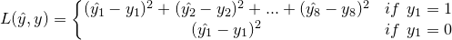
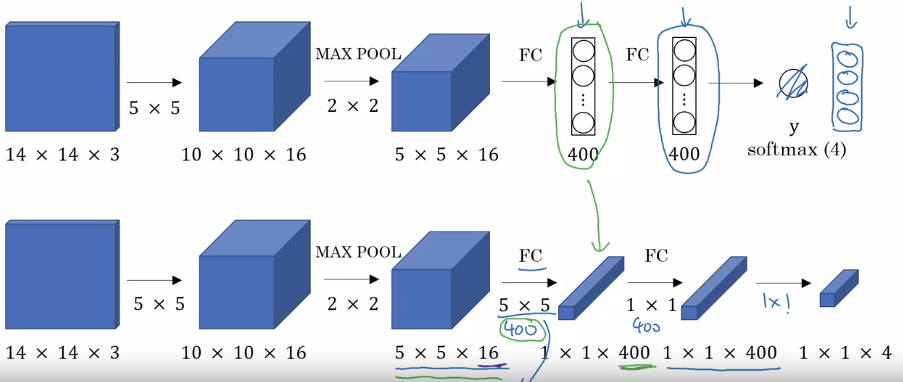
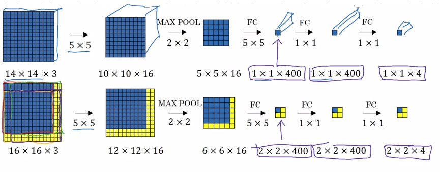

# Object Detection
Image classification => Localization => Detection

## Object Localization

### Defining Target
Assume the following classes:
1. pedestrian
2. car
3. motorcycle
4. background

The target label y will be defined as `[Pc, bx, by, bh, bw, c1, c2, c3]`: </br>
`Pc`: `1` if there is an object, `0` otherwise. </br>
`bx, by, bh, bw`: Boundary box for the object. `bx, by` range in (0, 1); `bh, bw` range in (0, ∞). </br>
`c1, c2, c3`: `1` if the image belongs to the class, `0` otherwise. </br>

For example, with car in the image, output is `[1, bx, by, bh, bw, 0, 1, 0]`; with nothing in the image, output is `[0, ?, ?, ?, ?, ?, ?, ?]`.

### Defining Loss Function
The loss function for the above case will be: <br />
 <br />

### Landmark Detection
During training, we can also add the landmark points on the objects to detect for the model to learn to identify the landmark points for the objects. These landmark points can later on be used for face recognition or body gesture recognition.

## Object Detection
### Sliding Window Detection
1. Train the model with closely cropped images of cars.

2. Use a sliding window of defined size, sliding through the input image, and feed the data into the model for detection.

3. Computation cost is high

### Convolutional Implementation of Sliding Window
In ConvNets, instead of having fully connected layers, we use convolution filters to convert them into 1x1xN feature maps:

 <br />

Then, instead of use sliding window to do computation on the model multiple times, we can feed the entire image in and get the result to save computation cost:

 <br />

The downside is that the position of the bounding box is not very accurate.

### YOLO
1. Split the input image into grids.

2. Apply the Object Localization Algorithm onto each of the grids.

3. Just like Convolutional Implementation of Sliding Window, you can compute the entire image on the model all at once to save computation cost.

### Intersection Over Union
```
IoU = Intersection(actual_bounding_box, predicted_bounding_box) / Union(actual_bounding_box, predicted_bounding_box)
```

IoU must be larger than threshold (usually 0.5) to judge the predction is correct or not.

### Non-max Suppression
The same object can be detected multiple times in different grids.

1. Discard all the detections with low `Pc` (e.g. lower than 0.6).

2. Pick the detection with highest `Pc` for the class.

3. Suppress the ones that have high IoU (e.g. larger than 0.5) with that detection.

4. Repeat step 2 and 3 until no detections left.

For multi-class detection, we can just repeat the above algorithm for each class.

### Anchor Boxes
Anchor Boxes enable a grid to detect multiple objects.

* With no anchor box, each object in training image is assigned to grid cell that contains that object's midpoint.

* With anchor box, each object in training image is assigned to grid cell that contains object's midpoint and anchor box for the grid cell with highest IoU.

* The output label y will be size `8 * m` (m is the number of anchor boxes each grid)

### Put It All Together
1. For each grid cell, get 2 predicted bounding boxes (assume we use 2 anchor boxes).

2. Get rid of low probability predictions.

3. For each class, use non-max suppression to generate final predictions.

### R-CNN
* R-CNN: Propose regions. Classify proposed regions one at a time. Output label + bounding box.

* Fast R-CNN: Propose regions. Use convolutional implementation of sliding windows to classify all the proposed regions.

* Faster R-CNN: Use convolutional network to propose regions.

## Yolo Implementation in Python
```python
def yolo_filter_boxes(box_confidence, boxes, box_class_probs, threshold = .6):
    """Filters YOLO boxes by thresholding on object and class confidence.
    
    Arguments:
    box_confidence -- tensor of shape (19, 19, 5, 1)
    boxes -- tensor of shape (19, 19, 5, 4)
    box_class_probs -- tensor of shape (19, 19, 5, 80)
    threshold -- real value, if [ highest class probability score < threshold], then get rid of the corresponding box
    
    Returns:
    scores -- tensor of shape (None,), containing the class probability score for selected boxes
    boxes -- tensor of shape (None, 4), containing (b_x, b_y, b_h, b_w) coordinates of selected boxes
    classes -- tensor of shape (None,), containing the index of the class detected by the selected boxes
    
    Note: "None" is here because you don't know the exact number of selected boxes, as it depends on the threshold. 
    For example, the actual output size of scores would be (10,) if there are 10 boxes.
    """

    box_scores = box_confidence * box_class_probs

    box_classes = K.argmax(box_scores, axis = -1)
    box_class_scores = K.max(box_scores, axis = -1)

    filtering_mask = box_class_scores >= threshold

    scores = tf.boolean_mask(box_class_scores, filtering_mask)
    boxes = tf.boolean_mask(boxes, filtering_mask)
    classes = tf.boolean_mask(box_classes, filtering_mask)
    
    return scores, boxes, classes

def iou(box1, box2):
    """Implement the intersection over union (IoU) between box1 and box2
    
    Arguments:
    box1 -- first box, list object with coordinates (x1, y1, x2, y2)
    box2 -- second box, list object with coordinates (x1, y1, x2, y2)
    """

    xi1 = np.max([box1[0], box2[0]])
    yi1 = np.max([box1[1], box2[1]])
    xi2 = np.min([box1[2], box2[2]])
    yi2 = np.min([box1[3],box2[3]])
    inter_area = max((yi2-yi1),0) * max((xi2-xi1),0)

    box1_area = (box1[3]-box1[1]) * (box1[2] - box1[0])
    box2_area = (box2[3]-box2[1]) * (box2[2] - box2[0])
    union_area = box1_area + box2_area - inter_area

    iou = inter_area/union_area
    
    return iou

def yolo_non_max_suppression(scores, boxes, classes, max_boxes = 10, iou_threshold = 0.5):
    """
    Applies Non-max suppression (NMS) to set of boxes
    
    Arguments:
    scores -- tensor of shape (None,), output of yolo_filter_boxes()
    boxes -- tensor of shape (None, 4), output of yolo_filter_boxes() that have been scaled to the image size (see later)
    classes -- tensor of shape (None,), output of yolo_filter_boxes()
    max_boxes -- integer, maximum number of predicted boxes you'd like
    iou_threshold -- real value, "intersection over union" threshold used for NMS filtering
    
    Returns:
    scores -- tensor of shape (, None), predicted score for each box
    boxes -- tensor of shape (4, None), predicted box coordinates
    classes -- tensor of shape (, None), predicted class for each box
    
    Note: The "None" dimension of the output tensors has obviously to be less than max_boxes. Note also that this
    function will transpose the shapes of scores, boxes, classes. This is made for convenience.
    """
    
    max_boxes_tensor = K.variable(max_boxes, dtype='int32')

    K.get_session().run(tf.variables_initializer([max_boxes_tensor]))

    nms_indices = tf.image.non_max_suppression(boxes, scores, max_boxes,iou_threshold )

    scores = K.gather(scores, nms_indices)
    boxes = K.gather(boxes, nms_indices)
    classes = K.gather(classes, nms_indices)
    
    return scores, boxes, classes

def yolo_eval(yolo_outputs, image_shape = (720., 1280.), max_boxes=10, score_threshold=.6, iou_threshold=.5):
    """
    Converts the output of YOLO encoding (a lot of boxes) to your predicted boxes along with their scores, box coordinates and classes.
    
    Arguments:
    yolo_outputs -- output of the encoding model (for image_shape of (608, 608, 3)), contains 4 tensors:
                    box_confidence: tensor of shape (None, 19, 19, 5, 1)
                    box_xy: tensor of shape (None, 19, 19, 5, 2)
                    box_wh: tensor of shape (None, 19, 19, 5, 2)
                    box_class_probs: tensor of shape (None, 19, 19, 5, 80)
    image_shape -- tensor of shape (2,) containing the input shape, in this notebook we use (608., 608.) (has to be float32 dtype)
    max_boxes -- integer, maximum number of predicted boxes you'd like
    score_threshold -- real value, if [ highest class probability score < threshold], then get rid of the corresponding box
    iou_threshold -- real value, "intersection over union" threshold used for NMS filtering
    
    Returns:
    scores -- tensor of shape (None, ), predicted score for each box
    boxes -- tensor of shape (None, 4), predicted box coordinates
    classes -- tensor of shape (None,), predicted class for each box
    """

    box_confidence, box_xy, box_wh, box_class_probs = yolo_outputs

    boxes = yolo_boxes_to_corners(box_xy, box_wh)

    scores, boxes, classes = yolo_filter_boxes(box_confidence, boxes, box_class_probs, threshold = score_threshold)
    
    boxes = scale_boxes(boxes, image_shape)

    scores, boxes, classes = yolo_non_max_suppression(scores, boxes, classes)
    
    return scores, boxes, classes
```