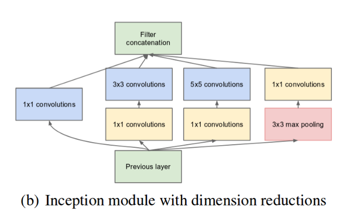

# ResNets and Inception Networks

## ResNets
Due to vanishing/exploding gradient problems, very deep Neural Networks are difficult to train. ResNets can solve this problem.

### Theory Behind ResNets
  

<code>a[l+2] = g(z[l+2] + a[l]) = g(w[l+2]a[l+1] + b[l+2] + a[l]) </code>  

If we have <code>w[l+2]</code> and <code>b[l+2]</code> to be `0`, then we can get <code>a[l+2] = g(a[l]) = a[l] </code>. Which means it is very easy for the new ResNet to learn to reproduce the network without residual block. So we can conclude that it will not hurt the performance as the baseline.

If <code>z[l+2]</code> and <code>a[l]</code> have different dimensions, we can add an extra matrix `w` to multiply with <code>a[l]</code> or just *zero-padding* <code>a[l]</code> to make it the same dimension as <code>z[l+2]</code>.

## Inception Networks

### 1X1 Convoluction
A problem with deep convolutional neural networks is that the number of feature maps often increases with the depth of the network. This problem can result in a dramatic increase in the number of parameters and computation required when larger filter sizes are used, such as 5×5 and 7×7.

* The 1×1 filter can be used to create a linear projection of a stack of feature maps.

* The projection created by a 1×1 can act like channel-wise pooling and be used for dimensionality reduction.

* The projection created by a 1×1 can also be used directly or be used to increase the number of feature maps in a model.

### Inception Module
  

The input data may have huge variation in the location of the information, choosing the right kernel size for the convolution operation becomes tough. A larger kernel is preferred for information that is distributed more globally, and a smaller kernel is preferred for information that is distributed more locally.

So we use inception module to overcome it. It performs convolution on an input, with 3 different sizes of filters (1x1, 3x3, 5x5). Additionally, max pooling is also performed. The outputs are concatenated and sent to the next inception module. **To make it cheaper, we can limit the number of input channels by adding an extra 1x1 convolution**.