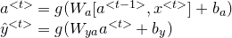
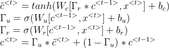
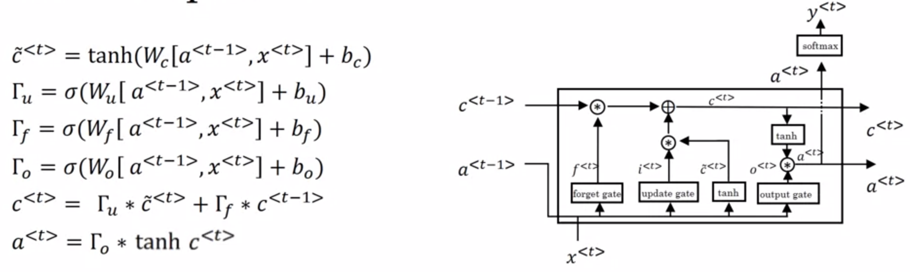
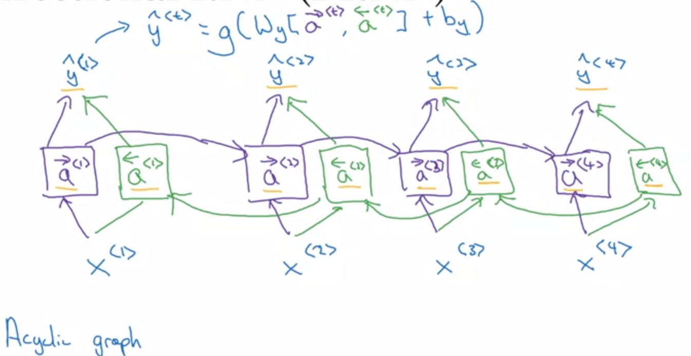

# Recurrent Neural Networks

## Notations
<code>x<sup>(i)\<t></sup></code>: The t<sup>th</sup> element of the i<sup>th</sup> training example. </br>
<code>T<sub>x</sub><sup>(i)</sup></code>: The length of the input sequence of the i<sup>th</sup> training example. </br>
<code>y<sup>(i)\<t></sup></code>: The t<sup>th</sup> element in the output sequence of the i<sup>th</sup> training example. </br>
<code>T<sub>y</sub><sup>(i)</sup></code>: The length of the output sequence of the i<sup>th</sup> training example. </br>

## Basica RNN
RNN overcomes two main disadvantages of regular neural networks:
1. Inputs, outputs can be different lengths in different samples.
2. Does not share features learned across different positions of text.

 <br />

 <br />

## Language Model
 <br />

### Training
1. Training Set: large corpus of english text.

2. We tokenize the sentence + 2 extra tokens `EOS` and `UNK`.

3. For each sequence layer, we use softmax to predict <code>y<sup>(i)\<t></sup></code> for all the possible words with inputs <code>x<sup>(i)\<t></sup>=y<sup>(i)\<t-1></sup>, a<sup>\<t-1></sup></code> (predict the next word base on previous words, and set 0 for initial inputs <code>x<sup>1</sup>, a<sup>0</sup></code>).

4. For each training sample, we calculate the prediction of the sentence: `P(y1,y2,y3) = P(y1)P(y2|y1)P(y3|y1,y2)`.

5. Loss Function is as below:

     <br />

### Sampling
1. Feed in initial inputs <code>x<sup>1</sup>=0, a<sup>0</sup>=0</code>, get the probability of all the words.

2. Use `np.random.choice` to pick a word, and feed that word along with computed  <code>a<sup>1</sup></code> into the second sequence.

3. Repeat step 2.

## Vanishing Gradients in RNNs
Due to vanishing gradients, in RNN model, the later sequences cannot have much impact on very early sequence. Below are a few techniques for this problem.

*For exploding gradients, we can simply use **gradient clipping**.*

### Gated Recurrent Unit
 <br />

 <br />

The basic idea of DRU is to use a gate `Γu` to decide whether to store the word in memory cell `c` or not, and then we can store the workd in momory long enough until it is used in later sequence.

We use sigmoid function to calculate `Γu` because sigmoid result can easily fall close to `0` or `1` for large inputs.

### Long Short Term Memory
 <br />

We have three gates in LSTM: update gate, forget gate, and output gate.

## Bidirectional RNN
 <br />

One disadvantage is that we need the entire sentence to make the prediction.

## Deep RNNs
 <br />

## Python Implementation
```python
```