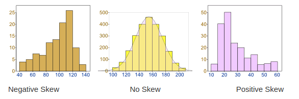
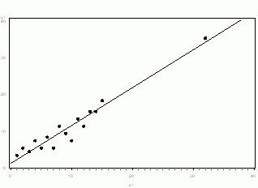
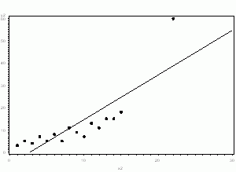
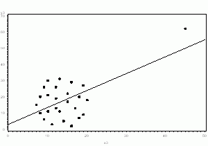

# Machine Learning Cheat Sheet — Data Processing Techniques

### Skewed Data

Outliers affect the distribution. If a value is significantly below the expected range, it will drag the distribution to the left, making the graph left-skewed or negative. Alternatively, if a value is significantly above the expected range, it will drag the distribution to the right, making the graph right-skewed or positive.

There are different ways to handle skewed data:
* Log Function, then Normalization
* Hyperbolic Tangent
* Percentile Linearization

### Data Normalization
For tree based models, we may not need data normalization;  
For linear models, we need to normalize the data, so that all the feature values fall in range _(0, 1)_. Otherwise, the model prediction results will be biased on the features with large values.

**Disadvantage:**   
Data normalization is sensitive to outliers.

### One-hot Encoding
Convert categorical data into binary variables. For example, convert feature gender into two columns, male and female, with value 0 or 1.

### Imbalanced Data Set
> Data is not well distributed among different classes. For example, only less than 0.1% of all the bacnk transactions are fraud.
1. **Use proper evaluation metrics**

2. **Under-sampling**  
This method is used when quantity of data is sufficient. Keep all samples in the rare class and randomly select an equal number of samples in the abundant class to form a balanced new dataset.  
Or use _Tomek Links_, which are pairs of points (A,B) such that A and B are each other’s nearest neighbor, and they have opposing labels. And remove from the abundant class along the _Tomek Links_.

3. **Over-sampling**  
This method is used when the quantity of data is insufficient. It tries to balance dataset by increasing the size of rare samples.  
    - Randomly pick a point from the minority class.
    - Compute the k-nearest neighbors (for some pre-specified k) for this point.
    - Add k new points somewhere between the chosen point and each of its neighbors.

4. **Use K-fold Cross-Validation in the right way**  
If cross-validation is applied after over-sampling, basically what we are doing is overfitting our model to a specific artificial bootstrapping result. So cross-validation should always be done before over-sampling the data. Only by resampling the data repeatedly, randomness can be introduced into the dataset to make sure that there won’t be an overfitting problem.

5. **Ensemble different resampled datasets**  
Building n models that use all the samples of the rare class and n-differing samples of the abundant class, then ensemble the models.

6. **Cluster the abundant class**  
Cluster the abundant class in r groups, and for each group, only the medoid (centre of cluster) is kept. The model is then trained with the rare class and the medoids only.

7. **Use penalized models**  
Penalized models impose an additional cost on the model for making classification mistakes on the minority class during training. These penalties can bias the model to pay more attention to the minority class. There are penalized versions of algorithms such as penalized-SVM and penalized-LDA.

### Outliers: To Drop or Not to Drop
* If it is obvious that the outlier is due to incorrectly entered or measured data, you should drop the outlier.

* If the outlier does not change the results but does affect assumptions, you may drop the outlier. But keep a note of it.  

* If the outlier affects both results and assumptions, we cannot simply drop the outlier. We need to run the analysis both with and without it, and keep a not of how the results changed by dropping the outlier.  

* If the outlier creates a significant association, you should drop the outlier and should not report any significance from your analysis.  
  
<small>*Drop the Outlier*</small>

For cases where we cannot drop a outlier, we can do the following:
1. Try a transformation. Square root and log transformations both pull in high numbers. This can make assumptions work better if the outlier is a dependent variable and can reduce the impact of a single point if the outlier is an independent variable.

2. Minkowski Error. Instead of measuring our model using the squared error, we raise error to a power less than two: say 1.5. In this way, the contribution that an outlier gives is lessened and we can keep the data.

3. Try a different model.

### Feature Selection / Dimension Reduction
> A good feature set contains features that are highly correlated with the class, yet uncorrelated with each other. It will not only speed up algorithm execution, but may also improve model scores.

1. **Missing Values Ratio**  
Data columns with too many missing values can be removed.

2. **Low Variance Filter**  
Data columns with little changes (low variance)in the data can be removed. Variance is range dependent; therefore normalization is required before applying this technique.

3. **High Correlation Filter**  
Data columns with high correlations can be reduced to only one. Correlation is scale sensitive; therefore column normalization is required for a meaningful correlation comparison.

4. **Random Forests / Ensemble Trees**  
Generate a large set of shallow trees (e.g. 2 levels), with each tree being trained on a small fraction of the total number of attributes. If an attribute is often selected as best split, it is most likely an informative feature to retain.

5. **PCA**  
PCA is a statistical procedure that transforms the original n coordinates of a data set into a new set of n coordinates called principal components. As a result of the transformation, the first principal component has the largest possible variance; each succeeding component has the highest possible variance under the constraint that it is orthogonal to (i.e., uncorrelated with) the preceding components. Keeping only the first m < n components reduces the data dimensionality while retaining most of the data information, i.e. the variation in the data. Notice that the PCA transformation is sensitive to the relative scaling of the original variables. Data column ranges need to be normalized before applying PCA. Also notice that the new coordinates (PCs) are not real system-produced variables anymore. Applying PCA to your data set loses its interpretability. If interpretability of the results is important for your analysis, PCA is not the transformation for your project.

6. **Backward Feature Elimination**  
In this technique, at a given iteration, the selected classification algorithm is trained on n input features. Then we remove one input feature at a time and train the same model on n-1 input features n times. The input feature whose removal has produced the smallest increase in the error rate is removed, leaving us with n-1 input features. The classification is then repeated using n-2 features, and so on.

7. **Forward Feature Construction**  
This is the inverse process to the Backward Feature Elimination. We start with 1 feature only, progressively adding 1 feature at a time, i.e. the feature that produces the highest increase in performance.