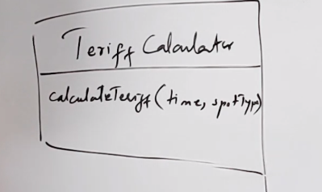

## Clarify Question
1. Big parking lots (10k to 30k spots)
2. 4 entrances and 4 exits
3. Ticket assignment at entrance
4. Parking spot assigned should be nearest to the entrance
5. Should not allow more vehicles than the capacity
6. Different types of spots (handicapped, compact cars, large cars)
7. Hourly rate
8. Payment system - cash / credit
9. Monitoring system
10. One system design can be reusable to be deployed to different systems

## Design
### interface vs abstract class vs class
An abstract class allows you to create functionality that subclasses can implement or override.

An interface only allows you to define functionality, not implement it.

If the child class has the same functions, then we use abstrct class instead of interface.

A class can extend only one abstract class, it can take advantage of multiple interfaces.

### Components
1. Parking lot system
2. Entry / Exit Terminals
    - printers
    - payment system
3. Parking spot (no need of vehicle class, we use the spot for the vehicles)
4. Ticket
5. Database
6. Monitoring System

#### Parking Spot
1. Bad Design - not flexible as if we need to add more types, we need to modify the class (violates open/close principle: existing and well tested class should not be modified with new features)
    ```
    enum ParkingSpot {
        handicapped,
        compact,
        large,
        motorcycle
    }
    ```

2. Good Design


Parent Class (no objects can be instantiated from it) - id; reserve()

Child Class - derived from parent class; easy to add new classes

#### Parking Ticket Class


#### Terminals (interface or abstract classes)


#### Strategy (interface and class)


- K log(n)

#### Payment Strategy (interface and class)


- we can add new payment class (apple pay)

#### Amount Calculater Interface


- we can create classes on this interfaces for amount calculation for weekdays / weekends / day time / night time


#### Monitoring Class (observer design pattern)
Interface:
logger - logmessage()

