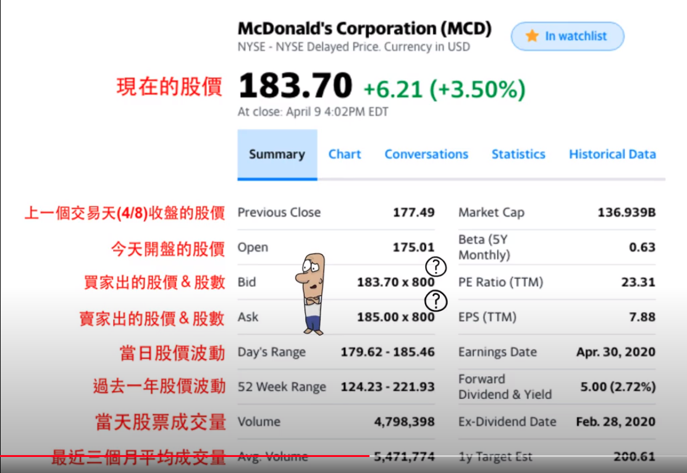
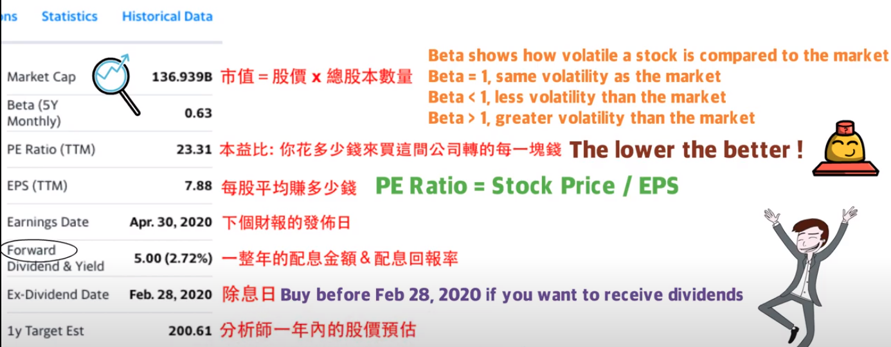

## Concepts
1. PE Ratio: Amount I pay for every dollar revenue of the company
2. EPS - Earnings Per Share

## Charts - <a href="https://ca.finance.yahoo.com/">Yahoo Finance</a>

  

  

## Company Analysis
### Facebook

* products
    * Facebook
    * WhatsApp
    * Facebook Messenger
    * Instagram

* Number of users: https://www.statista.com/statistics/272014/global-social-networks-ranked-by-number-of-users/

* Avg user revenue: https://www.statista.com/statistics/251328/facebooks-average-revenue-per-user-by-region/

* Income Statement: https://finance.yahoo.com/quote/FB/financials/
    - Revenue
    - Operating Expenses

* Balance Sheet: https://finance.yahoo.com/quote/FB/balance-sheet/
    - Cash
    - Debt (long term / short term)

* Reason to buy
    - Great business model and profit margin
    - Great balance sheet and cash loaded for R&D and to weather any economic downturn
    - Facebook owns 4 of the top 6 social media platforms
    - Current ads revenue from Facebook and Instagram only; Messenger and Whatsapp have not been monitized yet

* Pandemic Impact
    - Ads budget cut from merchants (But FB has enough cash to get through it)