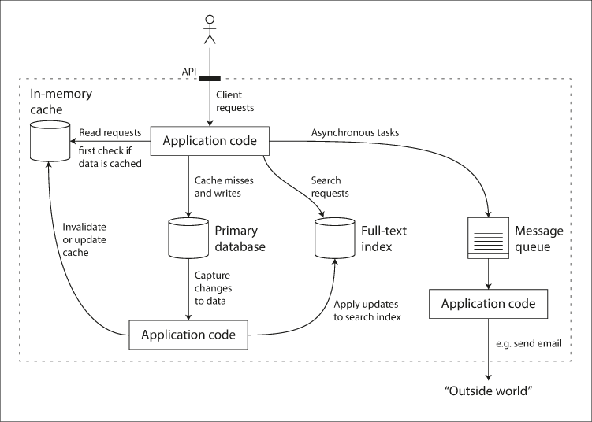

# Design Data Intensive Application

## Think as a data system designer, more than an application developer
 <br />
<small>*Combine the use of Cache, DB, Solr/ELK, Queue*</small>

## DBs

### SQL vs No-SQL
 <br />
<small>*Sample of Relational DB*</small>

* Relations
	* New features may require more and more relations in data.
	* Primary index is for unique values, sendary index can be for duplicate values
	* No-SQL is good for one-many, but not so good for many-many or many-one
	* No joins in No-SQL, but we can denormalize the data (still need to keep data consistency for the denormalization)
	* No-SQL is faster in query and less disk seeks if all the data needed is in one document

* Schema flexibility
	* Schema change on SQL is difficult, we can have new fields set to NULL and update it at read time

* Graph Data Models
	 <br />
	<small>*Sample of Graph DB*</small>

	* Used for many-many relations, have edges and vertices
	* Vertex consists of
		* A unique identifier
		* A set of outgoing edges
		* A set of incoming edges
		* A collection of perperties
	* Edge consists of
		* A unique identifier
		* The head vertex
		* The tail vertex
		* A label to describe the relationship between the two vertices
		* A collection of perperties
	* SQL Equivalent Tables
		```SQL
		CREATE TABLE vertices (
		    vertex_id   integer PRIMARY KEY,
		    properties  json
		);

		CREATE TABLE edges (
		    edge_id     integer PRIMARY KEY,
		    tail_vertex integer REFERENCES vertices (vertex_id),
		    head_vertex integer REFERENCES vertices (vertex_id),
		    label       text,
		    properties  json
		);

		CREATE INDEX edges_tails ON edges (tail_vertex);
		CREATE INDEX edges_heads ON edges (head_vertex);
		```
	* Sample Graph Query
		```SQL
		MATCH
		  (person) -[:BORN_IN]->  () -[:WITHIN*0..]-> (us:Location {name:'United States'}),
		  (person) -[:LIVES_IN]-> () -[:WITHIN*0..]-> (eu:Location {name:'Europe'})
		RETURN person.name
		```

### Cache
* If data is larger than memory, by using LRU, we can save data on disk, and cache it if it is accessed again.

### Data Warehouse
 <br />
<small>*Example of a star schema for use in a data warehouse*</small>

* Each row in the fact table represents an event, the dimensions represent the who, what, where, when, how, and why of the event.
* Even date and time are often represented using dimension tables, because this allows queries to differentiate between sales on holidays and non-holidays.
* Column oriented storage - due to the large number of rows in fact table, it stores data by column
	 <br />
	<small>*Compressed, bitmap-indexed storage of a single column*</small>

	* Since column data is similar in each element, it is also good for compression
	* On query, we can do bitwise AND / OR on the values to query
	* The first column to sort can be picked base on most frequently used queries
		* If the sorted column has lots of duplicate data, then this will help us further compress the data
	* Sort/index data in different ways in replicas, so that we can use the replica which best fit our needs to query


