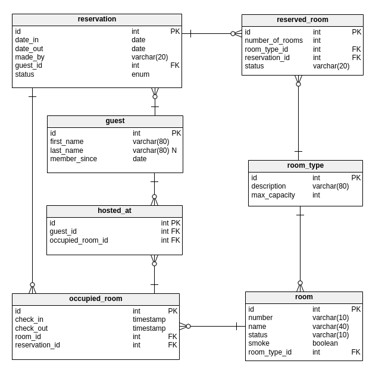

## Requirements
1. for guests
    - search rooms by locations, dates, number of rooms, and number of guests
    - get room details (like picture, name, review, address, etc.) and prices
    - pay and book room from inventory by date and room id
    - notification via Email and mobile push notification
    
2. for hotel or rental administrators (suppliers/hosts)
    - administrators (receptionist/manager/rental owner): manage room inventory and help the guest to check-in and check out
    - housekeeper: clean up rooms routinely

## Tables
  
- status (canceled, confirmed)
- made_by (online, in_person, phone)

