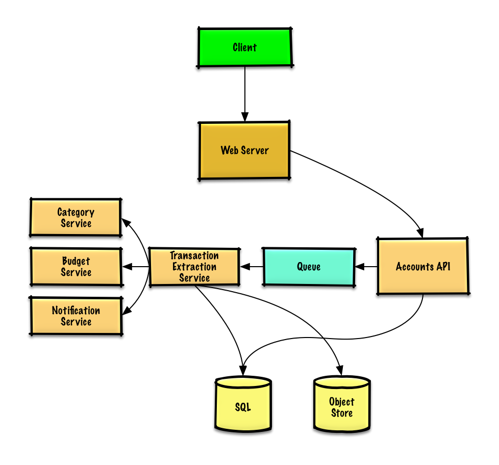
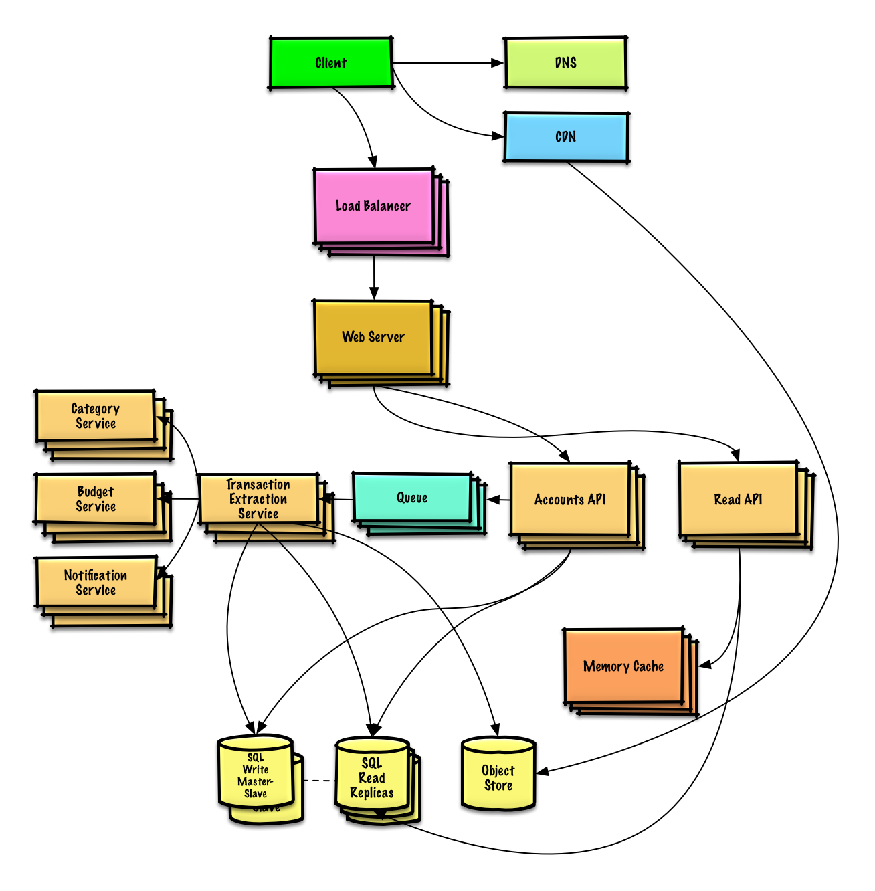

# Design Mint.com

## Step 1: Outline use cases and constraints
### Use cases
* User connects to a financial account
* Service extracts transactions from the account
    - Updates daily
    - Categorizes transactions
        - Allows manual category override by the user
        - No automatic re-categorization
    - Analyzes monthly spending, by category
* Service recommends a budget
    - Allows users to manually set a budget
    - Sends notifications when approaching or exceeding budget
* Service has high availability
* Service performs additional logging and analytics

### Constraints and assumptions
* State assumptions
    - Traffic is not evenly distributed
    - Automatic daily update of accounts applies only to users active in the past 30 days
    - Adding or removing financial accounts is relatively rare
    - Budget notifications don't need to be instant
    - 10 million users
        - 10 budget categories per user = 100 million budget items
        - Example categories:
            - Housing = $1,000
            - Food = $200
            - Gas = $100
        - Sellers are used to determine transaction category
            - 50,000 sellers
    - 30 million financial accounts
    - 5 billion transactions per month
    - 500 million read requests per month
    - 10:1 write to read ratio
        - Write-heavy, users make transactions daily, but few visit the site daily

* Calculate usage
    - Size per transaction:
        - user_id - 8 bytes
        - created_at - 5 bytes
        - seller - 32 bytes
        - amount - 5 bytes
        - Total: ~50 bytes
    - 250 GB of new transaction content per month
        - 50 bytes per transaction * 5 billion transactions per month
        - 9 TB of new transaction content in 3 years
        - Assume most are new transactions instead of updates to existing ones
    - 2,000 transactions per second on average
    - 200 read requests per second on average

* Handy conversion guide:
    - 2.5 million seconds per month
    - 1 request per second = 2.5 million requests per month
    - 40 requests per second = 100 million requests per month
    - 400 requests per second = 1 billion requests per month

## Step 2: Create a high level design
 <br />

## Step 3: Design core components
### Use case: User connects to a financial account
Sampe API request:
```
$ curl -X POST --data '{ "user_id": "foo", "account_url": "bar", \
    "account_login": "baz", "account_password": "qux" }' \
    https://mint.com/api/v1/account
```

1. The Client sends a request to the Web Server, running as a reverse proxy
2. The Web Server forwards the request to the Accounts API server
3. The Accounts API server updates the SQL Database accounts table with the newly entered account info
4. For internal communications, we could use Remote Procedure Calls

We could store info on the 10 million users in a relational database.
* We should discuss the use cases and tradeoffs between choosing SQL or NoSQL.
* Design the `account` table
    ```
    id int NOT NULL AUTO_INCREMENT
    created_at datetime NOT NULL
    last_update datetime NOT NULL
    account_url varchar(255) NOT NULL
    account_login varchar(32) NOT NULL
    account_password_hash char(64) NOT NULL
    user_id int NOT NULL
    PRIMARY KEY(id)
    FOREIGN KEY(user_id) REFERENCES users(id)
    ```
* We'll create an index on `id`, `user_id` , and `created_at` to speed up lookups and to keep the data in memory. Reading 1 MB sequentially from memory takes about 250 microseconds, while reading from SSD takes 4x and from disk takes 80x longer.

### Use case: Service extracts transactions from the account
We'll want to extract information from an account in these cases:
* The user first links the account
* The user manually refreshes the account
* Automatically each day for users who have been active in the past 30 days

Data flow:
1. The Client sends a request to the Web Server
2. The Web Server forwards the request to the Accounts API server
3. The Accounts API server places a job on a Queue such as Amazon SQS or RabbitMQ
    * Extracting `transactions` could take awhile, we'd probably want to do this asynchronously with a queue, although this introduces additional complexity
4. The Transaction Extraction Service does the following:
    * Pulls from the Queue and extracts `transactions` for the given account from the financial institution, storing the results as raw log files in the Object Store
    * Uses the Category Service to categorize each transaction
    * Uses the Budget Service to calculate aggregate monthly spending by category
        * The Budget Service uses the Notification Service to let users know if they are nearing or have exceeded their budget
    * Updates the SQL Database transactions table with categorized `transactions`
    * Updates the SQL Database `monthly_spending` table with aggregate monthly spending by category
    * Notifies the user the `transactions` have completed through the Notification Service:
        * Uses a Queue (not pictured) to asynchronously send out notifications

Table Design
* `transactions` table
    ```
    id int NOT NULL AUTO_INCREMENT
    created_at datetime NOT NULL
    seller varchar(32) NOT NULL
    amount decimal NOT NULL
    user_id int NOT NULL
    PRIMARY KEY(id)
    FOREIGN KEY(user_id) REFERENCES users(id)
    ```
    We'll create an index on `id`, `user_id` , and `created_at`.

* `monthly_spending` table
    ```
    id int NOT NULL AUTO_INCREMENT
    month_year date NOT NULL
    category varchar(32)
    amount decimal NOT NULL
    user_id int NOT NULL
    PRIMARY KEY(id)
    FOREIGN KEY(user_id) REFERENCES users(id)
    ```
    We'll create an index on `id` and `user_id` .

#### Category service
For the Category Service, we can seed a seller-to-category dictionary with the most popular sellers. If we estimate 50,000 sellers and estimate each entry to take less than 255 bytes, the dictionary would only take about 12 MB of memory.

```python
from enum import Enum

class DefaultCategories(Enum):
    HOUSING = 0
    FOOD = 1
    GAS = 2
    SHOPPING = 3
    # ...

seller_category_map = {}
seller_category_map['Exxon'] = DefaultCategories.GAS
seller_category_map['Target'] = DefaultCategories.SHOPPING

class Categorizer(object):
    def __init__(self, seller_category_map, seller_category_overrides_map):
        self.seller_category_map = seller_category_map
        self.seller_category_overrides_map = seller_category_overrides_map

    # For sellers not initially seeded in the map, we could use a crowdsourcing effort by evaluating the manual category overrides our users provide.
    # We could use a heap to quickly lookup the top manual override per seller in O(1) time.
    def categorize(self, transaction):
        if transaction.seller in self.seller_category_map:
            return self.seller_category_map[transaction.seller]
        if transaction.seller in self.seller_category_overrides_map:
            seller_category_map[transaction.seller] = \
                self.manual_overrides[transaction.seller].peek_min()
            return self.seller_category_map[transaction.seller]
        return None


class Transaction(object):
    def __init__(self, timestamp, seller, amount):
        self.timestamp = timestamp
        self.seller = seller
        self.amount = amount
```

### Use case: Service recommends a budget
We could use a generic budget template that allocates category amounts based on income tiers. Using this approach, we would not have to store the 100 million budget items identified in the constraints, only those that the user overrides. If a user overrides a budget category, which we could store the override in the TABLE `budget_overrides`.

```python
class Budget(object):
    def __init__(self, income):
        self.income = income
        self.categories_to_budget_map = self.create_budget_template()

    def create_budget_template(self):
        return {
            'DefaultCategories.HOUSING': income * .4,
            'DefaultCategories.FOOD': income * .2
            'DefaultCategories.GAS': income * .1,
            'DefaultCategories.SHOPPING': income * .2
            ...
        }

    def override_category_budget(self, category, amount):
        self.categories_to_budget_map[category] = amount
```

For the **Budget Service**, we can potentially run SQL queries on the `transactions` table to generate the `monthly_spending` aggregate table. The `monthly_spending` table would likely have much fewer rows than the total 5 billion transactions, since users typically have many transactions per month.

As an alternative, we can run MapReduce jobs on the raw transaction files to:
* Categorize each transaction
* Generate aggregate monthly spending by category

Running analyses on the transaction files could significantly reduce the load on the database.

We could call the Budget Service to re-run the analysis if the user updates a category.

```python
class SpendingByCategory(MRJob):

    def __init__(self, categorizer):
        self.categorizer = categorizer
        ...

    def current_year_month(self):
        """Return the current year and month."""
        ...

    def extract_year_month(self, timestamp):
        """Return the year and month portions of the timestamp."""
        ...

    def handle_budget_notifications(self, key, total):
        """Call notification API if nearing or exceeded budget."""
        ...

    def mapper(self, _, line):
        """Parse each log line, extract and transform relevant lines.

        Emit key value pairs of the form:

        (2016-01, shopping), 25
        (2016-01, shopping), 100
        (2016-01, gas), 50
        """
        timestamp, category, amount = line.split('\t')
        period = self. extract_year_month(timestamp)
        if period == self.current_year_month():
            yield (period, category), amount

    def reducer(self, key, values):
        """Sum values for each key.

        (2016-01, shopping), 125
        (2016-01, gas), 50
        """
        total = sum(values)
        self.handle_budget_notifications(key, total)
        yield key, sum(values)

    def steps(self):
        """Run the map and reduce steps."""
        return [
            self.mr(mapper=self.mapper,
                    reducer=self.reducer)
        ]
```

### Use case: User accesses summaries and transactions.
User sessions, aggregate stats by category, and recent transactions could be placed in a Memory Cache such as Redis or Memcached.
* The Client sends a read request to the Web Server
* The Web Server forwards the request to the Read API server
    * Static content can be served from the Object Store such as S3, which is cached on the CDN
* The Read API server does the following:
    * Checks the Memory Cache for the content
        * If the url is in the Memory Cache, returns the cached contents
        * Else
            * If the url is in the SQL Database, fetches the contents
                * Updates the Memory Cache with the contents

## Step 4: Scale the design
 <br />

Do not simply jump right into the final design from the initial design. State you would 1. Benchmark/Load Test, 2. Profile for bottlenecks 3. address bottlenecks while evaluating alternatives and trade-offs, and 4. repeat.

Instead of keeping the `monthly_spending` aggregate table in the SQL Database, we could create a separate Analytics Database using a data warehousing solution such as Amazon Redshift or Google BigQuery.

We might only want to store a month of transactions data in the database, while storing the rest in a data warehouse or in an Object Store. An Object Store such as Amazon S3 can comfortably handle the constraint of 250 GB of new content per month.

To address the 2,000 average read requests per second (higher at peak), traffic for popular content should be handled by the Memory Cache instead of the database. The Memory Cache is also useful for handling the unevenly distributed traffic and traffic spikes. The SQL Read Replicas should be able to handle the cache misses, as long as the replicas are not bogged down with replicating writes.

200 average transaction writes per second (higher at peak) might be tough for a single SQL Write Master-Slave. We might need to employ additional SQL scaling patterns: Federation, Sharding, Denormalization, SQL Tuning. We should also consider moving some data to a NoSQL Database.