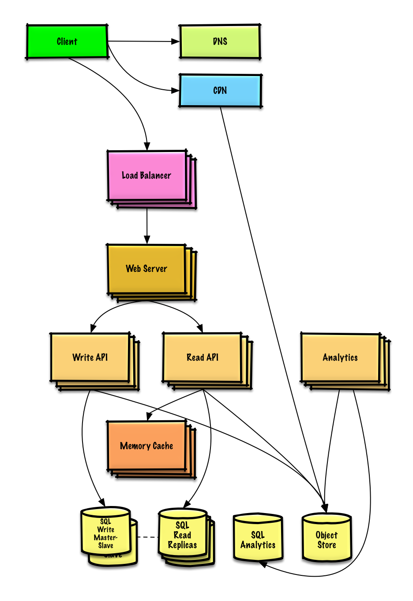

# Design Pastebin.com (or Bit.ly)

## Step 1: Outline use cases and constraints
### Use cases
* User enters a block of text and gets a randomly generated link
    * Expiration
        * Default setting does not expire
        * Can optionally set a timed expiration
* User enters a paste's url and views the contents
* User is anonymous
* Service tracks analytics of pages
    * Monthly visit stats
* Service deletes expired pastes
* Service has high availability

### Constraints and assumptions
* State assumptions
    * Traffic is not evenly distributed
    * Following a short link should be fast
    * Pastes are text only
    * Page view analytics do not need to be realtime
    * 10 million users
    * 10 million paste writes per month
    * 100 million paste reads per month
    * 10:1 read to write ratio

* Calculate usage
    * Size per paste
        * 1 KB content per paste
        * shortlink - 7 bytes
        * expiration_length_in_minutes - 4 bytes
        * created_at - 5 bytes
        * paste_path - 255 bytes
        * total = ~1.27 KB
    * 12.7 GB of new paste content per month
        * 1.27 KB per paste * 10 million pastes per month
        * ~450 GB of new paste content in 3 years
        * 360 million shortlinks in 3 years
        * Assume most are new pastes instead of updates to existing ones
    * 4 paste writes per second on average
    * 40 read requests per second on average

## Step 2: Create a high level design
 <br />

## Step 3: Design core components
### Use case: User enters a block of text and gets a randomly generated link
Sampe API request:
```
$ curl -X POST --data '{ "expiration_length_in_minutes": "60", \
    "paste_contents": "Hello World!" }' https://pastebin.com/api/v1/paste
```

1. The Client sends a create paste request to the Web Server, running as a reverse proxy
2. The Web Server forwards the request to the Write API server
3. The Write API server does the following:
    * Generates a unique url
        * Checks if the url is unique by looking at the SQL Database for a duplicate
        * If the url is not unique, it generates another url
        * If we supported a custom url, we could use the user-supplied (also check for a duplicate)
    * Saves to the SQL Database pastes table
    * Saves the paste data to the Object Store
    * Returns the url

DB Design
* We could use a relational database as a large hash table, mapping the generated url to a file server and path containing the paste file.
* Instead of managing a file server, we could use a managed Object Store such as Amazon S3 or a NoSQL document store.
* An alternative to a relational database acting as a large hash table, we could use a NoSQL key-value store. We should discuss the tradeoffs between choosing SQL or NoSQL. The following discussion uses the relational database approach.
    * Design the `pastes` table
        ```
        shortlink char(7) NOT NULL
        expiration_length_in_minutes int NOT NULL
        created_at datetime NOT NULL
        paste_path varchar(255) NOT NULL
        PRIMARY KEY(shortlink)
        ```
    * create index on `shortlink` and `created_at`

Generate Unique URL
* Take the MD5 hash of the user's ip_address + timestamp
    * MD5 is a widely used hashing function that produces a 128-bit hash value
    * MD5 is uniformly distributed
    * Alternatively, we could also take the MD5 hash of randomly-generated data
* Base 62 encode the MD5 hash
    * Base 62 encodes to [a-zA-Z0-9] which works well for urls, eliminating the need for escaping special characters
    * There is only one hash result for the original input and Base 62 is deterministic (no randomness involved)
    * Base 64 is another popular encoding but provides issues for urls because of the additional + and / characters
    * The following Base 62 pseudocode runs in O(k) time where k is the number of digits = 7:
        ```python
        def base_encode(num, base=62):
            digits = []
            while num > 0
                remainder = modulo(num, base)
                digits.push(remainder)
                num = divide(num, base)
            digits = digits.reverse
        ```
* Take the first 7 characters of the output, which results in 62^7 possible values and should be sufficient to handle our constraint of 360 million shortlinks in 3 years:
    ```python
    url = base_encode(md5(ip_address+timestamp))[:URL_LENGTH]
    ```

### Use case: User enters a paste's url and views the contents
* The Client sends a get paste request to the Web Server
* The Web Server forwards the request to the Read API server
* The Read API server does the following:
    * Checks the SQL Database for the generated url
        * If the url is in the SQL Database, fetch the paste contents from the Object Store
        * Else, return an error message for the user

### Use case: Service tracks analytics of pages
W could simply MapReduce the Web Server logs to generate hit counts.
```python
class HitCounts(MRJob):

    def extract_url(self, line):
        """Extract the generated url from the log line."""
        pass

    def extract_year_month(self, line):
        """Return the year and month portions of the timestamp."""
        pass

    def mapper(self, _, line):
        """Parse each log line, extract and transform relevant lines.

        Emit key value pairs of the form:

        (2016-01, url0), 1
        (2016-01, url0), 1
        (2016-01, url1), 1
        """
        url = self.extract_url(line)
        period = self.extract_year_month(line)
        yield (period, url), 1

    def reducer(self, key, values):
        """Sum values for each key.

        (2016-01, url0), 2
        (2016-01, url1), 1
        """
        yield key, sum(values)

    def steps(self):
        """Run the map and reduce steps."""
        return [
            self.mr(mapper=self.mapper,
                    reducer=self.reducer)
        ]

```

### Use case: Service deletes expired pastes
To delete expired pastes, we could just scan the SQL Database for all entries whose expiration timestamp are older than the current timestamp. All expired entries would then be deleted (or marked as expired) from the table.

## Step 4: Scale the design
 <br />

The Analytics Database could use a data warehousing solution such as Amazon Redshift or Google BigQuery.

An Object Store such as Amazon S3 can comfortably handle the constraint of 12.7 GB of new content per month.

To address the 40 average read requests per second (higher at peak), traffic for popular content should be handled by the Memory Cache instead of the database. The Memory Cache is also useful for handling the unevenly distributed traffic and traffic spikes. The SQL Read Replicas should be able to handle the cache misses, as long as the replicas are not bogged down with replicating writes.