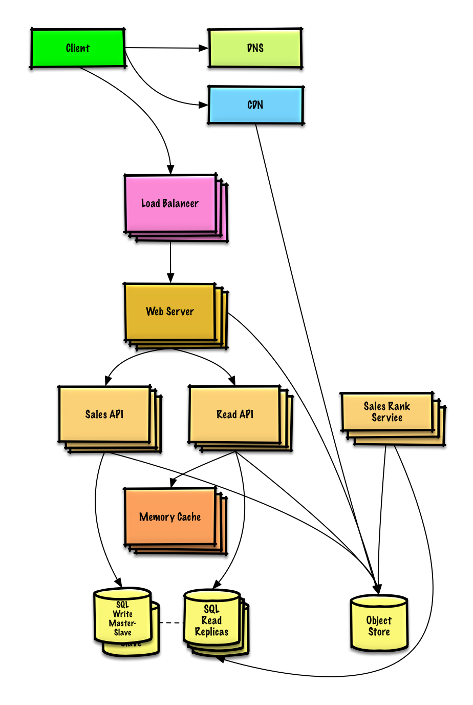

# Design Amazon's sales rank by category feature

## Step 1: Outline use cases and constraints
### Use cases
* Service calculates the past week's most popular products by category
* User views the past week's most popular products by category
* Service has high availability

### Constraints and assumptions
* State assumptions
    * Traffic is not evenly distributed
    * Items can be in multiple categories
    * Items cannot change categories
    * There are no subcategories ie `foo/bar/baz`
    * Results must be updated hourly
        * More popular products might need to be updated more frequently
    * 10 million products
    * 1000 categories
    * 1 billion transactions per month
    * 100 billion read requests per month
    * 100:1 read to write ratio

* Calculate usage
    * Size per transaction:
        * created_at - 5 bytes
        * product_id - 8 bytes
        * category_id - 4 bytes
        * seller_id - 8 bytes
        * buyer_id - 8 bytes
        * quantity - 4 bytes
        * total_price - 5 bytes
        * Total: ~40 bytes
    * 40 GB of new transaction content per month
        * 40 bytes per transaction * 1 billion transactions per month
        * 1.44 TB of new transaction content in 3 years
        * Assume most are new transactions instead of updates to existing ones
    * 400 transactions per second on average
    * 40,000 read requests per second on average

## Step 2: Create a high level design
 <br />

## Step 3: Design core components
### Use case: Service calculates the past week's most popular products by category
We could store the raw Sales API server log files on a managed Object Store such as Amazon S3, rather than managing our own distributed file system. Log entry looks like below:
```
timestamp  product_id  category_id qty  total_price  seller_id  buyer_id
t1         product1    category1    2      20.00         1            1
t2         product1    category2    2      20.00         2            2
t2         product1    category2    1      10.00         2            3
t3         product2    category1    3       7.00         3            4
t4         product3    category2    7       2.00         4            5
t5         product4    category1    1       5.00         5            6
```
The Sales Rank Service could use MapReduce, using the Sales API server log files as input and writing the results to an aggregate table sales_rank in a SQL Database. We'll use a multi-step MapReduce:
* Step 1 - Transform the data to `(category, product_id), sum(quantity)`
* Step 2 - Perform a distributed sort
```python
class SalesRanker(MRJob):

    def within_past_week(self, timestamp):
        """Return True if timestamp is within past week, False otherwise."""
        ...

    def mapper(self, _, line):
        """Parse each log line, extract and transform relevant lines.

        Emit key value pairs of the form:

        (foo, p1), 2
        (bar, p1), 2
        (bar, p1), 1
        (foo, p2), 3
        (bar, p3), 10
        (foo, p4), 1
        """
        timestamp, product_id, category, quantity = line.split('\t')
        if self.within_past_week(timestamp):
            yield (category, product_id), quantity

    def reducer(self, key, values):
        """Sum values for each key.

        (foo, p1), 2
        (bar, p1), 3
        (foo, p2), 3
        (bar, p3), 10
        (foo, p4), 1
        """
        yield key, sum(values)

    def mapper_sort(self, key, value):
        """Construct key to ensure proper sorting.

        Transform key and value to the form:

        (foo, 2), p1
        (bar, 3), p1
        (foo, 3), p2
        (bar, 10), p3
        (foo, 1), p4

        The shuffle/sort step of MapReduce will then do a
        distributed sort on the keys, resulting in:

        (category1, 1), product4
        (category1, 2), product1
        (category1, 3), product2
        (category2, 3), product1
        (category2, 7), product3
        """
        category, product_id = key
        quantity = value
        yield (category, quantity), product_id

    def reducer_identity(self, key, value):
        yield key, value

    def steps(self):
        """Run the map and reduce steps."""
        return [
            self.mr(mapper=self.mapper,
                    reducer=self.reducer),
            self.mr(mapper=self.mapper_sort,
                    reducer=self.reducer_identity),
        ]
```
The result would be the following sorted list, which we could insert into the `sales_rank` table:
```
(category1, 1), product4
(category1, 2), product1
(category1, 3), product2
(category2, 3), product1
(category2, 7), product3
```
The sales_rank table could have the following structure:
```
id int NOT NULL AUTO_INCREMENT
category_id int NOT NULL
total_sold int NOT NULL
product_id int NOT NULL
PRIMARY KEY(id)
FOREIGN KEY(category_id) REFERENCES Categories(id)
FOREIGN KEY(product_id) REFERENCES Products(id)
```
We'll create an index on `id` , `category_id`, and `product_id` to speed up lookups and to keep the data in memory.

### Use case: User views the past week's most popular products by category
Sampe API request:
```
$ curl https://amazon.com/api/v1/popular?category_id=1234
```
* The Client sends a request to the Web Server, running as a reverse proxy
* The Web Server forwards the request to the Read API server
* The Read API server reads from the SQL Database `sales_rank` table
Response
```
{
    "id": "100",
    "category_id": "1234",
    "total_sold": "100000",
    "product_id": "50",
}, {
    "id": "53",
    "category_id": "1234",
    "total_sold": "90000",
    "product_id": "200",
}, {
    "id": "75",
    "category_id": "1234",
    "total_sold": "80000",
    "product_id": "3",
}
```

## Step 4: Scale the design
 <br />

The Analytics Database could use a data warehousing solution such as Amazon Redshift or Google BigQuery.

We might only want to store a limited time period of data in the database, while storing the rest in a data warehouse or in an Object Store. An Object Store such as Amazon S3 can comfortably handle the constraint of 40 GB of new content per month.

To address the 40,000 average read requests per second (higher at peak), traffic for popular content (and their sales rank) should be handled by the Memory Cache instead of the database. The Memory Cache is also useful for handling the unevenly distributed traffic and traffic spikes. With the large volume of reads, the SQL Read Replicas might not be able to handle the cache misses. We'll probably need to employ additional SQL scaling patterns.

400 average writes per second (higher at peak) might be tough for a single SQL Write Master-Slave, also pointing to a need for additional scaling techniques.
