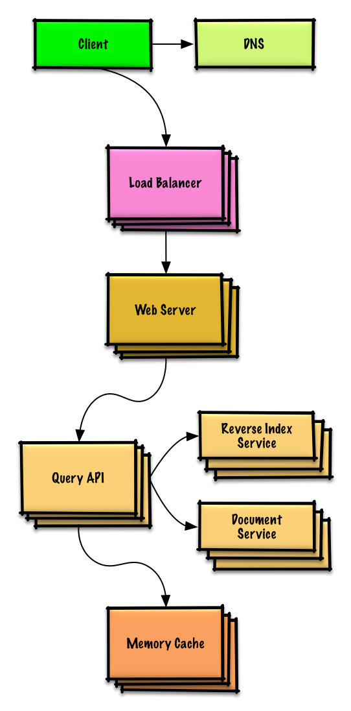

# Design a key-value store for a search engine

## Step 1: Outline use cases and constraints
### Use cases
* User sends a search request resulting in a cache hit
* User sends a search request resulting in a cache miss
* Service has high availability

### Constraints and assumptions
* State assumptions
    * Traffic is not evenly distributed
        * Popular queries should almost always be in the cache
        * Need to determine how to expire/refresh
    * Serving from cache requires fast lookups
    * Low latency between machines
    * Limited memory in cache
        * Need to determine what to keep/remove
        * Need to cache millions of queries
    * 10 million users
    * 10 billion queries per month

* Calculate usage
    * Cache stores ordered list of key: query, value: results
        * query - 50 bytes
        * title - 20 bytes
        * snippet - 200 bytes
        * Total: 270 bytes
    * 2.7 TB of cache data per month if all 10 billion queries are unique and all are stored
        * 270 bytes per search * 10 billion searches per month
        * Assumptions state limited memory, need to determine how to expire contents
    * 4,000 requests per second

## Step 2: Create a high level design
 <br />

## Step 3: Design core components
### Use case: User sends a request resulting in a cache hit
Popular queries can be served from a **Memory Cache** such as Redis or Memcached to reduce read latency and to avoid overloading the **Reverse Index Service** and **Document Service**.

Since the cache has limited capacity, we'll use a least recently used (LRU) approach to expire older entries.

* The **Client** sends a request to the **Web Server**, running as a [reverse proxy](https://github.com/donnemartin/system-design-primer#reverse-proxy-web-server)
* The **Web Server** forwards the request to the **Query API** server
* The **Query API** server does the following:
    * Parses the query
        * Removes markup
        * Breaks up the text into terms
        * Fixes typos
        * Normalizes capitalization
        * Converts the query to use boolean operations
    * Checks the **Memory Cache** for the content matching the query
        * If there's a hit in the **Memory Cache**, the **Memory Cache** does the following:
            * Updates the cached entry's position to the front of the LRU list
            * Returns the cached contents
        * Else, the **Query API** does the following:
            * Uses the **Reverse Index Service** to find documents matching the query
                * The **Reverse Index Service** ranks the matching results and returns the top ones
            * Uses the **Document Service** to return titles and snippets
            * Updates the **Memory Cache** with the contents, placing the entry at the front of the LRU list

#### Cache Implementation
The cache can use a doubly-linked list: new items will be added to the head while items to expire will be removed from the tail. We'll use a hash table for fast lookups to each linked list node.

```python
class QueryApi(object):
    def __init__(self, memory_cache, reverse_index_cluster):
        self.memory_cache = memory_cache
        self.reverse_index_cluster = reverse_index_cluster

    def parse_query(self, query):
        """Remove markup, break text into terms, deal with typos,
        normalize capitalization, convert to use boolean operations.
        """
        ...

    def process_query(self, query):
        query = self.parse_query(query)
        results = self.memory_cache.get(query)
        if results is None:
            results = self.reverse_index_cluster.process_search(query)
            self.memory_cache.set(query, results)
        return results

class Node(object):
    def __init__(self, query, results):
        self.query = query
        self.results = results


class LinkedList(object):
    def __init__(self):
        self.head = None
        self.tail = None

    def move_to_front(self, node):
        ...

    def append_to_front(self, node):
        ...

    def remove_from_tail(self):
        ...

class Cache(object):
    def __init__(self, MAX_SIZE):
        self.MAX_SIZE = MAX_SIZE
        self.size = 0
        self.lookup = {}
        self.linked_list = LinkedList()

    def get(self, query):
        """Get the stored query result from the cache.

        Accessing a node updates its position to the front of the LRU list.
        """
        node = self.lookup[query]
        if node is None:
            return None
        self.linked_list.move_to_front(node)
        return node.results

    def set(self, results, query):
        """Set the result for the given query key in the cache.

        When updating an entry, updates its position to the front of the LRU list.
        If the entry is new and the cache is at capacity, removes the oldest entry
        before the new entry is added.
        """
        node = self.map[query]
        if node is not None:
            # Key exists in cache, update the value
            node.results = results
            self.linked_list.move_to_front(node)
        else:
            # Key does not exist in cache
            if self.size == self.MAX_SIZE:
                # Remove the oldest entry from the linked list and lookup
                self.lookup.pop(self.linked_list.tail.query, None)
                self.linked_list.remove_from_tail()
            else:
                self.size += 1
            # Add the new key and value
            new_node = Node(query, results)
            self.linked_list.append_to_front(new_node)
            self.lookup[query] = new_node
```
The cache should be updated when:
* The page contents change
* The page is removed or a new page is added
* The page rank changes

The most straightforward way to handle these cases is to simply set a TTL.

## Step 4: Scale the design
 <br />

To handle the heavy request load and the large amount of memory needed, we'll scale horizontally. We have three main options on how to store the data on our Memory Cache cluster:
* **Each machine in the cache cluster has its own cache** - Simple, although it will likely result in a low cache hit rate.
* **Each machine in the cache cluster has a copy of the cache** - Simple, although it is an inefficient use of memory.
* **The cache is sharded across all machines in the cache cluster** - More complex, although it is likely the best option. We could use hashing to determine which machine could have the cached results of a query using `machine = hash(query)`. We'll likely want to use consistent hashing.
