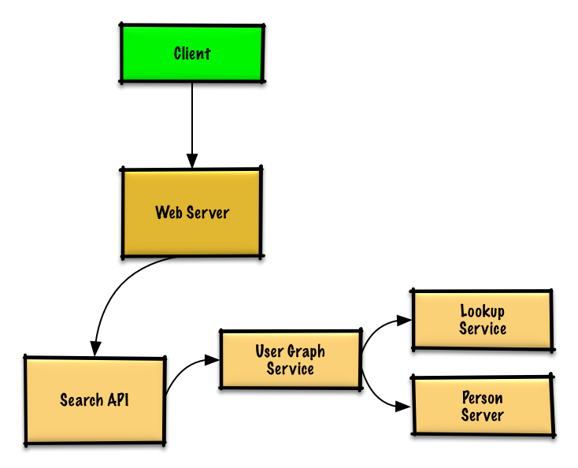

# Design the data structures for a social network

## Step 1: Outline use cases and constraints
### Use cases
* User searches for someone and sees the shortest path to the searched person
* Service has high availability

### Constraints and assumptions
* State assumptions
    * Traffic is not evenly distributed
        * Some searches are more popular than others, while others are only executed once
    * Graph data won't fit on a single machine
    * Graph edges are unweighted
    * 100 million users
    * 50 friends per user average
    * 1 billion friend searches per month

* Calculate usage
    * 5 billion friend relationships
        * 100 million users * 50 friends per user average
    * 400 search requests per second

## Step 2: Create a high level design
 <br />

## Step 3: Design core components
### Use case: User searches for someone and sees the shortest path to the searched person
Without the constraint of millions of users (vertices) and billions of friend relationships (edges), we could solve this unweighted shortest path task with a general BFS approach:
```python
class Graph(Graph):

    def shortest_path(self, source, dest):
        if source is None or dest is None:
            return None
        if source is dest:
            return [source.key]
        prev_node_keys = self._shortest_path(source, dest)
        if prev_node_keys is None:
            return None
        else:
            path_ids = [dest.key]
            prev_node_key = prev_node_keys[dest.key]
            while prev_node_key is not None:
                path_ids.append(prev_node_key)
                prev_node_key = prev_node_keys[prev_node_key]
            return path_ids[::-1]

    def _shortest_path(self, source, dest):
        queue = deque()
        queue.append(source)
        prev_node_keys = {source.key: None}
        source.visit_state = State.visited
        while queue:
            node = queue.popleft()
            if node is dest:
                return prev_node_keys
            prev_node = node
            for adj_node in node.adj_nodes.values():
                if adj_node.visit_state == State.unvisited:
                    queue.append(adj_node)
                    prev_node_keys[adj_node.key] = prev_node.key
                    adj_node.visit_state = State.visited
        return None
```
We won't be able to fit all users on the same machine, we'll need to shard users across Person Servers and access them with a Lookup Service.
- The Client sends a request to the Web Server, running as a reverse proxy
- The Web Server forwards the request to the Search API server
- The Search API server forwards the request to the User Graph Service
- The User Graph Service does the following:
    - Uses the Lookup Service to find the Person Server where the current user's info is stored
    - Finds the appropriate Person Server to retrieve the current user's list of `friend_ids`
    - Runs a BFS search using the current user as the `source` and the current user's `friend_ids` as the ids for each `adjacent_node`
    - To get the `adjacent_node` from a given id:
        - The User Graph Service will again need to communicate with the Lookup Service to determine which Person Server stores the `adjacent_node` matching the given id (potential for optimization)

**Lookup Service implementation**
```python
class LookupService(object):

    def __init__(self):
        self.lookup = self._init_lookup()  # key: person_id, value: person_server

    def _init_lookup(self):
        ...

    def lookup_person_server(self, person_id):
        return self.lookup[person_id]
```
**Person Server implementation**
```python
class PersonServer(object):

    def __init__(self):
        self.people = {}  # key: person_id, value: person

    def add_person(self, person):
        ...

    def people(self, ids):
        results = []
        for id in ids:
            if id in self.people:
                results.append(self.people[id])
        return results
```
**Person implementation**
```python
class Person(object):

    def __init__(self, id, name, friend_ids):
        self.id = id
        self.name = name
        self.friend_ids = friend_ids
```
**User Graph Service implementation**
```python
class UserGraphService(object):

    def __init__(self, lookup_service):
        self.lookup_service = lookup_service

    def person(self, person_id):
        person_server = self.lookup_service.lookup_person_server(person_id)
        return person_server.people([person_id])

    def shortest_path(self, source_key, dest_key):
        if source_key is None or dest_key is None:
            return None
        if source_key is dest_key:
            return [source_key]
        prev_node_keys = self._shortest_path(source_key, dest_key)
        if prev_node_keys is None:
            return None
        else:
            # Iterate through the path_ids backwards, starting at dest_key
            path_ids = [dest_key]
            prev_node_key = prev_node_keys[dest_key]
            while prev_node_key is not None:
                path_ids.append(prev_node_key)
                prev_node_key = prev_node_keys[prev_node_key]
            # Reverse the list since we iterated backwards
            return path_ids[::-1]

    def _shortest_path(self, source_key, dest_key, path):
        # Use the id to get the Person
        source = self.person(source_key)
        # Update our bfs queue
        queue = deque()
        queue.append(source)
        # prev_node_keys keeps track of each hop from
        # the source_key to the dest_key
        prev_node_keys = {source_key: None}
        # We'll use visited_ids to keep track of which nodes we've
        # visited, which can be different from a typical bfs where
        # this can be stored in the node itself
        visited_ids = set()
        visited_ids.add(source.id)
        while queue:
            node = queue.popleft()
            if node.key is dest_key:
                return prev_node_keys
            prev_node = node
            for friend_id in node.friend_ids:
                if friend_id not in visited_ids:
                    friend_node = self.person(friend_id)
                    queue.append(friend_node)
                    prev_node_keys[friend_id] = prev_node.key
                    visited_ids.add(friend_id)
        return None
```
**Sampe API request**
```
$ curl https://amazon.com/api/v1/popular?category_id=1234
```
Response
```
{
    "person_id": "100",
    "name": "foo",
    "link": "https://social.com/foo",
}, {
    "person_id": "53",
    "name": "bar",
    "link": "https://social.com/bar",
}, {
    "person_id": "1234",
    "name": "baz",
    "link": "https://social.com/baz",
}
```

## Step 4: Scale the design
 <br />
- Store complete or partial BFS traversals to speed up subsequent lookups in the Memory Cache
- Batch compute offline then store complete or partial BFS traversals to speed up subsequent lookups in a NoSQL Database
- Reduce machine jumps by batching together friend lookups hosted on the same Person Server
    - Shard Person Servers by location to further improve this, as friends generally live closer to each other
- Do two BFS searches at the same time, one starting from the source, and one from the destination, then merge the two paths
- Start the BFS search from people with large numbers of friends, as they are more likely to reduce the number of degrees of separation between the current user and the search target
- Set a limit based on time or number of hops before asking the user if they want to continue searching, as searching could take a considerable amount of time in some cases
- Use a Graph Database such as Neo4j or a graph-specific query language such as GraphQL (if there were no constraint preventing the use of Graph Databases)
