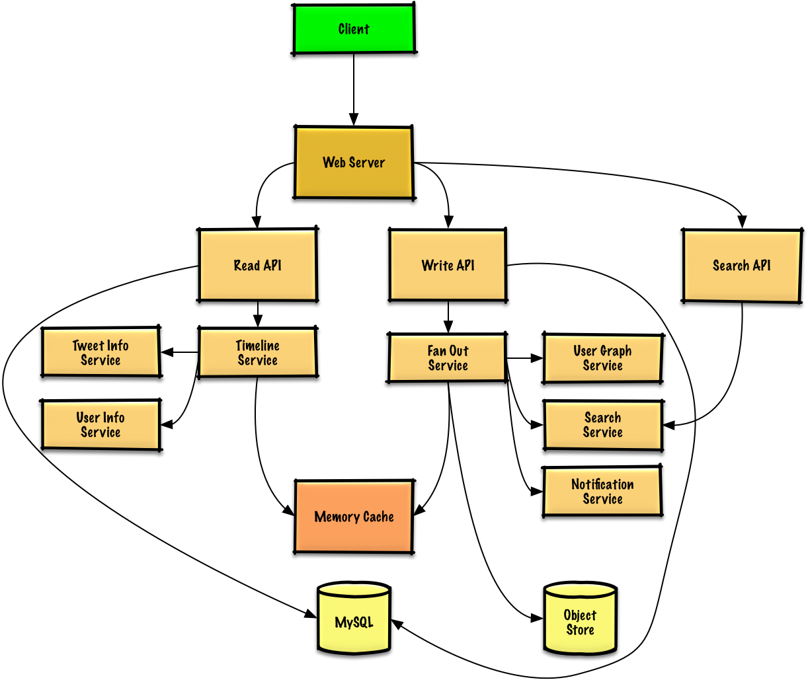

# Design the Twitter timeline and search

## Step 1: Outline use cases and constraints
### Use cases
- User posts a tweet
    - Service pushes tweets to followers, sending push notifications and emails
- User views the user timeline (activity from the user)
- User views the home timeline (activity from people the user is following)
- User searches keywords
- Service has high availability
- Service pushes tweets to the Twitter Firehose and other streams
- Service strips out tweets based on user's visibility settings
    - Hide @reply if the user is not also following the person being replied to
    - Respect 'hide retweets' setting
- Analytics

### Constraints and assumptions
* State assumptions
    - General
        - Traffic is not evenly distributed
        - Posting a tweet should be fast
            - Fanning out a tweet to all of your followers should be fast, unless you have millions of followers
        - 100 million active users
        - 500 million tweets per day or 15 billion tweets per month
            - Each tweet averages a fanout of 10 deliveries
            - 5 billion total tweets delivered on fanout per day
            - 150 billion tweets delivered on fanout per month
        - 250 billion read requests per month
        - 10 billion searches per month
    - Timeline
        - Viewing the timeline should be fast
        - Twitter is more read heavy than write heavy
            - Optimize for fast reads of tweets
        - Ingesting tweets is write heavy
    - Search
        - Searching should be fast
        - Search is read-heavy

* Calculate usage
    - Size per tweet:
        - tweet_id - 8 bytes
        - user_id - 32 bytes
        - text - 140 bytes
        - media - 10 KB average
        - Total: ~10 KB
    - 150 TB of new tweet content per month
        - 10 KB per tweet * 500 million tweets per day * 30 days per month
        - 5.4 PB of new tweet content in 3 years
    - 100 thousand read requests per second
        - 250 billion read requests per month * (400 requests per second / 1 billion requests per month)
    - 6,000 tweets per second
        - 15 billion tweets per month * (400 requests per second / 1 billion requests per month)
    - 60 thousand tweets delivered on fanout per second
        - 150 billion tweets delivered on fanout per month * (400 requests per second / 1 billion requests per month)
    - 4,000 search requests per second

## Step 2: Create a high level design
 <br />

## Step 3: Design core components
### Use case: User posts a tweet
Sample API:
```
$ curl -X POST --data '{ "user_id": "123", "auth_token": "ABC123", \
    "status": "hello world!", "media_ids": "ABC987" }' \
    https://twitter.com/api/v1/tweet
```
Response:
```
{
    "created_at": "Wed Sep 05 00:37:15 +0000 2012",
    "status": "hello world!",
    "tweet_id": "987",
    "user_id": "123"
}
```
- The Client posts a tweet to the Web Server, running as a reverse proxy
- The Web Server forwards the request to the Write API server
- The Write API stores the tweet in the user's timeline on a SQL database
- The Write API contacts the Fan Out Service, which does the following:
    - Queries the User Graph Service to find the user's followers stored in the Memory Cache
    - Stores the tweet in the home timeline of the user's followers in a Memory Cache
        - O(n) operation: 1,000 followers = 1,000 lookups and inserts
    - Stores the tweet in the Search Index Service to enable fast searching
    - Stores media in the Object Store
    - Uses the Notification Service to send out push notifications to followers:
        - Uses a Queue (not pictured) to asynchronously send out notifications

Database Design
- We could store the user's own tweets to populate the user timeline (activity from the user) in a relational database.

- Delivering tweets and building the home timeline (activity from people the user is following) is trickier. Fanning out tweets to all followers (60 thousand tweets delivered on fanout per second) will overload a traditional relational database. We'll probably want to choose a data store with fast writes such as a NoSQL database or Memory Cache.

- We could store media such as photos or videos on an Object Store.

- The new tweet would be placed in the Memory Cache, which populates user's home timeline (activity from people the user is following).

- If our Memory Cache is Redis, we could use a native Redis list with the following structure:
    ```
        tweet n+1                 tweet n
    |8 bytes  8 bytes  1 byte|8 bytes  8 bytes  1 byte|
    |tweet_id user_id   meta |tweet_id user_id   meta |
    ```

### Use case: User views the home timeline
Sample API:
```
$ curl https://twitter.com/api/v1/home_timeline?user_id=123
```
Response:
```
{
    "user_id": "456",
    "tweet_id": "123",
    "status": "foo"
}, {
    "user_id": "789",
    "tweet_id": "456",
    "status": "bar"
}
```
- The Client posts a home timeline request to the Web Server
- The Web Server forwards the request to the Read API server
- The Read API server contacts the Timeline Service, which does the following:
    - Gets the timeline data stored in the Memory Cache, containing tweet ids and user ids - O(1)
    - Queries the Tweet Info Service with a multiget to obtain additional info about the tweet ids - O(n)
    - Queries the User Info Service with a multiget to obtain additional info about the user ids - O(n)

### Use case: User views the user timeline
- The Client posts a user timeline request to the Web Server
- The Web Server forwards the request to the Read API server
- The Read API retrieves the user timeline from the SQL Database
- The REST API would be similar to the home timeline, except all tweets would come from the user as opposed to the people the user is following.

### Use case: User searches keywords
Sample API:
```
$ curl https://twitter.com/api/v1/search?query=hello+world
```
The response would be similar to that of the home timeline, except for tweets matching the given query.

- The Client sends a search request to the Web Server
- The Web Server forwards the request to the Search API server
- The Search API contacts the Search Service, which does the following:
    - Parses/tokenizes the input query, determining what needs to be searched
        - Removes markup
        - Breaks up the text into terms
        - Fixes typos
        - Normalizes capitalization
        - Converts the query to use boolean operations
    - Queries the Search Cluster (ie Lucene) for the results:
        - Scatter gathers each server in the cluster to determine if there are any results for the query
        - Merges, ranks, sorts, and returns the results

## Step 4: Scale the design
 <br />

The Fanout Service is a potential bottleneck. Twitter users with millions of followers could take several minutes to have their tweets go through the fanout process. This could lead to race conditions with @replies to the tweet, which we could mitigate by re-ordering the tweets at serve time.

We could also avoid fanning out tweets from highly-followed users. Instead, we could search to find tweets for highly-followed users, merge the search results with the user's home timeline results, then re-order the tweets at serve time.

Additional optimizations include:
- Keep only several hundred tweets for each home timeline in the Memory Cache
- Keep only active users' home timeline info in the Memory Cache
    - If a user was not previously active in the past 30 days, we could rebuild the timeline from the SQL Database
        - Query the User Graph Service to determine who the user is following
        - Get the tweets from the SQL Database and add them to the Memory Cache
- Store only a month of tweets in the Tweet Info Service
- Store only active users in the User Info Service
- The Search Cluster would likely need to keep the tweets in memory to keep latency low

We'll also want to address the bottleneck with the SQL Database.

Although the Memory Cache should reduce the load on the database, it is unlikely the SQL Read Replicas alone would be enough to handle the cache misses. We'll probably need to employ additional SQL scaling patterns.


