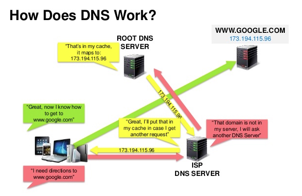
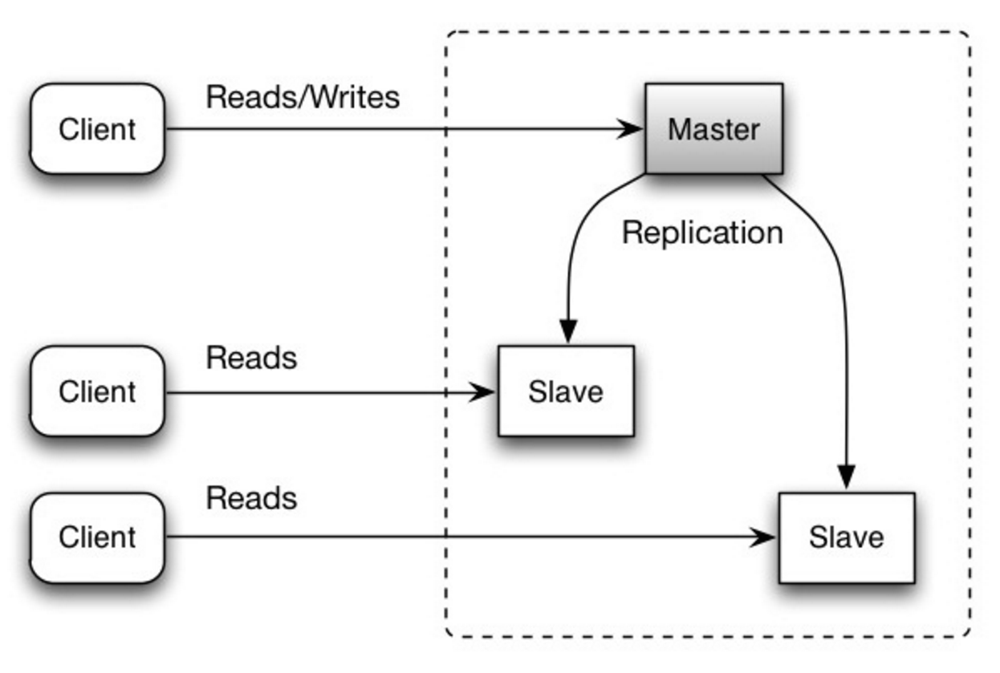
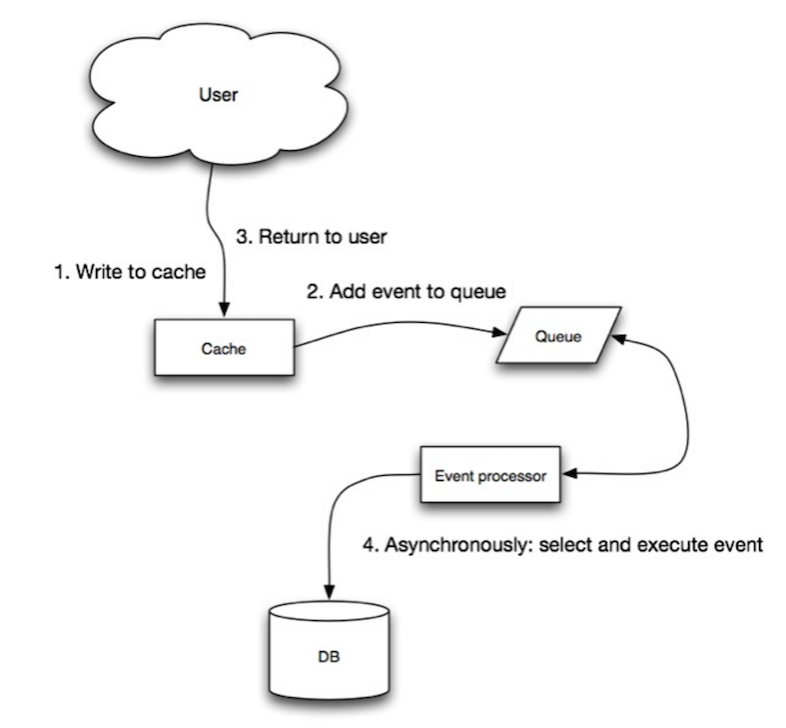
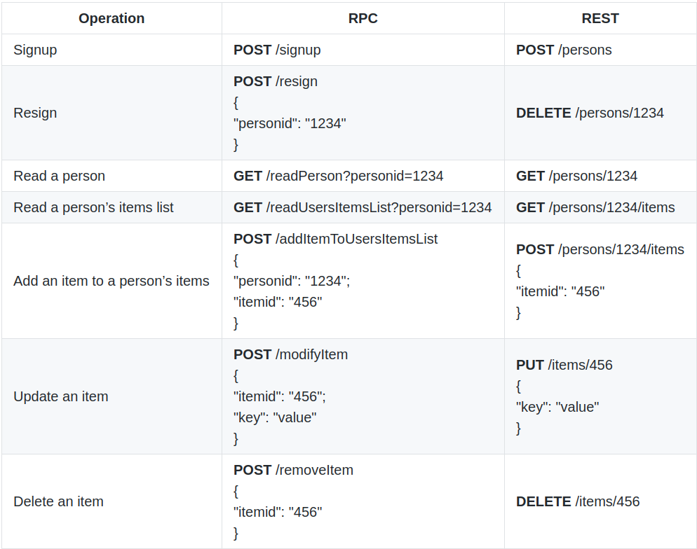

# System Design

## How to approach a system design question
1. Outline use cases, constraints, and assumptions
Gather requirements and scope the problem. Ask questions to clarify use cases and constraints. Discuss assumptions.
    - Who is going to use it?
    - How are they going to use it?
    - How many users are there?
    - What does the system do?
    - What are the inputs and outputs of the system?
    - How much data do we expect to handle?
    - How many requests per second do we expect?
    - What is the expected read to write ratio?

2. Create a high level design
Outline a high level design with all important components.
    - Sketch the main components and connections
    - Justify your ideas

3. Design core components
Dive into details for each core component. For example, if you were asked to design a url shortening service, discuss:
    - Generating and storing a hash of the full url
        - MD5 and Base62
        - Hash collisions
        - SQL or NoSQL
        - Database schema
    - Translating a hashed url to the full url
        - Database lookup
    - API and object-oriented design

4. Scale the design
Identify and address bottlenecks, given the constraints. For example, do you need the following to address scalability issues?
    - Load balancer
    - Horizontal scaling
    - Caching
    - Database sharding

5. Discuss potential solutions and trade-offs. Everything is a trade-off. Address bottlenecks using principles of scalable system design.

## Trade Offs
### Performance vs Scalability
A service is scalable if it results in increased performance in a manner proportional to resources added.
1. If you have a performance problem, your system is slow for a single user.
2. If you have a scalability problem, your system is fast for a single user but slow under heavy load.

### Latency vs Throughput
- Latency is the time to perform some action or to produce some result.

- Throughput is the number of such actions or results per unit of time.

- Generally, you should aim for maximal throughput with acceptable latency.

### Availability vs Consistency
#### CAP Theorem
In a distributed computer system, you can only support two of the following guarantees:
* **Consistency** - A read is guaranteed to return the most recent write for a given client. All nodes see the same data at the same time. Consistency is achieved by updating several nodes before allowing further reads.
* **Availability** - A non-failing node will return a reasonable response within a reasonable amount of time (no error or timeout). Every request gets a response on success/failure. Availability is achieved by replicating the data across different servers.
* **Partition Tolerance** - The system will continue to function when network partitions occur. A system that is partition-tolerant can sustain any amount of network failure that doesn’t result in a failure of the entire network. Data is sufficiently replicated across combinations of nodes and networks to keep the system up through intermittent outages.

1. CP - consistency and partition tolerance </br>
    - Waiting for a response from the partitioned node might result in a timeout error.
    - CP is a good choice if your business needs require atomic reads and writes.

2. AP - availability and partition tolerance </br>
    - Responses return the most recent version of the data available on a node, which might not be the latest. Writes might take some time to propagate when the partition is resolved.

    - AP is a good choice if the business needs allow for eventual consistency or when the system needs to continue working despite external errors.

#### Consistency Patterns
* Weak consistency
    - After a write, reads may or may not see it. A best effort approach is taken.

    - This approach is seen in systems such as memcached. Weak consistency works well in real time use cases such as VoIP, video chat, and realtime multiplayer games. For example, if you are on a phone call and lose reception for a few seconds, when you regain connection you do not hear what was spoken during connection loss.

* Eventual consistency
    - After a write, reads will eventually see it (typically within milliseconds). Data is replicated asynchronously.

    - This approach is seen in systems such as DNS and email. Eventual consistency works well in highly available systems.

* Strong consistency
    - After a write, reads will see it. Data is replicated synchronously.

    - This approach is seen in file systems and RDBMSes. Strong consistency works well in systems that need transactions.

#### Availability Patterns
* Fail-over
    1. Active-passive
        - With active-passive fail-over, heartbeats are sent between the active and the passive server on standby. If the heartbeat is interrupted, the passive server takes over the active's IP address and resumes service.

        - The length of downtime is determined by whether the passive server is already running in 'hot' standby or whether it needs to start up from 'cold' standby. Only the active server handles traffic.

        - Active-passive failover can also be referred to as master-slave failover.

    2. Active-active
        - In active-active, both servers are managing traffic, spreading the load between them.

        - If the servers are public-facing, the DNS would need to know about the public IPs of both servers. If the servers are internal-facing, application logic would need to know about both servers.

        - Active-active failover can also be referred to as master-master failover.

    3. Disadvantage
        - Fail-over adds more hardware and additional complexity.

        - There is a potential for loss of data if the active system fails before any newly written data can be replicated to the passive.

* Replication
    1. Master-Slave 
    2. Master-Master

* Availability in Parallel vs in Sequence
    * In Sequence
        ```
        Availability(Total) = Availability(Foo) * Availability(Bar)
        ```

    * In Parallel
        ```
        Availability(Total) = 1 - (1 - Availability(Foo)) * (1 - Availability(Bar))
        ```

## Design Concepts
### DNS
 <br />

Disadvantage(s):
1. Accessing a DNS server introduces a slight delay, although mitigated by caching described above.

2. DNS server management could be complex and is generally managed by governments, ISPs, and large companies.

3. DNS services have recently come under DDoS attack, preventing users from accessing websites such as Twitter without knowing Twitter's IP address(es).

### CDN
A CDN is a globally distributed network of proxy servers, serving content from locations closer to the user. Generally, static files such as HTML/CSS/JS, photos, and videos are served from CDN.

* Push CDNs
    - Push CDNs receive new content whenever changes occur on your server. You take full responsibility for providing content, uploading directly to the CDN and rewriting URLs to point to the CDN. You can configure when content expires and when it is updated. Content is uploaded only when it is new or changed, minimizing traffic, but maximizing storage.

    - Sites with a small amount of traffic or sites with content that isn't often updated work well with push CDNs. Content is placed on the CDNs once, instead of being re-pulled at regular intervals.

* Pull CDNs
    - Pull CDNs grab new content from your server when the first user requests the content. You leave the content on your server and rewrite URLs to point to the CDN. This results in a slower request until the content is cached on the CDN.

    - A time-to-live (TTL) determines how long content is cached. Pull CDNs minimize storage space on the CDN, but can create redundant traffic if files expire and are pulled before they have actually changed.

    - Sites with heavy traffic work well with pull CDNs, as traffic is spread out more evenly with only recently-requested content remaining on the CDN.

* Advantages:
    - Users receive content at data centers close to them

    - Your servers do not have to serve requests that the CDN fulfills

* Disadvantages:
    - CDN costs could be significant depending on traffic, although this should be weighed with additional costs you would incur not using a CDN.

    - Content might be stale if it is updated before the TTL expires it.

    - CDNs require changing URLs for static content to point to the CDN. 

### Load Balancer
Load balancers distribute incoming client requests to computing resources such as application servers and databases. In each case, the load balancer returns the response from the computing resource to the appropriate client. To protect against failures, it's common to set up multiple load balancers, either in active-passive or active-active mode.

* Layer 4 load balancing

    Layer 4 load balancers look at info at the transport layer to decide how to distribute requests. Generally, this involves the source, destination IP addresses, and ports in the header, but not the contents of the packet. Layer 4 load balancers forward network packets to and from the upstream server, performing Network Address Translation (NAT).

* Layer 7 load balancing

    Layer 7 load balancers look at the application layer to decide how to distribute requests. This can involve contents of the header, message, and cookies. Layer 7 load balancers terminates network traffic, reads the message, makes a load-balancing decision, then opens a connection to the selected server. For example, a layer 7 load balancer can direct video traffic to servers that host videos while directing more sensitive user billing traffic to security-hardened servers.

    At the cost of flexibility, layer 4 load balancing requires less time and computing resources than Layer 7, although the performance impact can be minimal on modern commodity hardware.

* Horizontal scaling

    Load balancers can also help with horizontal scaling, improving performance and availability. Scaling out using commodity machines is more cost efficient and results in higher availability than scaling up a single server on more expensive hardware, called Vertical Scaling. It is also easier to hire for talent working on commodity hardware than it is for specialized enterprise systems.

    - Disadvantages
        - Scaling horizontally introduces complexity and involves cloning servers

        - Servers should be stateless: they should not contain any user-related data like sessions or profile pictures

        - Sessions can be stored in a centralized data store such as a database (SQL, NoSQL) or a persistent cache (Redis, Memcached)

        - Downstream servers such as caches and databases need to handle more simultaneous connections as upstream servers scale out

* Load Balancing Methods
    - Least Connection Method — This method directs traffic to the server with the fewest active connections. This approach is quite useful when there are a large number of persistent client connections which are unevenly distributed between the servers.

    - Least Response Time Method — This algorithm directs traffic to the server with the fewest active connections and the lowest average response time.

    - Least Bandwidth Method - This method selects the server that is currently serving the least amount of traffic measured in megabits per second (Mbps).

    - Round Robin Method — This method cycles through a list of servers and sends each new request to the next server. When it reaches the end of the list, it starts over at the beginning. It is most useful when the servers are of equal specification and there are not many persistent connections.

    - Weighted Round Robin Method — The weighted round-robin scheduling is designed to better handle servers with different processing capacities. Each server is assigned a weight. Servers with higher weights receive new connections before those with less weights and servers with higher weights get more connections than those with less weights.

    - IP Hash — Under this method, a hash of the IP address of the client is calculated to redirect the request to a server.

* Advantages:
    - Preventing requests from going to unhealthy servers

    - Preventing overloading resources

    - Helping eliminate single points of failure

    - Load balancers can be implemented with hardware (expensive) or with software such as HAProxy.

    - SSL termination - Decrypt incoming requests and encrypt server responses so backend servers do not have to perform these potentially expensive operations

    - Removes the need to install X.509 certificates on each server

    - Session persistence - Issue cookies and route a specific client's requests to same instance if the web apps do not keep track of sessions

* Disadvantages
    - The load balancer can become a performance bottleneck if it does not have enough resources or if it is not configured properly.

    - Introducing a load balancer to help eliminate single points of failure results in increased complexity.

    - A single load balancer is a single point of failure, configuring multiple load balancers further increases complexity.

### Reverse Proxy (Web Server)
A reverse proxy is a web server that centralizes internal services and provides unified interfaces to the public. Requests from clients are forwarded to a server that can fulfill it before the reverse proxy returns the server's response to the client.

* Load balancer vs reverse proxy
    - Deploying a load balancer is useful when you have multiple servers. Often, load balancers route traffic to a set of servers serving the same function.

    - Reverse proxies can be useful even with just one web server or application server, opening up the benefits described in the previous section.

    - Solutions such as NGINX and HAProxy can support both layer 7 reverse proxying and load balancing.

* Advantages
    - Increased security - Hide information about backend servers, blacklist IPs, limit number of connections per client

    - Increased scalability and flexibility - Clients only see the reverse proxy's IP, allowing you to scale servers or change their configuration

    - SSL termination - Decrypt incoming requests and encrypt server responses so backend servers do not have to perform these potentially expensive operations
        - Removes the need to install X.509 certificates on each server

    - Compression - Compress server responses

    - Caching - Return the response for cached requests

    - Static content - Serve static content directly
        - HTML/CSS/JS
        - Photos
        - Videos
        - Etc

* Disadvantages
    - Introducing a reverse proxy results in increased complexity.

    - A single reverse proxy is a single point of failure, configuring multiple reverse proxies (ie a failover) further increases complexity.

### Application Layer
Separating out the web layer from the application layer (also known as platform layer) allows you to scale and configure both layers independently. Adding a new API results in adding application servers without necessarily adding additional web servers. The single responsibility principle advocates for small and autonomous services that work together. Small teams with small services can plan more aggressively for rapid growth.

* Microservices

    Microservices can be described as a suite of independently deployable, small, modular services. Each service runs a unique process and communicates through a well-defined, lightweight mechanism to serve a business goal.

* Service Discovery

    Systems such as Consul, Etcd, and Zookeeper can help services find each other by keeping track of registered names, addresses, and ports. Health checks help verify service integrity and are often done using an HTTP endpoint. Both Consul and Etcd have a built in key-value store that can be useful for storing config values and other shared data.

* Disadvantages
    - Adding an application layer with loosely coupled services requires a different approach from an architectural, operations, and process viewpoint (vs a monolithic system).

    - Microservices can add complexity in terms of deployments and operations.

### Databases
* ACID
    - Atomicity - Each transaction is all or nothing

    - Consistency - Any transaction will bring the database from one valid state to another

    - Isolation - Executing transactions concurrently has the same results as if the transactions were executed serially

    - Durability - Once a transaction has been committed, it will remain so

* Replication
    - Master-Slave Replication

         <br />
        - The master serves reads and writes, replicating writes to one or more slaves, which serve only reads.
        
        - Slaves can also replicate to additional slaves in a tree-like fashion. If the master goes offline, the system can continue to operate in read-only mode until a slave is promoted to a master or a new master is provisioned.

    - Master-Master Replication

         <br />
        - Both masters serve reads and writes and coordinate with each other on writes.
        
        - If either master goes down, the system can continue to operate with both reads and writes.

        
        - You'll need a load balancer or you'll need to make changes to your application logic to determine where to write.
        
        - Most master-master systems are either loosely consistent (violating ACID) or have increased write latency due to synchronization.
        
        - Conflict resolution comes more into play as more write nodes are added and as latency increases.

    - Disadvantages
        - There is a potential for loss of data if the master fails before any newly written data can be replicated to other nodes.
        
        - Writes are replayed to the read replicas. If there are a lot of writes, the read replicas can get bogged down with replaying writes and can't do as many reads.
        
        - The more read slaves, the more you have to replicate, which leads to greater replication lag.
        
        - On some systems, writing to the master can spawn multiple threads to write in parallel, whereas read replicas only support writing sequentially with a single thread.
        
        - Replication adds more hardware and additional complexity.

* Federation

    Federation (or functional partitioning) splits up databases by function. For example, instead of a single, monolithic database, you could have three databases: forums, users, and products, resulting in less read and write traffic to each database and therefore less replication lag. Smaller databases result in more data that can fit in memory, which in turn results in more cache hits due to improved cache locality. With no single central master serializing writes you can write in parallel, increasing throughput.

    - Disadvantages
        - Federation is not effective if your schema requires huge functions or tables.
        
        - You'll need to update your application logic to determine which database to read and write.
        
        - Joining data from two databases is more complex with a server link.

        - Enforce data integrity constraints such as foreign keys in a partitioned database can be extremely difficult
        
        - Federation adds more hardware and additional complexity.

* Sharding

     <br />
    Sharding distributes data across different databases such that each database can only manage a subset of the data. Taking a users database as an example, as the number of users increases, more shards are added to the cluster. Common ways to shard a table of users is either through the user's last name initial or the user's geographic location.

    - Criteria
        - Key or Hash-based partitioning: Under this scheme, we apply a hash function to some key attributes of the entity we are storing; that yields the partition number. For example, if we have 100 DB servers and our ID is a numeric value that gets incremented by one each time a new record is inserted. In this example, the hash function could be ‘ID % 100’, which will give us the server number where we can store/read that record. This approach should ensure a uniform allocation of data among servers. The fundamental problem with this approach is that it effectively fixes the total number of DB servers, since adding new servers means changing the hash function which would require redistribution of data and downtime for the service. A workaround for this problem is to use Consistent Hashing.

        - List partitioning: In this scheme, each partition is assigned a list of values, so whenever we want to insert a new record, we will see which partition contains our key and then store it there. For example, we can decide all users living in Iceland, Norway, Sweden, Finland, or Denmark will be stored in a partition for the Nordic countries.

        - Round-robin partitioning: This is a very simple strategy that ensures uniform data distribution. With ‘n’ partitions, the ‘i’ tuple is assigned to partition (i mod n).

        - Composite partitioning: Under this scheme, we combine any of the above partitioning schemes to devise a new scheme. For example, first applying a list partitioning scheme and then a hash based partitioning. Consistent hashing could be considered a composite of hash and list partitioning where the hash reduces the key space to a size that can be listed.

    - Advantages
        - Less read and write traffic, less replication, and more cache hits.

        - Reduces index size, which generally improves performance with faster queries.

        - If one shard goes down, the other shards are still operational, although you'll want to add some form of replication to avoid data loss.
        
        - No single central master serializing writes, allowing you to write in parallel with increased throughput.

    - Disadvantages
        - If the value whose range is used for partitioning isn’t chosen carefully, then the partitioning scheme will lead to unbalanced servers

        - You'll need to update your application logic to work with shards, which could result in complex SQL queries.
        
        - Data distribution can become lopsided in a shard. For example, a set of power users on a shard could result in increased load to that shard compared to others.
        
        - Rebalancing adds additional complexity. A sharding function based on consistent hashing can reduce the amount of transferred data.
        
        - Joining data from multiple shards is more complex.
        
        - Sharding adds more hardware and additional complexity.

* Directory Service

    For sharding and federation, we can create a lookup service which knows your current partitioning scheme and abstracts it away from the DB access code. So, to find out where a particular data entity resides, we query the directory server that holds the mapping between each tuple key to its DB server.
    
    This loosely coupled approach means we can perform tasks like adding servers to the DB pool or changing our partitioning scheme without having an impact on the application.

* Denormalization

    Denormalization attempts to improve read performance at the expense of some write performance. Redundant copies of the data are written in multiple tables to avoid expensive joins. Some RDBMS such as PostgreSQL and Oracle support materialized views which handle the work of storing redundant information and keeping redundant copies consistent.

    Once data becomes distributed with techniques such as federation and sharding, managing joins across data centers further increases complexity. Denormalization might circumvent the need for such complex joins.

    In most systems, reads can heavily outnumber writes 100:1 or even 1000:1. A read resulting in a complex database join can be very expensive, spending a significant amount of time on disk operations.

    - Disadvantages
        - Data is duplicated.

        - Constraints can help redundant copies of information stay in sync, which increases complexity of the database design.

        - A denormalized database under heavy write load might perform worse than its normalized counterpart.

* SQL Tuning
    - Tighten up the schema
        - MySQL dumps to disk in contiguous blocks for fast access.

        - Use CHAR instead of VARCHAR for fixed-length fields.
            - CHAR effectively allows for fast, random access, whereas with VARCHAR, you must find the end of a string before moving onto the next one.

        - Use TEXT for large blocks of text such as blog posts. TEXT also allows for boolean searches. Using a TEXT field results in storing a pointer on disk that is used to locate the text block.

        - Use INT for larger numbers up to 2^32 or 4 billion.

        - Use DECIMAL for currency to avoid floating point representation errors.

        - Avoid storing large BLOBS, store the location of where to get the object instead.

        - VARCHAR(255) is the largest number of characters that can be counted in an 8 bit number, often maximizing the use of a byte in some RDBMS.

        - Set the NOT NULL constraint where applicable to improve search performance.

    - Use good indexes
        - Columns that you are querying (SELECT, GROUP BY, ORDER BY, JOIN) could be faster with indices.

        - Indices are usually represented as self-balancing B-tree that keeps data sorted and allows searches, sequential access, insertions, and deletions in logarithmic time.

        - Placing an index can keep the data in memory, requiring more space.

        - Writes could also be slower since the index also needs to be updated.

        - When loading large amounts of data, it might be faster to disable indices, load the data, then rebuild the indices.

    - Avoid expensive joins
        - Denormalize where performance demands it.

    - Partition tables
        - Break up a table by putting hot spots in a separate table to help keep it in memory.

    - Tune the query cache
        - In some cases, the query cache could lead to performance issues.

* NoSQL

    NoSQL is a collection of data items represented in a key-value store, document store, wide column store, or a graph database. Data is denormalized, and joins are generally done in the application code. Most NoSQL stores lack true ACID transactions and favor eventual consistency.

    BASE is often used to describe the properties of NoSQL databases. In comparison with the CAP Theorem, BASE chooses availability over consistency.

    - Basically available - the system guarantees availability.

    - Soft state - the state of the system may change over time, even without input.

    - Eventual consistency - the system will become consistent over a period of time, given that the system doesn't receive input during that period.

    1. Key-value store
    
        A key-value store generally allows for O(1) reads and writes and is often backed by memory or SSD. Data stores can maintain keys in lexicographic order, allowing efficient retrieval of key ranges. Key-value stores can allow for storing of metadata with a value.

        Key-value stores provide high performance and are often used for simple data models or for rapidly-changing data, such as an in-memory cache layer. Since they offer only a limited set of operations, complexity is shifted to the application layer if additional operations are needed.

        A key-value store is the basis for more complex systems such as a document store, and in some cases, a graph database.

    2. Document store

        A document store is centered around documents (XML, JSON, binary, etc), where a document stores all information for a given object. Document stores provide APIs or a query language to query based on the internal structure of the document itself. Note, many key-value stores include features for working with a value's metadata, blurring the lines between these two storage types.

        Based on the underlying implementation, documents are organized by collections, tags, metadata, or directories. Although documents can be organized or grouped together, documents may have fields that are completely different from each other.

        Some document stores like MongoDB and CouchDB also provide a SQL-like language to perform complex queries. DynamoDB supports both key-values and documents.

        Document stores provide high flexibility and are often used for working with occasionally changing data.

    3. Wide column store

         <br />
        A wide column store's basic unit of data is a column (name/value pair). A column can be grouped in column families (analogous to a SQL table). Super column families further group column families. You can access each column independently with a row key, and columns with the same row key form a row. Each value contains a timestamp for versioning and for conflict resolution.

        Google introduced Bigtable as the first wide column store, which influenced the open-source HBase often-used in the Hadoop ecosystem, and Cassandra from Facebook. Stores such as BigTable, HBase, and Cassandra maintain keys in lexicographic order, allowing efficient retrieval of selective key ranges.

        Wide column stores offer high availability and high scalability. They are often used for very large data sets.

    4. Graph database

         <br />
        In a graph database, each node is a record and each arc is a relationship between two nodes. Graph databases are optimized to represent complex relationships with many foreign keys or many-to-many relationships.

        Graphs databases offer high performance for data models with complex relationships, such as a social network. They are relatively new and are not yet widely-used; it might be more difficult to find development tools and resources. Many graphs can only be accessed with REST APIs.

* SQL vs NoSQL
    - Reasons for SQL:
        - Structured data
        - Strict schema
        - Relational data
        - Need for complex joins
        - Transactions
        - Clear patterns for scaling
        - More established: developers, community, code, tools, etc
        - Lookups by index are very fast

    - Reasons for NoSQL:
        - Semi-structured data
        - Dynamic or flexible schema
        - Non-relational data
        - No need for complex joins
        - Store many TB (or PB) of data
        - Very data intensive workload
        - Very high throughput for IOPS

    - Sample data well-suited for NoSQL:
        - Rapid ingest of clickstream and log data
        - Leaderboard or scoring data
        - Temporary data, such as a shopping cart
        - Frequently accessed ('hot') tables
        - Metadata/lookup tables

### Caches
Caching improves page load times and can reduce the load on your servers and databases. Databases often benefit from a uniform distribution of reads and writes across its partitions. Popular items can skew the distribution, causing bottlenecks. Putting a cache in front of a database can help absorb uneven loads and spikes in traffic. There are two types of caches: global caches and distributed caches.

- Client caching

    Caches can be located on the client side (OS or browser), server side, or in a distinct cache layer.

- CDN caching

    CDNs are considered a type of cache. In a typical CDN setup, a request will first ask the CDN for a piece of static media; the CDN will serve that content if it has it locally available. If it isn’t available, the CDN will query the back-end servers for the file, cache it locally, and serve it to the requesting user.

    If the system we are building isn’t yet large enough to have its own CDN, we can ease a future transition by serving the static media off a separate subdomain (e.g. static.yourservice.com) using a lightweight HTTP server like Nginx, and cut-over the DNS from your servers to a CDN later.

- Web server caching

    Reverse proxies and caches such as Varnish can serve static and dynamic content directly. Web servers can also cache requests, returning responses without having to contact application servers.

- Database caching

    Your database usually includes some level of caching in a default configuration, optimized for a generic use case. Tweaking these settings for specific usage patterns can further boost performance.

- Application caching

    In-memory caches such as Memcached and Redis are key-value stores between your application and your data storage. Since the data is held in RAM, it is much faster than typical databases where data is stored on disk. RAM is more limited than disk, so cache invalidation algorithms such as least recently used (LRU) can help invalidate 'cold' entries and keep 'hot' data in RAM.

    Redis has the following additional features:
    - Persistence option
    - Built-in data structures such as sorted sets and lists
    
    There are multiple levels you can cache that fall into two general categories: database queries and objects:
    - Row level
    - Query-level
    - Fully-formed serializable objects
    - Fully-rendered HTML
    
    Generally, you should try to avoid file-based caching, as it makes cloning and auto-scaling more difficult.

- Caching at the database query level

    Whenever you query the database, hash the query as a key and store the result to the cache. This approach suffers from expiration issues:

    - Hard to delete a cached result with complex queries
    - If one piece of data changes such as a table cell, you need to delete all cached queries that might include the changed cell

- Caching at the object level

    See your data as an object, similar to what you do with your application code. Have your application assemble the dataset from the database into a class instance or a data structure(s):
    - Remove the object from cache if its underlying data has changed
    - Allows for asynchronous processing: workers assemble objects by consuming the latest cached object
    
    Suggestions of what to cache:
    - User sessions
    - Fully rendered web pages
    - Activity streams
    - User graph data

- When to update the cache
    - Cache-aside

         <br />
        The application is responsible for reading and writing from storage. The cache does not interact with storage directly. The application does the following:
        - Look for entry in cache, resulting in a cache miss
        - Load entry from the database
        - Add entry to cache
        - Return entry

        Advantages
        - Memcached is generally used in this manner.
        - Subsequent reads of data added to cache are fast. 
        - Cache-aside is also referred to as lazy loading. Only requested data is cached, which avoids filling up the cache with data that isn't requested.

        Disadvantages
        - Each cache miss results in three trips, which can cause a noticeable delay.
        - Data can become stale if it is updated in the database. This issue is mitigated by setting a time-to-live (TTL) which forces an update of the cache entry, or by using write-through.
        - When a node fails, it is replaced by a new, empty node, increasing latency.

    - Write-through

         <br />
        The application uses the cache as the main data store, reading and writing data to it, while the cache is responsible for reading and writing to the database. Write through minimizes the risk of data loss, since every write operation must be done twice before returning success to the client:
        - Application adds/updates entry in cache
        - Cache synchronously writes entry to data store
        - Return

        Disadvantages
        - Write-through is a slow overall operation due to the write operation, but subsequent reads of just written data are fast. Users are generally more tolerant of latency when updating data than reading data. Data in the cache is not stale.
        - When a new node is created due to failure or scaling, the new node will not cache entries until the entry is updated in the database. Cache-aside in conjunction with write through can mitigate this issue.
        - Most data written might never be read, which can be minimized with a TTL.

    - Write-behind

         <br />
        In write-behind, the application does the following:
        - Add/update entry in cache
        - Asynchronously write entry to the data store, improving write performance
        
        Disadvantages
        - There could be data loss if the cache goes down prior to its contents hitting the data store.
        - It is more complex to implement write-behind than it is to implement cache-aside or write-through.

    - Refresh-ahead

         <br />
        You can configure the cache to automatically refresh any recently accessed cache entry prior to its expiration.
        
        Refresh-ahead can result in reduced latency vs read-through if the cache can accurately predict which items are likely to be needed in the future.

        Disadvantages
        - Not accurately predicting which items are likely to be needed in the future can result in reduced performance than without refresh-ahead.

- Cache eviction policies
    - First In First Out
    - Last In First Out
    - Least Recently Used
    - Most Recently Used
    - Least Frequently Used
    - Random Replacement

- Disadvantages
    - Need to maintain consistency between caches and the source of truth such as the database through cache invalidation.
    - Cache invalidation is a difficult problem, there is additional complexity associated with when to update the cache.
    - Need to make application changes such as adding Redis or memcached.

### Consistent Hashing
Consistent hashing is a very useful strategy for distributed caching system and DHTs. It allows us to distribute data across a cluster in such a way that will minimize reorganization when nodes are added or removed. Hence, the caching system will be easier to scale up or scale down.

- Can be used in sharding DB management
- Can be used in distribued cache management

In Consistent Hashing, objects are mapped to the same host if possible. When a host is removed from the system, the objects on that host are shared by other hosts; when a new host is added, it takes its share from a few hosts without touching other’s shares.

- Given a list of cache servers, hash them to integers in the range.
- To map a key to a server,
    - Hash it to a single integer.
    - Move clockwise on the ring until finding the first cache it encounters.
    - That cache is the one that contains the key. See animation below as an example: key1 maps to cache A; key2 maps to cache C.

The real data is essentially randomly distributed and thus may not be uniform. It may make the keys on caches unbalanced.

To handle this issue, we add “virtual replicas” for caches. Instead of mapping each cache to a single point on the ring, we map it to multiple points on the ring, i.e. replicas. This way, each cache is associated with multiple portions of the ring.

If the hash function “mixes well,” as the number of replicas increases, the keys will be more balanced.

### Asynchronism
1. Pre-Compute the Time Consuming Requests
    - Execute the time-consuming work in advance
    - Serve the finished work with a low request time
    - Turn dynamic content into static content
    - Tasks are done on a regular basis, maybe by a cronjob

2. Task Queues
    - An application publishes a job to the queue, then notifies the user of job status
    - A worker picks up the job from the queue, processes it, then signals the job is complete

3. Disadvantages
    - Use cases such as inexpensive calculations and realtime workflows might be better suited for synchronous operations, as introducing queues can add delays and complexity.

### Communication
* HTTP
    - GET: Reads a resource
    - POST: Creates a resource or trigger a process that handles data
    - PUT: Creates or replace a resource
    - PATCH: Partially updates a resource
    - DELETE: Deletes a resource

* TCP

    TCP is a connection-oriented protocol over an IP network. Connection is established and terminated using a handshake. All packets sent are guaranteed to reach the destination in the original order and without corruption through

* UDP

    UDP is connectionless. Datagrams (analogous to packets) are guaranteed only at the datagram level. Datagrams might reach their destination out of order or not at all. UDP does not support congestion control. Without the guarantees that TCP support, UDP is generally more efficient.

* RPC (Remote procedure call)

    RPC is focused on exposing behaviors. RPCs are often used for performance reasons with internal communications, as you can hand-craft native calls to better fit your use cases.

    Disadvantages
    - RPC clients become tightly coupled to the service implementation.
    - A new API must be defined for every new operation or use case.
    - It can be difficult to debug RPC.
    - You might not be able to leverage existing technologies out of the box. For example, it might require additional effort to ensure RPC calls are properly cached on caching servers such as Squid.

* REST

     <br />
    REST is focused on exposing data. It minimizes the coupling between client/server and is often used for public HTTP APIs. All communication must be stateless and cacheable. Being stateless, REST is great for horizontal scaling and partitioning.

    - Identify resources (URI in HTTP) - use the same URI regardless of any operation.
    - Change with representations (Verbs in HTTP) - use verbs, headers, and body.
    - Self-descriptive error message (status response in HTTP) - Use status codes, don't reinvent the wheel.
    - HATEOAS (HTML interface for HTTP) - your web service should be fully accessible in a browser.

    Disadvantages
    - With REST being focused on exposing data, it might not be a good fit if resources are not naturally organized or accessed in a simple hierarchy. For example, returning all updated records from the past hour matching a particular set of events is not easily expressed as a path. With REST, it is likely to be implemented with a combination of URI path, query parameters, and possibly the request body.
    - REST typically relies on a few verbs (GET, POST, PUT, DELETE, and PATCH) which sometimes doesn't fit your use case. For example, moving expired documents to the archive folder might not cleanly fit within these verbs.
    - Fetching complicated resources with nested hierarchies requires multiple round trips between the client and server to render single views, e.g. fetching content of a blog entry and the comments on that entry. For mobile applications operating in variable network conditions, these multiple roundtrips are highly undesirable.
    - Over time, more fields might be added to an API response and older clients will receive all new data fields, even those that they do not need, as a result, it bloats the payload size and leads to larger latencies.

## Things to Notice
* Datacenters are far away so it takes a long time to send anything between them.
* Memory is fast and disks are slow.
* By using a cheap compression algorithm a lot (by a factor of 2) of network bandwidth can be saved.
* Writes are 40 times more expensive than reads.
* Global shared data is expensive. This is a fundamental limitation of distributed systems. The lock contention in shared heavily written objects kills performance as transactions become serialized and slow.
* Architect for scaling writes.
* Optimize for low write contention.
* Optimize wide. Make writes as parallel as you can.