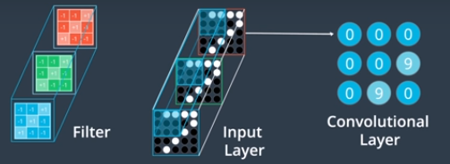
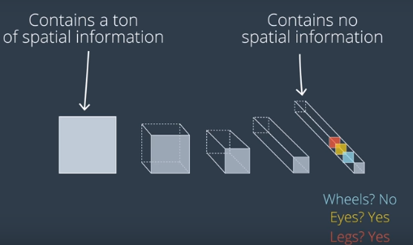
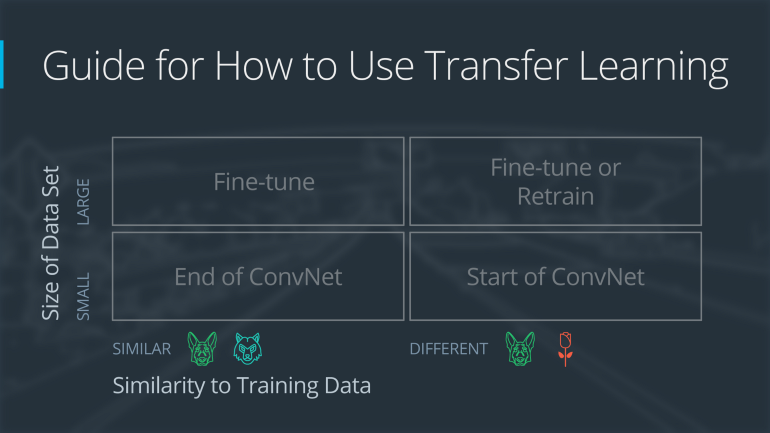
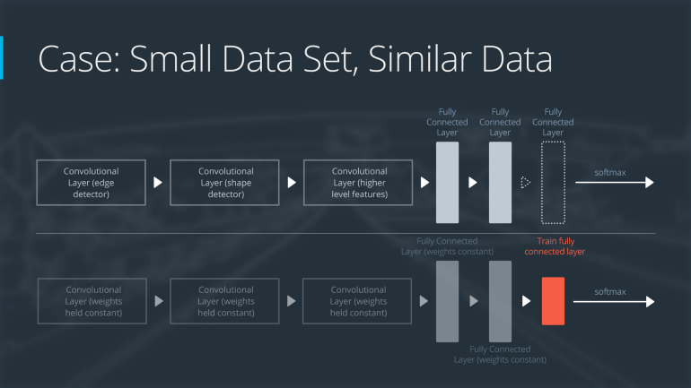

# Machine Learning Cheat Sheet — CNN

## MLP Vs CNN
* MLP only use fully connected layers

* MLP has to convert the images into vectors, and has no knowledge of each pixel’s neighbors;

* CNN use sparsely connected layers (locally connected)

* CNN accept matrix as input

## Convolutional Layer
 <br />
* Filter determines the pattern to detect; filter weights are learnt during training while it tries to minimize the loss function

* With N filters, we can get N convolved feature maps; then we can stack the N feature maps together as the input for the next convolutional layer

## Convolutional Layer Parameters
* filters — The number of filters.

* kernel_size — Number specifying both the height and width of the (square) convolution window.

* input_shape - Tuple specifying the height, width, and depth of the input. Required when it is first hidden layer.

* Stride — Amount by which the filter slides over the image, default is 1. Smaller stride will help with block artifact.

* Padding — When set to `Valid` (default), we loose some information of edge nodes when the edge nodes cannot fully cover the filter; When set to `same`, we padding the image with 0s to give the filter more space to move.

* activation — Activation function, usually set to `relu`.

## Formulas
* number of parameters of a Convolutional Layer
```
number of parameters = number_of_filters * filter_width * filter_width * prev_layer_depth + number_of_filters
```

* Shape of a Convolutional Layer
```
depth = number_of_filters
For padding = 'same':
    height = ceil(float(prev_layer_height) / float(stride))
    width = ceil(float(prev_layer_width) / float(stride)
For padding = 'valid':
    height = ceil(float(prev_layer_height-filter_width+1) / float(stride))
    width = ceil(float(prev_layer_width-filter_width+1) / float(stride)
```

* Pooling Layer
    - Max Pooling Layer: Take the maximum value in the window
    - Average Pooling Layer: Take average in the window
    - Global Max Pooling Layer: Take the maximum of the entire map in the stack
    - Global Average Pooling Layer: Take the average of the entire map in the stack

## CNN Architecture
 <br />
*Spatial Information is lost; Gaining Feature Information*

1. Resize the images to the same size before feed into the model; usually resize the images into square with each dimension equal to a power of two.

2. Input layer is followed by a sequence of convolutional layers and pooling layers, to generate feature maps <br />
**convolutional layers**: Maker the array deeper; kernel size is usually between 2 and 5; strides is usually set to 1; padding is usually set to same; activation function is usually set to relu; number of filters usually increases in the sequence. <br />
**pooling layers**: Decrease the spatial dimensions; for example, set pool size to 2, and stride to 2 will result in half the dimension size.

3. Flatten layer to flat the feature maps into a vector

4. Dense layers to elucidate the content of the image

5. Output layer for prediction (for classification, this should be a dense layer with number of nodes the same as number of classes)

## Image Augmentation
> To help make the models more statistically invariant, we can try introducing rotations, translations, etc. into our training images, so that the training set is expanded by augmenting the data. This will improve the model performance.

```python
from keras.preprocessing.image import ImageDataGenerator
# create and configure augmented image generator
datagen_train = ImageDataGenerator(
    # randomly shift images horizontally (10% of total width)
    width_shift_range=0.1,
    # randomly shift images vertically (10% of total height)
    height_shift_range=0.1,
    # randomly flip images horizontally
    horizontal_flip=True)
# fit augmented image generator on data
datagen_train.fit(x_train)
###############################
# define and compile the model#
###############################
from keras.callbacks import ModelCheckpoint
batch_size = 32
epochs = 100
# train the model
checkpointer = ModelCheckpoint(
    filepath='aug_model.weights.best.hdf5',
    verbose=1,
    save_best_only=True
)
model.fit_generator(
    datagen_train.flow( x_train, y_train, batch_size=batch_size ),
    # x_train.shape[0] is the number of unique samples in train set
    # steps_per_epoch ensure that the model sees x_train.shape[0] augmented images in each epoch.
    steps_per_epoch=x_train.shape[0] // batch_size,
    epochs=epochs,
    verbose=2,
    callbacks=[checkpointer],
    validation_data=(x_valid, y_valid),
    validation_steps=x_valid.shape[0] // batch_size
)
```

## Transfer Learning
> Transfer learning involves taking a pre-trained neural network and adapting the neural network to a new, different data set.

 <br />
*Four Cases when Using Transfer Learning*

### Case 1: Small Data Set, Similar Data
* slice off the end of the neural network

* add a new fully connected layer that matches the number of classes in the new data set

* randomize the weights of the new fully connected layer; freeze all the weights from the pre-trained network

* train the network to update the weights of the new fully connected layer

To avoid overfitting on the small data set, the weights of the original network will be held constant rather than re-training the weights.
Since the data sets are similar, images from each data set will have similar higher level features. Therefore most or all of the pre-trained neural network layers already contain relevant information about the new data set and should be kept.

 <br />
*Neural Network with Small Data Set, Similar Data*

### Case 2: Small Data Set, Different Data
* slice off most of the pre-trained layers near the beginning of the network

* add to the remaining pre-trained layers a new fully connected layer that matches the number of classes in the new data set

* randomize the weights of the new fully connected layer; freeze all the weights from the pre-trained network

* train the network to update the weights of the new fully connected layer

Because the data set is small, overfitting is still a concern. To combat overfitting, the weights of the original neural network will be held constant, like in the first case.
But the original training set and the new data set do not share higher level features. In this case, the new network will only use the layers containing lower level features.

 <br />
*Neural Network with Small Data Set, Different Data*

### Case 3: Large Data Set, Similar Data
* remove the last fully connected layer and replace with a layer matching the number of classes in the new data set

* randomly initialize the weights in the new fully connected layer

* initialize the rest of the weights using the pre-trained weights

* re-train the entire neural network

Overfitting is not as much of a concern when training on a large data set; therefore, you can re-train all of the weights.
Because the original training set and the new data set share higher level features, the entire neural network is used as well.

 <br />
*Neural Network with Large Data Set, Similar Data*

### Case 4: Large Data Set, Different Data
* If the new data set is large and different from the original training data:

* remove the last fully connected layer and replace with a layer matching the number of classes in the new data set

* retrain the network from scratch with randomly initialized weights

* alternatively, you could just use the same strategy as the “large and similar” data case

Even though the data set is different from the training data, initializing the weights from the pre-trained network might make training faster. So this case is exactly the same as the case with a large, similar data set.
If using the pre-trained network as a starting point does not produce a successful model, another option is to randomly initialize the convolutional neural network weights and train the network from scratch.

 <br />
*Neural Network with Large Data Set, Different Data*

## Vanishing Gradient Problem
The gradient tends to get smaller as we move backward through the hidden layers. So in deep neural network, the gradients of the loss function in initial layers approaches zero, making the network hard to train. The random initialization means the first layer throws away most information about the input image. Even if later layers have been extensively trained, they will still find it extremely difficult to identify the input image, simply because they don’t have enough information. Below are a few techniques to avoid vanishing gradient problem.

* RELU <br />
ReLU has a derivative of 1, while sigmoid function has a derivative of 0.25 maximum.

* ResNet <br />
Residual networks provide residual connections straight to earlier layers. The residual connection directly adds the value at the beginning of the block to the end of the block `(F(x)+x)`. This residual connection doesn’t go through activation functions that “squashes” the derivatives, resulting in a higher overall derivative of the block.

* Batch Normalization <br />
The vanishing gradient problem arises when a large input space is mapped to a small one, causing the derivatives to disappear. Batch normalization reduces this problem by simply normalizing the input so `|x|` doesn’t reach the outer edges of the sigmoid function.

## Dead Filters:
ReLU units can be fragile during training and can “die”. For example, a large gradient flowing through a ReLU neuron could cause the weights to update in such a way that the neuron will never activate on any datapoint again. If this happens, then the gradient flowing through the unit will forever be zero from that point on. That is, the ReLU units can irreversibly die during training since they can get knocked off the data manifold. For example, you may find that as much as 40% of your network can be “dead” (i.e. neurons that never activate across the entire training dataset) if the learning rate is set too high. With a proper setting of the learning rate this is less frequently an issue.

“Leaky” ReLUs with a small positive gradient for negative inputs (y=0.01x when x < 0 say) are one attempt to address this issue and give a chance to recover.

For sigmoid units, if weights are very large numbers, then the sigmoid will saturate(tail regions), resulting into dead as well. Therefore, we usually initialize the weights that are evenly distributed, using a uniform distribution. Units with more incoming connections should have relatively smaller weights.

## Visualize Filters
The filter weights are useful to visualize because well-trained networks usually display nice and smooth filters without any noisy patterns. Noisy patterns can be an indicator of a network that hasn’t been trained for long enough, or possibly a very low regularization strength that may have led to overfitting.

[This blog](https://blog.keras.io/how-convolutional-neural-networks-see-the-world.html?source=post_page---------------------------) shows how we use gradient ascent to generate images that maximize the activation of a filter.