# Deep Reinforcement Learning

## RL in Continuous Spaces
Two ways to deal with continuous spaces: **Discretization**, **Function Approximation**

### Discretization
> Convert a continuous space into a discrete one, and then apply Reinforcement Learning Algorithm on it

* [Discretization Sample](Discretization_Solution.html)
* [Tile Coding Sample](Tile_Coding_Solution.html)

### Function Approximation
> Each element of the feature vector <code>x1(s)</code> can be produced by a separate function (e.g. <code>x2</code>), which can help us capture non-linear relationships.

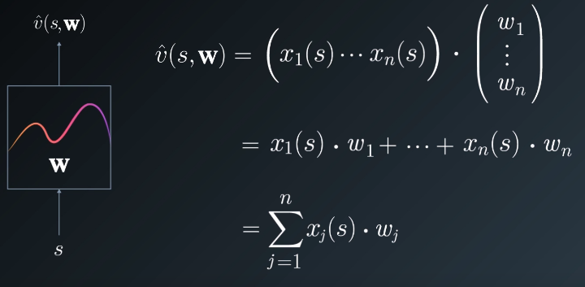  
<small>*The states can be represented by a vector <code>X</code>, and we can try to approximate the state value function by multiplying states with a vector of weights: <code>v=XW</code>*</small>

**Value Function:**  
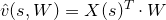

**Minimize Error:**  
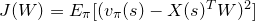

**Error Gradient:**  
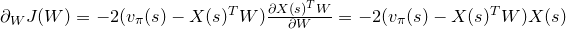

**Update Rule:**  
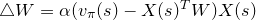  
<small>*<code>∆W</code>: change of weights*</small>  
<small>*<code>α</code>: learning reate*</small>  
<small>*<code>vπ(s)-X(s)TW</code>: away from error*</small>  
<small>*<code>X(s)</code>: direction*</small>  

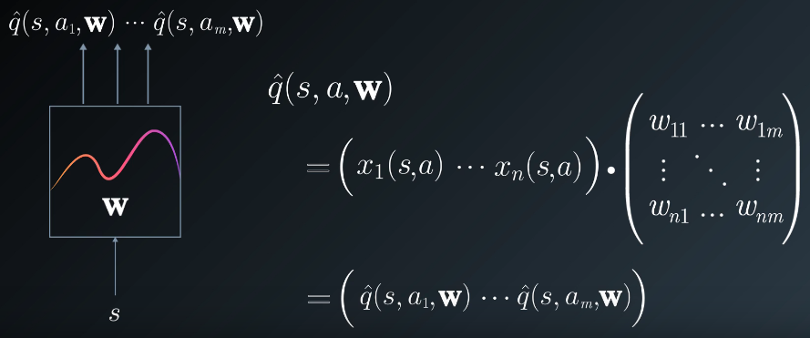  
<small>*Action Value Approximation*</small>

**Activation Function** can also be applied to the State Value / Action Value to introduce extra non-linearity:  
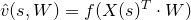  

The new gradient descent update rule:  
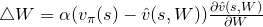  

## Deep Q Learning

### Monte Carlo Learning
In Monte Carlo Learning, we update the state value function as below:  
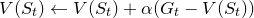  

Where <code>Gt</code> is expected return:  
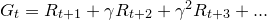  

So the update rule:  
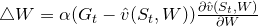  
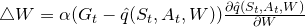  

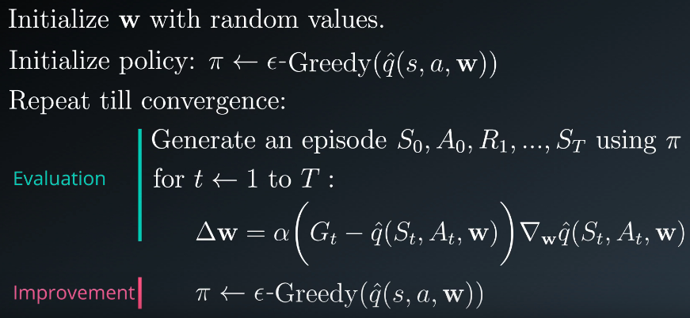  
<small>*MC is guaranteed to converge on a local optimum in general; in case of a linear function approximation, it will converge on the global optimum.*</small>

### TD Learning
Update Rule:  
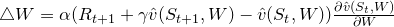  

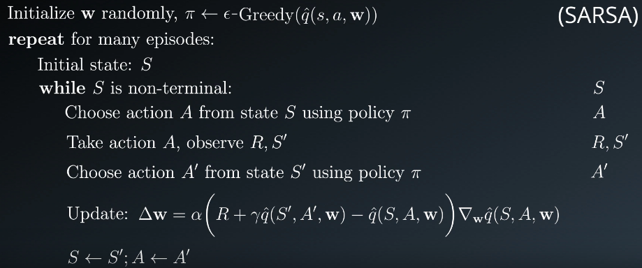  
<small>*TD Episodic Function Approximation*</small>

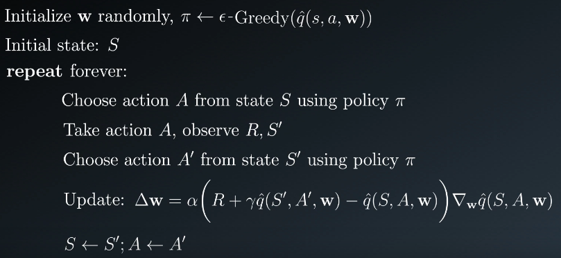  
<small>*TD Continuous Function Approximation*</small>

### Q Learning
> One drawback of both SARSA & Q-Learning, since they are TD approaches, is that they may not converge on the global optimum when using non-linear function approximation.

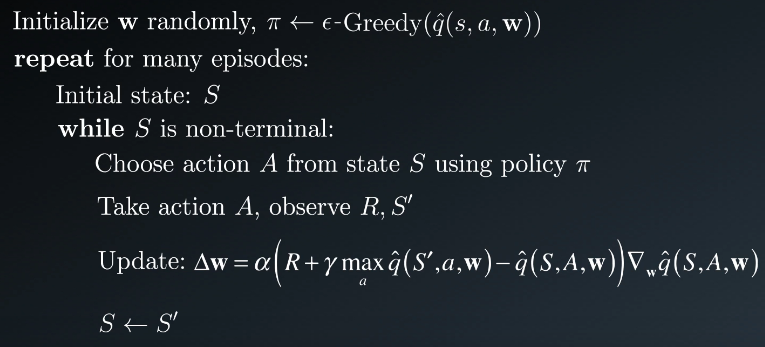  
<small>*Q Learning Function Approximation: we use policy <code>π</code> to take actions, and use the greedy policy to update the value function. That is why it is called **off policy** algorithm*</small>

### SARSA vs Q-Learning
**SARSA**

* On-policy  
<small>Follow the same policy that it is learning</small>

* Good online performance  
<small>At any point of time, you are using the most updated policy interacting with the environment</small>

* Q-values affected by exploration

**Q-Learning**

* Off-policy  
<small>The policy it follows to choose actions is different from the policy it is learning</small>

* Bad online performance  

* Q-values unaffected by exploration

**Off-policy Advantages**

* More exploration when learning

* Learning from demonstration

* Supports offline or batch learning

### Deep Q Netowrks
#### Experience Replay
* Interact with the environment, and take actions by following a ϵ-greedy policy <code>π</code>, save the tuples <code>(St,At,Rt+1,St+1)</code> into the replay buffer

* Then sample batches from the buffer randomly for the agent to learn

* Advantages:
    - Since the tuples are sampled randomly from the buffer, we can avoide the dependencies winthin the sequence of the experienced tuples. Thus prevents the action values from oscillating or diverging catastrophically.

    - Helps to transfer reinforcement learning into supervised learning.

    - Prioritize experience tuples that are rare or more important

#### Fixed Q Targets
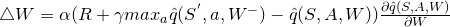  

* Fix <code>W-</code> for a certain number of learning steps to update <code>W</code>

* Then update <code>W-</code> with latest <code>W</code> and learn again

* With fixed parameters in learning, we can decouple the target (<code>∇W</code>) from the parameters (<code>W</code>) to get a more stable learning environment

#### Double DQNs
  

* Select best action use one set of parameters and evaluate the action use another set of parameters.

* Prevents the algorithm from progating incidental higher rewards that may have been obtained by chance and do not reflect long term returns.

#### Prioritized Replay
> Some important tuples may not occur as frequently as the others; we need to determin an algorithm to assign a higher probability for these tuples when we are sample the tuples.

TD Error:  
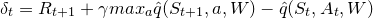  

Priority:  
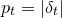  

Sampling Probility:  
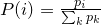  

In case TD error is 0, for priority, we can add a samll constant: <code>pt=|δt|+e</code>

Update sampling probility to introduce randomness to avoid overfitting on a subset with high priority:  
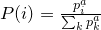  
<code>a</code> is 0: use pure uniform randomness  
<code>a</code> is 1: use pure priorities

Modified Updated Rule due to non-uniform sampling on Priority:  
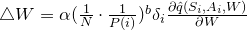  

#### Dueling Networks
> Values of most states do not vary a lot across actions; so it makes sense to try and directly estimate them.

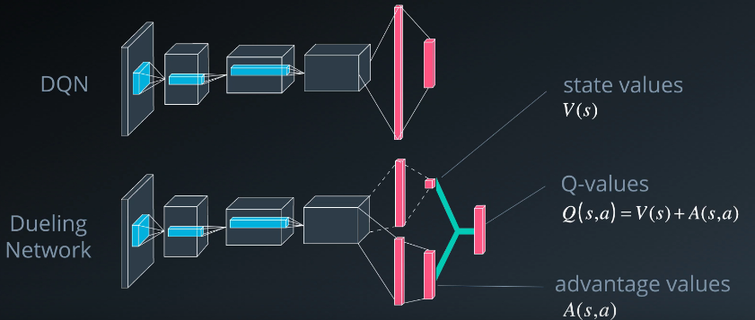  

## Policy-Based Methods
> Find optimal policy directly without finding value functions as an intermediate step.

* Value based approach tends to learn a deterministic or near deterministic policy; policy based approach can learn the desired stochastic policy. 

* In aliasd states (two or more states that we perceive to be identical but are actually different), a stochastic poliy is better.

* When action space is continuous, it will be difficult to find the global optimum action in value based approach; It will benefit and saves computation time if we can map a given state to an action directly.

### Policy Function Approximation
> Under policy <code>π</code>, we need to approximate the probility of actions <code>P[a|s,θ]</code>.

Linear function with softmat policy for discrete action space:  
  

Linear function with gaussian policy for continuous action space:  
  

Objective functions:  
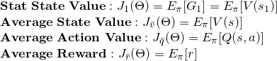  

### OptimalPolicy search
* Stochastic policy search
    - Start with a arbitrary policy and evaluate it
    - Generate neighbors (with a large range) to explore, and find the best policy
    - For the new policy, generate neignbors(gradually reduce the range) to explore, and find the best policy
    - Repeat until we find the optimal policy
    - Then try with a large search range under the current best policy, in case we stuck under local optimum.

* Policy Gradients  
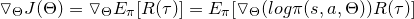  

* Reinforced Algorithm  
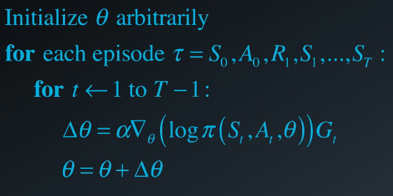  

* Constrained policy
    - only change the parameters in a certain way by a certain ammount to stablize the learning algorithm
    - When we update policy parameters from our current policy to the better policy, by updating parameters with a learning rate <code>α</code>, we may result in a very poor performance.
    - <code>D(π(s,a,θ),π(s,a,θ'))<δ</code>
    - Add a penalty term: <code>J(θ)=Eπ[R(τ)]-βD(π(s,a,θ),π(s,a,θ'))</code>
    - Parameter different is measured by KL-Divergence: <code>D(p||q)=<big>∫</big>p(x)(log p(x)-log q(x))dx</code>

## Actor-Critic Methods
- Actor: Policy
- Critic: Value function

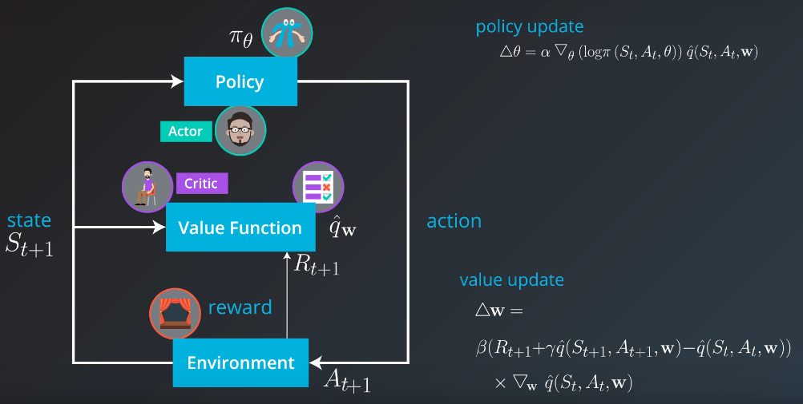  

1. The actor follows a random policy, and the critic oberves the behavior and provides feedbacks
2. The actor learns from the feedbacks and update its policy
3. The critic update its value functions to provide better feedback
4. Repeat the steps

### Advantage Function
> When we do policy update, the expected value function <code>q(St,At,W)</code> may vary a lot: some state action may have a higher Q-value, some may have a lower Q-value.

New policy update rule:  
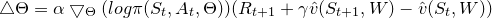  