# Machine Learning Cheat Sheet — Neural Network

## Perceptron
> Perceptron is a single layer of neural network.

  

## Neural Networks
> A neural network consists multiple layers of perceptron. It has three parts: input layer, hidden layers and output layer. The training samples define the input and output layers.  
> When the output layer is a categorical variable, then the neural network is a way to address classification problems. When the output layer is a continuous variable, then the network can be used to do regression. When the output layer is the same as the input layer, the network can be used to extract intrinsic features. The number of hidden layers defines the model complexity and modeling capacity.

### Gradient Descent Deduction
Assume the following scenario, we need to classify `m` points into 2 groups, each point has `p` features, which is represented by <code>(X1,X2,...,Xp)</code>. Say we are using one layer neural networks to do that.

We feed in point `P1`, after the neuron we get <code>WX+b</code>; We apply activation function on <code>WX+b</code> (let us assume we use sigmoid function), and we can get the probability for P1 in class 1 is <code>y&#770;11=S(WX+b)</code>, and probability for P1 in class 2 is <code>y&#770;12=1-S(WX+b)</code>.

All we need to do now is to maximize <code>G1=y11y&#770;11+(1-y11)(1-y&#770;11)</code>; <code>Y11</code> is 1 for P1 belongs to class 1, and 0 for P1 belongs to class 2. So for all these m points, we need to maximize <code>G1\*G2\*...\*Gm</code>. We can design the Cross-Entropy as below for `m` points and `n` classes:

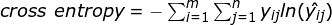  
*The lower the CE, the higher the probability*

Then our error function can be:   
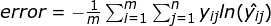  

Now `Gradient Descent` is applied to find the derivatives of the Error over the weights. To simplify the calculations, we only consider the error that one point produces. <code>E=-yln(y&#770;)-(1-y)ln(1-y&#770;)</code>.

We can get the derivative of the error `E` at a point `x`, with respect to the weight <code>wj</code>:  
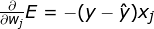  
and similarly:  
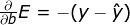  

So we can get the gradient of `E`:  
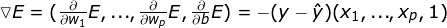  

Then we can set a learning rate alpha, and update weights and bias.  
_Note: `Gradient Descent` may lead to local minimum._

### Back Propagation
1. Doing a feedforward operation.

2. Comparing the output of the model with the desired output.

3. Calculating the error.

4. Running the feedforward operation backwards (backpropagation) to spread the error to each of the weights.

5. Use this to update the weights, and get a better model.

6. Continue this until we have a model that is good.

### Neural Network Techniques
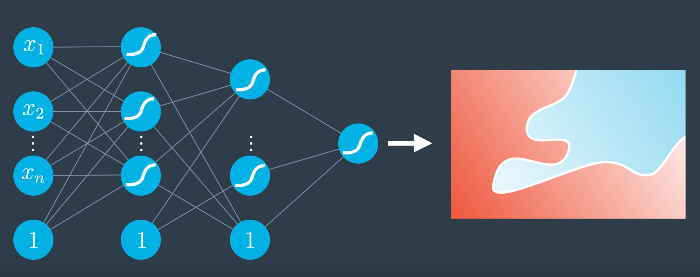  
<small>*Binary Classification NN (or to do Regression by Removing Activation Function on Last Layer)*</small>

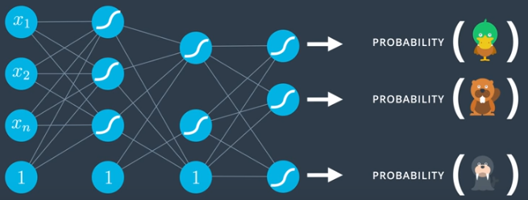  
<small>*Multi-Class Classification (Softmax in the output layer)*</small>

#### Early Stopping
>To determine the number of training epochs. If we use too few epochs, we might underfit; if we use too many epochs, we might overfit.  

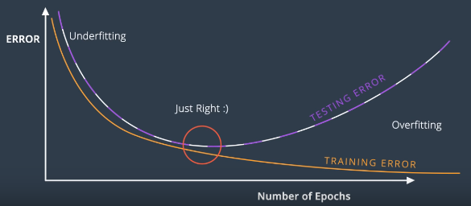  
<small>*Stop Training when Testing Error starts increasing*</small>

#### Regularization
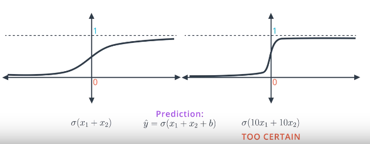  
* Model on the left (small coefficients)has larger errors, model on the right (large coefficients) has smaller errors  

* Model on the right is better than the model on the right; Model on the right is too certain, and has little room to apply gradient descent; easily results in over fitting  

* Bad models are usually too certain of themselves; good models are full of doubts  

* So we add regularization to punish on the large coefficients  

#### Activation Functions
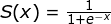  
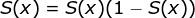  
<small>*Sigmoid Function - Binary classification*</small>

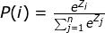  
<small>*Softmax Function - Multi-classification*</small>

> Since the sigmoid function has very low derivatives when value is large (result in small steps), we have other activation funcations:

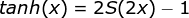  
<small>*hyperbolic tangent function — zero centered, result in faster convergence*</small>

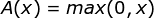  
<small>*ReLU (rectified linear unit)*</small>

#### Learning Rate Decay
If error derivative is steep, taking long steps;  
If error derivative is plain, taking small steps.

#### Neural Network Training Challenges
* Learning Rate  
It is difficult to get a proper learning rate. A small learning rate leads to slow convergence, while a large learning rate can hinder convergence and cause the loss function to fluctuate around the minimum or even to diverge.  

* Learning Rate Schedules  
Learning rate schedules try to adjust the learning rate during training, i.e. reducing the learning rate according to a pre-defined schedule or when the change in objective between epochs falls below a threshold. These schedules and thresholds, however, have to be defined in advance and are thus unable to adapt to a dataset’s characteristics.  

* Learning Rate on Different Features  
The same learning rate applies to all parameter updates. If our data is sparse and our features have very different frequencies, we need to perform a larger update for rarely occurring features.  

* Local Minimum  
We need to avoid getting trapped in local minima for non-convex error functions. Especially for saddle points, i.e. points where one dimension slopes up and another slopes down. These saddle points are usually surrounded by a plateau of the same error, which makes it notoriously hard for SGD to escape, as the gradient is close to zero in all dimensions.  

#### Optimizers
* SGD Stochastic Gradient Descent (or mini-batch) 
instead of run all the data forward and backward, and update the weights, SGD divides the training data into small batches. During each epoch, run each batch of the data points one by one to update the weights, introducing noise into gradients. This has a very desirable effect; i.e. — with the introduction of noise during the training, the model becomes less prone to overfitting.  

* Momentum  
instead of define the step as the gradient descent of the current point (at local minimum, the step is 0), define the step as a sum of the previous steps `(step(n)+r*step(n-1))`, then times that with the learning rate; this gives us a good chance to go over the hump on local minimum.  

* Nesterov accelerated gradient  
when computing the gradient, take `r*step(n-1)` into consideration, the new step is `step_new(n)+r*step(n-1)`  

* Adagrad  
an optimizer with parameter-specific learning rates, which are adapted relative to how frequently a parameter gets updated during training. The more updates a parameter receives, the smaller the learning rate. For this reason, it is well-suited for dealing with sparse data. The weakness is that the learning rate will shrink to very small during training.  

* Adadelta  
it is an extension of Adagrad that adapts learning rates based on a moving window of gradient updates, instead of accumulating all past gradients. This way, Adadelta continues learning even when many updates have been done.  

* RMSProp (RMS stands for Root Mean Squared Error)  
decreases the learning rate by dividing it by an exponentially decaying average of squared gradients.  

* Adam (Adaptive Moment Estimation)  
uses a more complicated exponential decay that consists of not just considering the average (first moment), but also the variance (second moment) of the previous steps. It can be viewed as a combination of RMSprop and momentum.  

* Nadam  
Similar to Adam, it can be viewed as a combination of RMSprop and NAG  

#### Callbacks
* EarlyStopping — Stop training when a monitored quantity has stopped improving  
* ModelCheckpoint — Save the model after every epoch

### Network Layers
* First hidden layer specifies the input shape, then each layer takes the outputs from the previous layer as inputs and pipes through to the next layer.  

* Activation layers  
specifies activation function for the Dense layers (e.g., `model.add(Dense(128)); model.add(Activation('softmax'))` is equivalent to `model.add(Dense(128, activation="softmax"))`). By separating the activation layers allows direct access to the outputs of each layer before the activation is applied.  

* Dropout layers  
probability that each node gets dropped at each epoch during training. In a fully connected layer, neurons develop co-dependency with each other during training, and will result in over fitting. Dropout can prevent that.  

* Output Layer  

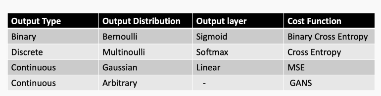  