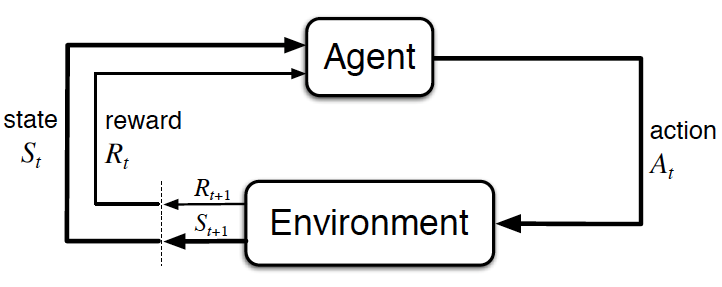

# Reinforcement Learning Introduction

## The Problem Description
  
<small>*The agent-environment interaction in reinforcement learning*</small>

### The Setting
* The reinforcement learning (RL) framework is characterized by an **agent** learning to interact with its environment.  

* At each time step, the agent receives the environment's **state** (*the environment presents a situation to the agent*), and the agent must choose an appropriate **action** in response. One time step later, the agent receives a **reward** (*the environment indicates whether the agent has responded appropriately to the state*) and a new **state**.  

* All agents have the goal to **_maximize_** expected **cumulative reward**.  

### Episodic vs. Continuing Tasks
* **Continuing tasks** are tasks that continue forever, without end.  

* **Episodic tasks** are tasks with a well-defined starting and ending point.  
    - In this case, we refer to a complete sequence of interaction, from start to finish, as an **episode**.  
    - Episodic tasks come to an end whenever the agent reaches a **terminal state**.  

### Cumulative Reward
* The discounted return at time step t is <code>Gt = Rt+1 + γRt+2 + γ2Rt+3 + ...</code>

* The agent selects actions with the goal of maximizing expected (discounted) return.

* The discount rate γ is something that you set, to refine the goal that you have the agent.
    - It must satisfy 0 ≤ γ ≤ 1.
    - If γ=0, the agent only cares about the most immediate reward.
    - If γ=1, the return is not discounted.
    - For larger values of γ, the agent cares more about the distant future. Smaller values of γ result in more extreme discounting.

### MDPs and One-Step Dynamics
* The **state space** **S** is the set of all (nonterminal) states.

* In episodic tasks, we use **S**+ to refer to the set of all states, including terminal states.

* The **action space** **A** is the set of possible actions. (Alternatively, **A**(s) refers to the set of possible actions available in state <code>s ∈ **S**</code>.)

* The **one-step dynamics** of the environment determine how the environment decides the state and reward at every time step. The dynamics can be defined by specifying <code>p(s',r|s,a) = P(St+1=s', Rt+1=r|St=s, At=a)</code> for each possible <code>s', r, s</code> and <code>a</code>.

* A (finite) Markov Decision Process (MDP) is defined by:
    - a (finite) set of states **S** (or **S**+)
    - a (finite) set of actions **A**
    - a set of rewards **R**
    - the one-step dynamics of the environment
    - the discount rate <code>γ ∈ [0,1]</code>