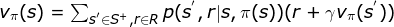
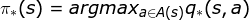

# Reinforcement Learning Introduction

## The Problem Description
  
<small>*The agent-environment interaction in reinforcement learning*</small>

### The Setting
* The reinforcement learning (RL) framework is characterized by an **agent** learning to interact with its environment.  

* At each time step, the agent receives the environment's **state** (*the environment presents a situation to the agent*), and the agent must choose an appropriate **action** in response. One time step later, the agent receives a **reward** (*the environment indicates whether the agent has responded appropriately to the state*) and a new **state**.  

* All agents have the goal to **_maximize_** expected **cumulative reward**.  

### Episodic vs. Continuing Tasks
* **Continuing tasks** are tasks that continue forever, without end.  

* **Episodic tasks** are tasks with a well-defined starting and ending point.  
    - In this case, we refer to a complete sequence of interaction, from start to finish, as an **episode**.  
    - Episodic tasks come to an end whenever the agent reaches a **terminal state**.  

### Cumulative Reward
* The discounted return at time step t is <code>Gt = Rt+1 + γRt+2 + γ2Rt+3 + ...</code>

* The agent selects actions with the goal of maximizing expected (discounted) return.

* The discount rate <code>γ</code> is something that you set, to refine the goal that you have the agent.
    - It must satisfy <code>0 ≤ γ ≤ 1</code>.
    - If <code>γ = 0</code>, the agent only cares about the most immediate reward.
    - If <code>γ = 1</code>, the return is not discounted.
    - For larger values of <code>γ</code>, the agent cares more about the distant future. Smaller values of <code>γ</code> result in more extreme discounting.

### MDPs and One-Step Dynamics
* The **state space** <code>**S**</code> is the set of all (nonterminal) states.

* In episodic tasks, we use <code>**S**+</code> to refer to the set of all states, including terminal states.

* The **action space** <code>**A**</code> is the set of possible actions. (Alternatively, <code>**A**(s)</code> refers to the set of possible actions available in state <code>s ∈ **S**</code>.)

* The **one-step dynamics** of the environment determine how the environment decides the state and reward at every time step. The dynamics can be defined by specifying <code>p(s',r|s,a) = P(St+1=s', Rt+1=r|St=s, At=a)</code> for each possible <code>s', r, s</code> and <code>a</code>.

* A (finite) Markov Decision Process (MDP) is defined by:
    - a (finite) set of states <code>**S**</code> (or <code>**S**+</code>)
    - a (finite) set of actions <code>**A**</code>
    - a set of rewards <code>**R**</code>
    - the one-step dynamics of the environment
    - the discount rate <code>γ ∈ [0,1]</code>

## The Solution Description
  
<small>*State-value function for golf-playing agent*</small>

### Policies
* A **deterministic policy** is a mapping <code>π: **S** → **A**</code>. For each state <code>s ∈ **S**</code>, it yields the action <code>a ∈ **A**</code> that the agent will choose while in state <code>s</code>.

* A **stochastic policy** is a mapping <code>π: **S** x **A** → [0,1]</code>. For each state <code>s ∈ **S**</code> and action <code>a ∈ **A**</code>, it yields the probability <code>π(a∣s)</code> that the agent chooses action <code>a</code> while in state <code>s</code>.

### Stete-Value Functions
The **state-value function** for a policy <code>π</code> is denoted <code>vπ</code>. For each state <code>s ∈ S</code>, it yields the expected return if the agent starts in state <code>s</code> and then uses the policy to choose its actions for all time steps. That is, <code>vπ(s) = Eπ[Gt|St=s]</code>. We refer to <code>vπ(s)</code> as the value of state <code>s</code> under policy <code>π</code>.

  
<small>*Bellman Expection for <code>vπ</code>*</small>

  
<small>*Bellman Expection for **Deterministic Policy***</small>

  
<small>*Bellman Expection for **Stochastic Policy***</small>

### Optimality
* A policy <code>π'</code> is defined to be better than or equal to a policy <code>π</code> if and only if <code>vπ'(s) ≥ vπ(s)</code> for all <code>s ∈ S</code>. It is often possible to find two policies that cannot be compared.

* An **optimal policy** <code>π\*</code> satisfies <code>π\* ≥ π</code> for all policies <code>π</code>. An optimal policy is guaranteed to exist but may not be unique.

* All optimal policies have the same **optimal state-value function** <code>v\*</code>.

### Action-Value Functions
* The action-value function for a policy <code>π</code> is denoted <code>qπ</code>. For each state <code>s ∈ S</code> and action <code>a ∈ A</code>, it yields the expected return if the agent starts in state <code>s</code>, takes action <code>a</code>, and then follows the policy for all future time steps. That is, <code>qπ(s,a) = Eπ[Gt|St=s,At=a]</code>. We refer to <code>qπ(s,a)</code> as the value of the state-action pair <code>s</code>, <code>a</code>.

* All optimal policies have the same action-value function <code>q\*</code>, called the **optimal action-value function**.

* For a deterministic policy <code>π</code>, <code>vπ(s) = qπ(s,π(s))</code>, holds for all <code>s ∈ S</code>.

### Optimal Policies
Once the agent determines the optimal action-value function <code>q\*</code>, it can quickly obtain an optimal policy <code>π\*</code> by:

  
