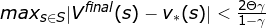
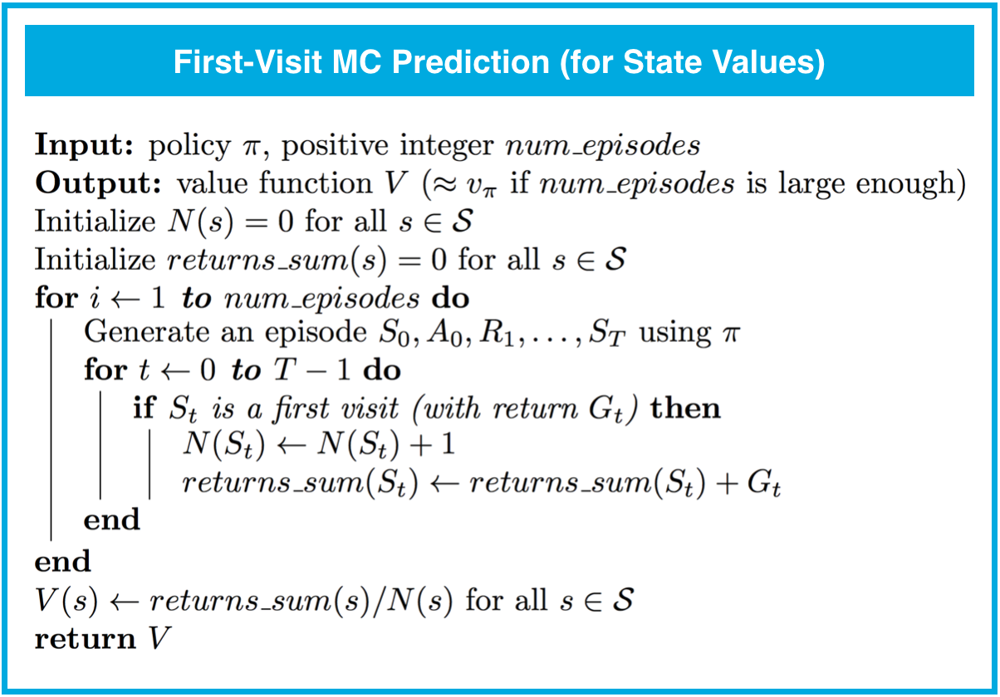
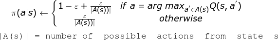
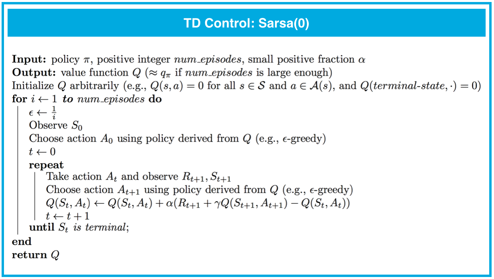
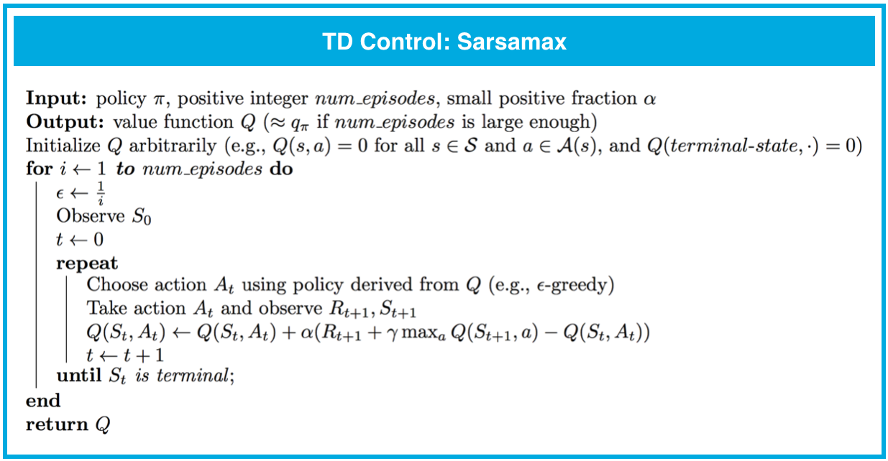

# Reinforcement Learning Algorithms
> In the **dynamic programming** setting, the agent has full knowledge of the Markov decision process (MDP) that characterizes the environment. (This is much easier than the **reinforcement learning** setting, where the agent initially knows nothing about how the environment decides state and reward and must learn entirely from interaction how to select actions.)

## Model-Based Learning (Dynamic Programming)
  
<small>***Iterative policy evaluation** is an algorithm used in the dynamic programming setting to estimate the state-value function <code>vπ</code> corresponding to a policy <code>π</code>.*</small>

  
<small>***Policy improvement** takes an estimate <code>V</code> of the action-value function <code>vπ</code> corresponding to a policy <code>π</code>, and returns an improved (or equivalent) policy <code>π'</code>, where <code>π' ≥ π</code>.*</small>

> If we encounter a state with multiple choices of actions that maximize the action-value function, we can arbitrarily pick one or construct a stochastic policy that assigns non-zero probility to any or all of them.

### Ploicy Iteration
  
<small>***Policy iteration** is an algorithm that can solve an MDP in the dynamic programming setting. It proceeds as a sequence of policy evaluation and improvement steps, and is guaranteed to converge to the optimal policy (for an arbitrary finite MDP).*</small>

### Truncated Policy Iteration
  
  
<small>***Truncated policy iteration** is an algorithm used in the dynamic programming setting to estimate the state-value function <code>vπ</code> corresponding to a policy <code>π</code>. In this approach, the evaluation step is stopped after a fixed number of sweeps through the state space.*</small>

We do not need to wait for a really good estimate of the value function before calculating an improved policy; as long as the relative values between state action paris are correct, we can get the optimal plicy.

It is unlikely to work if the hyperparameter max_iterations is set too small, cause the updates to the value function estimate <code>V</code> may be too small to result in any updates to its corresponding policy.

### Value Iteration
  
<small>***Value iteration** is an algorithm used in the dynamic programming setting to estimate the state-value function <code>vπ</code> corresponding to a policy <code>π</code>. In this approach, each sweep over the state space simultaneously performs policy evaluation and policy improvement.*</small>

Let <code>Vfinal</code> denote the final value function estimate that is calculated by the algorithm. Then it can be shown that <code>Vfinal</code> differs from the optimal value function <code>v*</code> by:  
  

## Model-Free Learning
There are two methods to evaluate a policy <code>π</code> from interaction with the environment:

* On-policy methods have the agent interact with the environment by following the same policy <code>π</code> that it seeks to evaluate (or improve).

* Off-policy methods have the agent interact with the environment by following a policy <code>b</code> (where <code>b≠π</code>) that is different from the policy that it seeks to evaluate (or improve).

### Monte Carlo Methods

#### MC Prediction: State Values
  

There are two types of Monte Carlo (MC) prediction methods (for estimating <code>vπ</code>):

* **First-visit MC** estimates <code>vπ(s)</code> as the average of the returns following only first visits to <code>s</code>.

    - The first-visit MC is unbiased because the total reward on a sample path from the start state <code>s</code> to the terminal state <code>T</code> is by definition an unbiased estimate of the expected total reward across all such paths.

* **Every-visit MC** estimates <code>vπ(s)</code> as the average of the returns following all visits to <code>s</code>.

    - The every-visit MC is biased because it averages many returns for each trial. So the returns from the same trial are not independent. The bias becomes smaller as more trials are observed becaused each trial is independent.

* Initially, every-visit MC has lower mean squared error (MSE), but as more episodes are collected, first-visit MC attains better MSE.

* Both the first-visit and every-visit method are guaranteed to converge to the true value function, as the number of visits to each state approaches infinity.

#### MC Prediction: Action Values
  

There are two types of MC prediction methods (for estimating <code>qπ</code>):

* **First-visit MC** estimates <code>qπ(s,a)</code> as the average of the returns following only first visits to <code>s, a</code>.

* **Every-visit MC** estimates <code>qπ(s,a)</code> as the average of the returns following all visits to <code>s, a</code>.

* Both the first-visit and every-visit methods are guaranteed to converge to the true value function, as the number of visits to each state-action pair approaches infinity.

* We won't use MC prediction to estimate the action-values corresponding to a deterministic policy; this is because many state-action pairs will never be visited (since a deterministic policy always chooses the same action from each state). Instead, so that convergence is guaranteed, we will only estimate action-value functions corresponding to policies where each action has a nonzero probability of being selected from each state.

#### MC Control
In above algorithm, it will take a lot of computation power to get the policy's action values even before improving the policy. In order to make the algorithm more efficient, we will try to improve the policy after every individual episode.

1. Initialize action values <code>Q(s,a) = 0</code>, and choose a starting policy <code>π</code>

2. Generate an episode using <code>π</code>, and use the episode to update <code>Q</code>

3. Use <code>Q</code> to improve <code>π</code>, by following **ϵ-greedy** policy:  
  

4. Repeat step 2 and step 3

When the agent knows little about the environment, we should favor **exploration** over **exploitation** by setting <code>ϵ=1</code>, which is equivalent to random policy.

At later time steps, it makes sense to favor **exploitation** over **exploration**, by slowly decrease <code>ϵ</code> to <code>0</code>.

In order for MC control to converge to the optimal policy, the Greedy in the Limit with Infinite Exploration (GLIE) conditions must be met:
* every state-action pair <code>s, a</code> is visited infinitely many times
* the policy converges to a policy that is greedy with respect to the action-value function estimate <code>Q</code>.

#### MC Control: Constant-alpha
The returns sampled at later eposides likely correspond to policies that are more optimal. So, it makes sense to amend the policy evaluation step to instead use a constant step size, to ensure that the agent primarily considers the most recently sampled returns when estimating the action-values and gradually forgets about returns in the distant past. Otherwise, then number of eposides is large, the update of <code>Q</code> will be too small.

  
<small>*The step-size parameter <code>α</code> must satisfy <code>0<α≤1</code>. Higher values of <code>α</code> will result in faster learning, but values of <code>α</code> that are too high can prevent MC control from converging to <code>π\*</code>.*</small>

### Temporal-Difference Learning
* Whereas MC prediction must wait until the end of an episode to update the value function estimate, TD prediction methods update the value function after every time step. Similarly, TD prediction methods work for continuous and episodic tasks, while MC prediction can only be applied to episodic tasks.

* In practice, TD prediction converges faster than MC prediction. 

* TD(0) is guaranteed to converge to the true state-value function, as long as the step-size parameter <code>α</code> is sufficiently small.

#### TD Prediction: TD(0)
  

#### TD Control: Sarsa(0)
> **Sarsa(0)** (or **Sarsa**) is an **on-policy** TD control method. It is guaranteed to converge to the optimal action-value function <code>q*</code>, as long as the step-size parameter <code>α</code> is sufficiently small and <code>ϵ</code> is chosen to satisfy the **GLIE** conditions.

  

#### TD Control: Sarsamax
> **Sarsamax** (or **Q-Learning**) is an **off-policy** TD control method. It is guaranteed to converge to the optimal action value function <code>q*</code>, under the same conditions that guarantee convergence of the Sarsa control algorithm.

  

#### TD Control: Expected Sarsa
> **Expected Sarsa** is an **on-policy** TD control method. It is guaranteed to converge to the optimal action value function <code>q*</code>, under the same conditions that guarantee convergence of Sarsa and Sarsamax.

  

#### Analyzing Performance
* On-policy TD control methods (like Expected Sarsa and Sarsa) have better online performance than off-policy TD control methods (like Q-learning).  
  
    - The figure shows the performance of Sarsa and Q-learning on the cliff walking environment for constant <code>ϵ=0.1</code>.

    - Q-learning achieves worse online performance (where the agent collects less reward on average in each episode), but learns the optimal policy.

    - Sarsa achieves better online performance, but learns a sub-optimal "safe" policy.

* Expected Sarsa generally achieves better performance than Sarsa.