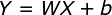
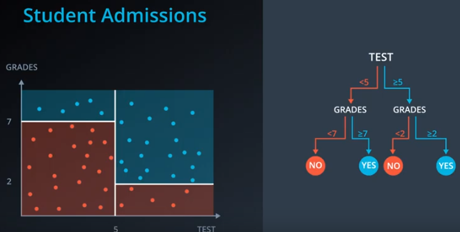
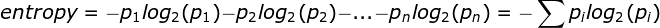
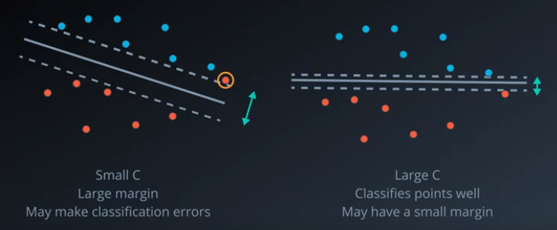
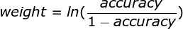

# Machine Learning Cheat Sheet — Supervised Learning

## Linear Regression
  
*W: weights; X: features*

Works best when the data is linear. If the data is not linear, then we may need to transform the data, add features, or use another model.  
Sensitive to outliers. Outliers contribute too much to the errors, so will impact the model. We may need to determine the outliers and remove them if necessary.

### Error functions:
  
*Mean Absolute Error*

  
*Mean Squared Error*

### Gradient Descent:
> Change the weights to move in the direction that descent the error the most.

In linear regression, split the data into many small batches. Each batch, with roughly the same number of points. Then, use each batch to update your weights. This is still called mini-batch gradient descent.

### Gradient Descent Vs Closed Form Solution:
We can solve W (weights) by setting derivatives of the Error to weights to 0. Then it is just a solving of n*n matrix (n is the number of features). But when n is too large, this requires a lot of computing power. So gradient descent will be a better solution to find the results which is close enough, but requires less computing power.

### Polynomial Regression:
Fit the data to a higher degree polynomials.

## Decision Trees
  
*Decision Tree Example*

### Entropy
Lower entropy means the state is more stable; higher entropy means the state has more randomness in it.

  
*Entropy Equation*

  
*Information Gain*

Decision Tree is to split the data into groups so that the information gain is maximized. However it is very easy to lead into **over fitting**.

### Random Forest to Avoid Over Fitting
1. Split features into groups
2. Each group forms a decision tree
3. Let the results from each decision tree to vote

### Decision Tree Hyper-parameters to Avoid Over Fitting
1. Maximum Depth — The largest possible length between the root to a leaf
2. Minimum number of samples to split
3. Minimum number of samples per leaf

## Naive Bayes
  
*Bayes Theorem*

Naive Bayes is to use the Bayes Theorem, make some assumptions (e.g. assume the features are independent, `P(A,B) = P(A)*P(B)` ), and calculate the proportions of the probability to simplify the calculation. For example: `P(A|B) ~ P(B|A)P(A)`

## Support Vector Machines
`Error = Error(Classification) + Error(Margin)`

  
*Margin Error (Same as L2 Regularization)*

### C Parameter
`Error =C * Error(Classification) + Error(Margin)`

  
*Impact of C*

### Polynomial Kernel
Set a polynomial degree to separate the data.

### RBF Kernel
Project the points to a higher dimension with Gaussian distribution, and cut the mountains by a plane; the circles of the cuts are the boundaries.

  
*Larger gamma, Narrower the Gaussian*

## Ensemble Methods
Combine multiple models into a better model.

### Bagging
Split data into smaller subsets, and get the models for each subset; then to get the predictions, run under all the models and vote for the final prediction.

### Boosting
1. Get a simple model on the data
2. Punish the classified data more and re-run to get a new model
3. Repeat step 2 for n times
4. Combine all the n models together by model weights

### Model Weights
  
*Model Weights*